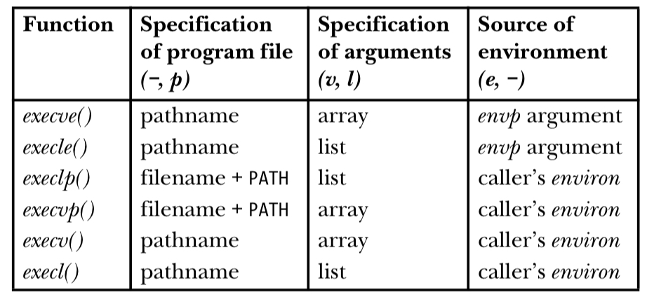

# TEST

## Tools & Instructions

### Programming, Compiling & Execution
~~~c
gcc -c path/to/file -o path/to/outputfile // results in an object file
objdump -d path/to/file // disassemble the code of an object file 
strace // trace program and which functions it calls in its execution
gdb path/to/file
valgrind path/to/file
~~~

### Search
~~~c
find <location> <query> // search something at directory <location>
find / <query> // search everywhere
grep <query> <location> // search in a file
grep <query> <location> | wc -l // count words in a file
~~~

### Manual
~~~c
man -k <query> // search for an entry in the manual page
~~~

### Processes
~~~c
vmstat 1 // update ressources every second
top // show all processes
~~~

### Files
~~~c
mv <src> <newname> // rename a file
rm <src> // remove a file
rmdir <location> // remove a directory
stat // show stats of a file
ln <src> <dst> // hardlink a file/dir to another
ln -s <src> <dst> // softlink a file/dir to another
~~~

## The more you know

### exec 

> Most of the exec() functions expect a pathname as the specification of the new program to be loaded. However, execlp() and execvp() allow the program to be specified using just a filename. The filename is sought in the list of directories specified in the PATH environment variable (explained in more detail below). This is the kind of searching that the shell performs when given a command name. To indicate this difference in operation, the names of these functions contain the letter p (for PATH). The PATH variable is not used if the filename contains a slash (/), in which case it is treated as a relative or absolute pathname.

> Instead of using an array to specify the argv list for the new program, execle(), execlp(), and execl() require the programmer to specify the arguments as a list of strings within the call. The first of these arguments corresponds to argv[0] in the main function of the new program, and is thus typically the same as the filename argument or the basename component of the pathname argument. A NULL pointer must terminate the argument list, so that these calls can locate the end of the list. (This requirement is indicated by the commented (char *) NULL in the above prototypes; for a discussion of why the cast is required before the NULL, see Appendix C.) The names of these functions contain the letter l (for list) to distinguish them from those functions requiring the argument list as a NULLterminated array. The names of the functions that require the argument list as an array (execve(), execvp(), and execv()) contain the letter v (for vector).

> Program Execution:
> The execve() and execle() functions allow the programmer to explicitly specify the environment for the new program using envp, a NULL-terminated array of pointers to character strings. The names of these functions end with the letter e (for environment) to indicate this fact. All of the other exec() functions use the caller’s existing environment (i.e., the contents of environ) as the environment for the new program.

> Version 2.11 of glibc added a nonstandard function, execvpe(file, argv, envp). This function is like execvp(), but instead of taking the environment for the new program from environ, the caller specifies the new environment via the envp argument (like execve() and execle()).

 https://github.com/shihyu/Linux_Programming/blob/master/books/The%20Linux%20Programming%20Interface%20-%20A%20Linux%20and%20UNIX%20System%20Programming%20Handbook.pdf

from p. 567 from the Linux Programming Interface

### interrupts

- 0–19 (0x0-0x13) Nonmaskable interrupts and exceptions
- 20–31 (0x14-0x1f) Intel-reserved
- 32–127 (0x20-0x7f)  External interrupts (IRQs)
- 128 (0x80)  Programmed exception for system calls (see Chapter 10)
- 129–238 (0x81-0xee) External interrupts (IRQs)
- 239 (0xef)  Local APIC timer interrupt (see Chapter 6)
- 240 (0xf0)  Local APIC thermal interrupt (introduced in the Pentium 4 models)
- 241–250 (0xf1-0xfa) Reserved by Linux for future use
- 251–253 (0xfb-0xfd) Interprocessor interrupts (see the section "Interprocessor Interrupt Handling" later in this chapter)
- 254 (0xfe)  Local APIC error interrupt (generated when the local APIC detects an erroneous condition)
- 255 (0xff)  Local APIC spurious interrupt (generated if the CPU masks an interrupt while the hardware device raises it)

https://www.oreilly.com/library/view/understanding-the-linux/0596005652/ch04s06.html

### inodes

Every directory contains the special name "." (dot), a shorthand name that is a map to the inode of the directory itself. That counts as a link to the directory. The smallest link count of any Unix directory is therefore two: count one link for the unique name-inode map in the parent directory that gives the directory its Unix "name", and count another link for the "." (dot) map in the directory itself. Every directory must have these two names.

~~~c
cd .. // .. is the inode of the parent directory
cd . // . is the inode of the current directory
~~~

http://teaching.idallen.com/dat2330/04f/notes/links_and_inodes.html
