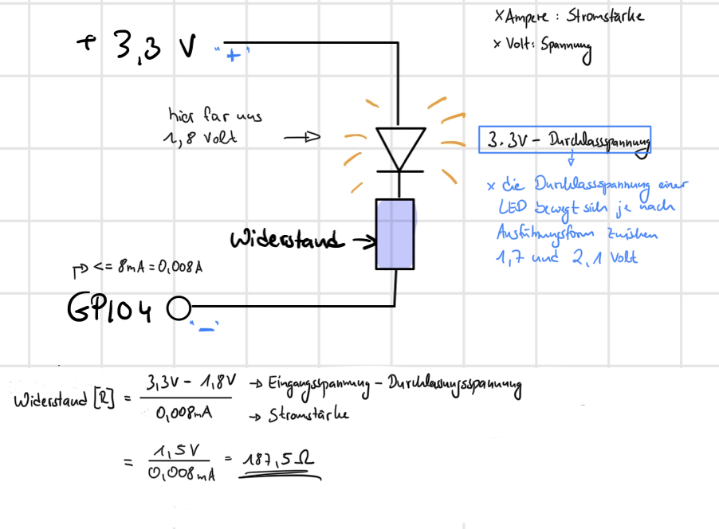

# Fragenkatalog zu Selbsttest

-> unser Model ist der **Rasperry Pi 4 Model B**

## Zur Raspberry Systemsoftware

### Wie funktioniert der Bootvorgang des RPi?

    1. First stage bootloader. Hier wird sichergestellt, dass der Second stage bootloader 
        - Zunächst ist die CPU abgeschaltet und der One-Time Programmable (OTP) Speicherblock, einem Vektor, der verschiedene Register enthält, wird gelesen. In ihm steht u.a., wie gebootet werden soll [(mehr Infos dazu)](https://www.raspberrypi.org/documentation/hardware/raspberrypi/booteeprom.md)
          - es kann von der SD-Karte gelesen werden. Dann wird versucht `recovery.bin` zu finden und den EEPROM über SPI zu aktualisieren
          - falls nicht gefunden, wird im EEPROM über SPI (Begriffe weiter im Text erklärt) nach dem Second stage bootloader gesucht
        - Es wird versucht `recovery.bin` über ein USB Gerät zu laden. Falls das funktioniert, wird der EEPROM über SPI aktualsiert. Falls nicht, wird das Ganze erneut verscuht
    2. Second stage bootloader
       1. Hier liegt der Unterschied zu den alten Modellen. Der `Second stage bootloader` liegt auf einem über das SPI (Serial Peripheral Interface) ansteuerbaren EEPROM (Electrically Programmable Read Only Memory), einem persistenten Speicher
   
    Wenn der Rasbperry gestartet wird, ist die CPU offline. Für das Booten des SoCs (System-On-A-Chip) ist ein kleiner auf der GPU liegender RISC-Kern verantwortlich. Aus diesem Grund passieren die Bootvorgänge auf dem GPU-Code anstatt auf der CPU. \
    **GPU:**
        1) First stage bootloader: In der ersten Stufe geschieht die Vorbereitung für den zweiten Bootloader, indem die FAT32-Bootpartition auf der SD-Karte installiert wird. Der FAT32 ist ein Filesystem, welches eine große Anzahl an möglichen Clustern unterstützt. 
    \
        1) Second stage bootloader: In der zweiten Stufe wird die GPU-Firmware, welche auf der SD-Karte zu finden ist, für den Start der GPU programmiert. -> bootcode.bin
    \
        1) GPU-Firmware: Sobald der vorherige Abgang abgeschlossen ist, wird der GPU ermöglicht die CPU hochzufahren. Für deren Konfiguartion wird eine weitere Datei, fixup.dat, verwendet. An diesem Punkt wird die CPU freigegeben und die Übertragung der Ausführung beginnt.
    \
        1) alles was auf der GPU läuft wird auf die ARM geladen: eine ARM-CPU

    #### Quellen
    * https://www.raspberrypi.org/documentation/hardware/raspberrypi/bootmodes/bootflow_2711.md
    * https://www.raspberrypi.org/documentation/hardware/raspberrypi/booteeprom.md

### Wie können Sie den Bootvorgang des Raspberry Pi auf ihrem Bildschirm anzeigen lassen?

#### Output
```sh
... ######## boot text
[  OK  ] Started Save/Restore Sound Card State.
[  OK  ] Started Check for Raspberry Pi EEPROM updates.
[  OK  ] Reached target Sound Card.
[  OK  ] Started LSB: Switch to ond…(unless shift key is pressed).
[  OK  ] Started dphys-swapfile - s…mount, and delete a swap file.
[  OK  ] Started Avahi mDNS/DNS-SD Stack.
[  OK  ] Started Login Service.
[  OK  ] Started WPA supplicant.
[  OK  ] Started dhcpcd on all interfaces.
[  OK  ] Reached target Network.
         Starting /etc/rc.local Compatibility...
         Starting Permit User Sessions...
My IP address is 192.168.0.128 2a02:8071:82ad:5d00:5d8c:32b6:2690:7b91 
         Starting OpenBSD Secure Shell server...
[  OK  ] Started /etc/rc.local Compatibility.
[  OK  ] Started Permit User Sessions.
[  OK  ] Started Getty on tty1.
[  OK  ] Started Serial Getty on ttyAMA0.
[  OK  ] Reached target Login Prompts.
[  OK  ] Started OpenBSD Secure Shell server.
[  OK  ] Reached target Multi-User System.
[  OK  ] Reached target Graphical Interface.
         Starting Update UTMP about System Runlevel Changes...
[  OK  ] Started Update UTMP about System Runlevel Changes.

Raspbian GNU/Linux 10 raspjosef ttyAMA0

######## Hier wurde ENTER gedrückt! Damit kann man sich einloggen
raspjosef login: pi      
Password: 
Last login: Fri May  7 11:20:34 BST 2021 from 192.168.0.185 on pts/0
Linux raspjosef 5.10.17-v7l+ #1403 SMP Mon Feb 22 11:33:35 GMT 2021 armv7l

The programs included with the Debian GNU/Linux system are free software;
the exact distribution terms for each program are described in the
individual files in /usr/share/doc/*/copyright.

Debian GNU/Linux comes with ABSOLUTELY NO WARRANTY, to the extent
permitted by applicable law.
pi@raspjosef:~$ ls ######## Man ist jetzt über die serielle Schnittstelle verbunden
mybutton.py  switch  switch.c  switch.h
pi@raspjosef:~$ sudo shutdown -h now
...
         Stopping Manage Sound Card State (restore and store)...
[  OK  ] Removed slice system-serial\x2dgetty.slice.
[  OK  ] Stopped /etc/rc.local Compatibility.
[  OK  ] Removed slice system-getty.slice.
[  OK  ] Stopped User Manager for UID 1000.
[  OK  ] Stopped LSB: Switch to ond…(unless shift key is pressed).
[  OK  ] Stopped Manage Sound Card State (restore and store).
         Stopping User Runtime Directory /run/user/1000...
[  OK  ] Stopped Login Service.
[  OK  ] Unmounted /run/user/1000.
[  OK  ] Stopped User Runtime Directory /run/user/1000.
[  OK  ] Removed slice User Slice of UID 1000.
         Stopping Permit User Sessions...
[  OK  ] Stopped Permit User Sessions.
[  OK  ] Stopped target Remote File Systems.
[  OK  ] Stopped target Remote File Systems (Pre).
[  OK  ] Stopped target NFS client services.
[  OK  ] Stopped target Network.
         Stopping WPA supplicant...
         Stopping dhcpcd on all interfaces...
         Stopping Raise network interfaces...
[  OK  ] Stopped WPA supplicant.
         Stopping D-Bus System Message Bus...
[  OK  ] Stopped D-Bus System Message Bus.
[  OK  ] Stopped Raise network interfaces.
[  OK  ] Stopped dhcpcd on all interfaces.
[  OK  ] Stopped target Basic System.
[  OK  ] Stopped target Slices.
[  OK  ] Removed slice User and Session Slice.
[  OK  ] Stopped target Paths.
[  OK  ] Stopped target Sockets.
[  OK  ] Closed Syslog Socket.
[  OK  ] Closed D-Bus System Message Bus Socket.
[  OK  ] Closed triggerhappy.socket.
[  OK  ] Closed Avahi mDNS/DNS-SD Stack Activation Socket.
[  OK  ] Stopped target System Initialization.
         Stopping Update UTMP about System Boot/Shutdown...
[  OK  ] Stopped target Local Encrypted Volumes.
[  OK  ] Stopped Dispatch Password …ts to Console Directory Watch.
[  OK  ] Stopped Forward Password R…uests to Wall Directory Watch.
         Stopping Load/Save Random Seed...
[  OK  ] Stopped Apply Kernel Variables.
[  OK  ] Stopped Load Kernel Modules.
[  OK  ] Stopped target Swap.
         Stopping Network Time Synchronization...
[  OK  ] Stopped Network Time Synchronization.
[  OK  ] Stopped Load/Save Random Seed.
[  OK  ] Stopped Update UTMP about System Boot/Shutdown.
[  OK  ] Stopped Create Volatile Files and Directories.
[  OK  ] Stopped target Local File Systems.
         Unmounting /boot...
[  OK  ] Unmounted /boot.
[  OK  ] Reached target Unmount All Filesystems.
[  OK  ] Stopped File System Check …/disk/by-partuuid/bccdb1c0-01.
[  OK  ] Removed slice system-systemd\x2dfsck.slice.
[  OK  ] Stopped target Local File Systems (Pre).
[  OK  ] Stopped Create Static Device Nodes in /dev.
[  OK  ] Stopped Create System Users.
[  OK  ] Stopped Remount Root and Kernel File Systems.
[  OK  ] Stopped File System Check on Root Device.
[  OK  ] Reached target Shutdown.
[  OK  ] Reached target Final Step.
[  OK  ] Started Power-Off.
[  OK  ] Reached target Power-Off.
         Stopping Restore / save the current clock...
[  645.249406] reboot: Power down
```
#### Antwort

Per Kommando `sudo screen /dev/ttyUSB0 115200` kann man sich über die serielle Schnittstelle auf den Raspberry Pi schalten. Dafür muss über auf dem Pi über `sudo raspi-config` die Schnittstelle P6 aktiviert werden.

**Achtung: man darf das Fenster nicht in seiner Größe verändern. Das ergibt dann einen lustigen Output. Weiterhin sollte der Befehl direkt nach dem Einstecken des Pis ausgeführt werden. Es kann manchmal dazu kommt, dass man nämlich gar nichts sieht.**

### Wie wird Ihre Komponente auf den Raspberry Pi geladen?

#### Antwort

Per `ssh` Befehl: hierzu wird als Input der Inhalt der Komponente übergeben.
```sh
filename="$(basename $1)"
ssh pi@raspjosef.local "cat > $filename" < $1
```

Das hat uns die Möglichkeit gegeben Skripte, Dateien und weiteres auf beide Raspberry's zu laden.


## Zur Raspberry Hardware

### Welche Architektur hat der Prozessor, und welche Eigenschaften hat dieser?

> A: Der Prozessor ist ein `ARMv7` (Advanved RISC Machines) Chip. Diese Architektur setzt, wie name bereits impliziert, auf `RISC` (Reduced Instruction Set Computer).
> Über den Befehl `cat /proc/cpuinfo` lassen sich diverse Informationen über den Prozessor ausgeben.

```sh
$ cat /proc/cpuinfo 
processor	: 0 # es gibt 3 weitere
model name	: ARMv7 Processor rev 3 (v7l)
BogoMIPS	: 108.00
Features	: half thumb fastmult vfp edsp neon vfpv3 tls vfpv4 idiva idivt vfpd32 lpae evtstrm crc32 
CPU implementer	: 0x41
CPU architecture: 7
CPU variant	: 0x0
CPU part	: 0xd08
CPU revision	: 3

...

Hardware	: BCM2711
Revision	: b03114
Serial		: 1000000027fd7164
Model		: Raspberry Pi 4 Model B Rev 1.4
```

> Eine besondere Eigenschaft dieses Prozessors ist der geringe Energieverbrauch. Der Raspberry lässt sich mit 5 W Leistung beitreiben. Das liegt daran, dass low-level Instruktionen im Vergleich zu `CISC` fest verdrahtet sind und über die Hardware laufen. Während `CISC` Rechner deutlich komplexere Operationen vollziehen können, da diese als mehrzyklische Instruktionen ablaufen, kann `RISC` weniger Operationen.

> Der Prozessor in dem Rasbperry Pi ist der **BCM2711**.\
**Architektur:** \
    - Verbesserung des Designs bei dem Quad-Core-CPU des vorherigen Models \
    - leistungsfähiger Kern = ARM Cortex A72 \
    - Verbesserung des GPU-Funktionssatzes für Eingabe und Ausgabe \
    - Integration eines PCIe-Links, welcher die Ports von USB-2 und USB-3 verbindet 
\
**Eigenschaften:** \
    - schnellere Ein- und Ausgabe \
    - Adressierung von mehr Speicher \
    - mehr Leistung trotz geringerem Energieverbrauch
  
### Welcher Chipsatz ist im Raspberry Pi verbaut?
    > A: Das Herzstück unseres Raspberry Pi's ist ein **1.5 GHz Vierkern Cortex A72 SoC(System-On-A-Chip)**. Dieser enthält den Prozessor und die Video-Core-Graphikeinheiten.

### Welche PIN-Belegung hat der GPIO?
    >A : Der Rasbperry Pi stellt eine frei programmierbare Schnittstelle für Eingaben und Ausgaben (= GPIO) zur Verfügung. GPIO bedeutet ausgeschrieben **General Purpose Input/Output** und enthält mehrere PINs auf Rasperry, wodurch z.B. Sensoren oder Displays angesteuert werden können. Jeder PIN ist manuel felxibel konfigurierbar und dient als Sender oder Empfänger für Dateien von der externen Hardware.\
    Insgesamt gibt es beim Model B 40 PINs, jeder mit einer bestimmten Funktion. Die PIN-Belegung für den GPIO sind z.B. die drei PINs für die serielle Verbindung: GND(GROUNF), TX(GPIO14), Rx(GPIO15) -> verantwortlich für die serielle Verbindung.\
    Bei unserem Raspberry Pi, und wie auch auf der Internetseite mit den jeweiligen Aufgaben, hat die GPIO folgende PIN-Belegungen: 3, 5, 7, 8, 10, 11, 12, 13, 15, 16, 18, 19, 21, 22, 23, 24, 26.\
    Jeder PIN hat, je nach Schaltung am Raspberry verschieden Funktionen, wie zum Beispiel GPIO für Input und Output.

### Skizzieren Sie die Serienschaltung aus Widerstand und LED, wenn die LED durch 3,3V am Ausgang der Raspberry Pi Leitung GPIO-4 leuchten soll. Wie groß wählen Sie den Widerstand, damit der Ausgang GPIO-4 mit nicht mehr als 8mA belastet wird (Rechnung)?
    > A: Im Folgenden ist die Zeichnung für die Serienschaltung sichtbar:
    



## Zu den Aufgaben

### Wie lauten die Shell Kommandos um einen GPIO PIN als Eingabe bzw. als Ausgabe zu konfigurieren?
```sh
# Input
sudo echo "in" > /sys/class/gpio/gpio4/direction
```

```sh
# Output
sudo echo "out" > /sys/class/gpio/gpio4/direction
```

-> um Zugang zu einem PIN zu bekommen, muss dieser zuerst mit dem Befehl `/sys/class/gpio/export` exportiert werden. Dabei handelt es sich um eine Datei, in welche die Nummer der GPIO-Leitung zur Reservierung geschrieben wird.\
-> wenn PIN 4 angesprochen werden soll, wird das `sys/class/gpio/gpio4/` Verzeichnis ausgewählt. Dabei handelt es sich um ein vom Kernel angelegtes Verzeichnis.\
-> die Richtung für den jeweiligen PIN erfolgt über die Datei `.../gpio4/direction`.

### Wie kann man einen Schalter via Software ‘entprellen’?
    > A: Als Prellen wird ein ausgelöster Störfaktor bei Schaltern und Tasten bezeichnet. Dabei schwankt der Wert sehr schnell zwischen HIGH und LOW.\
    Es gibt diverse Möglichkeiten einen Schalter zu entprellen. Eine Möglichkeit besteht darin den Wert des Buttons in regelmäßigen aber nicht zu kurzen Abständen zu `pollen`. Dabei umgeht man die schnelle Schwankung des Wertes. Dieser Lösungsansatz wurde in den Aufgaben verwendet.
    Dabei pollt ein separater Thread in `led5.c` und `react.c` alle 100 ms den Schalter und aktualsiert den Wert.


### Welche Arten von Lasten können auf einem Computer System generiert werden und wie?
    > A: Es gibt viele Arten von Lasterzeugungen, wie z.B. 
    - die CPU-Auslastung
    - die Latenz-Auslatung
    - die Speicher-Asulastung\
    Jeder Auslastung bedarf einer bestimmten Eingabe in der Konsole mit jeweis den Parametern und dazugehörigen Werten, die wiederum die jeweiligen Komponenten für eine Auslastung darstellen. Die Befehle können sowohl direkt ins Terminal oder als z.B. Shell Skript geschrieben werden.

## Links
* https://www.balena.io/docs/learn/develop/hardware/gpio/
* https://mmaechtel.github.io/homeworks/docs/resyhw/v1/V1-Vorbereitung/
* https://www.raspberrypi.org/documentation/hardware/raspberrypi/README.md
* https://elinux.org/RPi_Software
* https://bitreporter.de/raspberrypi/chips-und-bauteile-auf-dem-rapsberry-pi-4-identifizieren/ (BILD)
* https://www.raspberrypi.org/documentation/hardware/raspberrypi/bcm2711/README.md
* https://de.wikipedia.org/wiki/Raspberry_Pi#Raspberry_Pi
* https://magpi.raspberrypi.org/articles/raspberry-pi-4-specs-benchmarks
* https://wiki.ubuntu.com/ARM/RaspberryPi
* https://www.raspberrypi.org/documentation/hardware/raspberrypi/bootmodes/bootflow_2711.md
