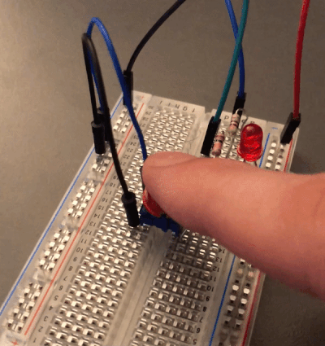
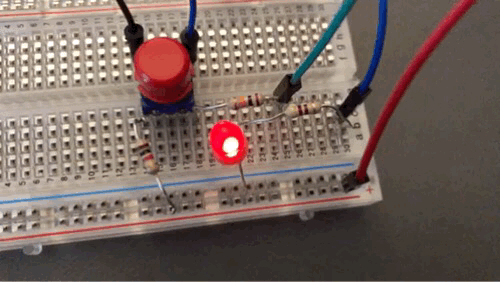

# Resy Lab Homework V1

### Gruppe: 1

### Name 1: jpkmiller

### Name 2: IsabellaSchoen

___
___

## Vorbereitung

### 'Machen Sie sich mit der Pin-Belegung des GPIO vertraut.'

Bei der Recherche über die GPIO Pins des Raspberry's wurde klar, dass diese PINs sowohl Ausgang als auch Eingang sein
können, ähnlich wie auf einem Arduino. Es wurde ebenfalls rasch klar, dass der Raspberry "richtig" herum ist, wenn die
LAN und USB Buchsen auf der rechten Seite sind.

## Aufgabenstellung

### Booten Sie das System und loggen Sie sich remote (per ssh) auf dem Device ein.

Für den Login über ssh ist es notwendig gewesen im `boot` Dateisystem eine Datei namens `ssh` anzulegen. Für den Fall,
dass der Raspberry im WLAN erreichbar sein soll, mussten entweder über `sudo raspi-config` bei einer bestehenden
Verbindung über bspw. Ethernet die SSID und das Passwort des WLANs eingetragen werden. Jedoch ließen sich diese
Einstellungen auch manuell vornehmen.

Für den Log-in über ssh hat es sich angeboten einen ssh-key hinzuzufügen. Hierfür wurden folgende Befehle ausgeführt:

```sh
$ ssh-keygen
$ ssh-copy-id pi@<ip-adresse-des-pis>
```

Damit wurde dem Raspberry der public key gegeben. Dadurch war die Passworteingabe beim Log-in nicht mehr notwendig.

### Welche Hardware Revision hat Ihr Board? Lesen Sie dazu die Datei /proc/cpuinfo Ihres Boards aus.

Diese Frage haben wir im Selbsttest.md beantwortet.

### Code zu `switch.c`

In diesem Code sollte sich mit dem GPIO Input beschäftigt und die richtige Schaltung auf dem Raspberry Pi (siehe Bild)
nachgemacht werden. Der `GPIO17` wurde hierbei als Input gewählt.\
Der erste Schritt bestand darin sich mit dem Filesystem auseinanderzusetzen. Um den Zugriff auf das `fs` zu
vereinfachen, wurden diverse Helper-Methoden in `helpergpio.h` geschrieben. Diese wurde durch konstruktives Feedback um
optionale Debugging-Optionen erweitert. Die h-Datei wurde in den anderen Programmen ebenfalls verwendet. Das Skript ist
recht einfach: zunächst wird der GPIO-PIN 17 aktiviert und seine Richtung auf `in` gestellt, da in diesen der Strom
fließt. Der Strom ist dann unterbrochen genauer gesagt fließt anders, wenn der Button gedrückt ist. Dann fließt der
Strom vom 3.3 V `Output` in Richtung `GROUND`. Dieser Zustand wird in einer Schleife abfragt: Wenn der Wert 48 beträgt,
so ist der Button gedrückt. Da beim Lesen des Wertes von `GPIO17` ein `char` zurückgegeben wird, der dann in einen `int`
gecastet wird, ist der Wert 48 lediglich die ASCII-Darstellung von 0, also LOW. 49 ist dementsprechend die 1, also HIGH.
Nach der Bearbeitung von `react.c` und `led5.c` wurde der Schalter dann noch entprellt. Davor wurde immer hochgezählt,
wann immer der Schalter gedrückt blieb - ein ungewolltes Verhalten.

### Code zu `led.sh`

In diesem Shell Script, sollte eine LED für eine Sekunde jeweils ein- und ausgeschaltet werden. Anstatt die LED wie
in `switch.c` über den Schalter aufleuchten zu lassen, sollte ein weiteres Kabel am Raspi gelegt werden, über das sich
die LED programmatisch steuern lässt. Hierfür wurde der PIN 18 gewählt, der als Output definiert wurde. Die LED leuchtet
auf, sobald am Output 0V, also `GROUND` angelegt sind. Sobald eine höhere Spannung angelegt wird, treffen sich die
Ströme vom 3.3V Output und von `GPIO18`. Es fließt dann kein Strom mehr und die LED bleibt aus. Bei dem Skript musste
darauf geachtet werden, dass jeweils der Aufruf von `sleep` an der richtigen Stelle stattfindet und auch der Wert
für `value` richtig gesetzt wurde. Wenn `GPIO18` HIGH ist, leuchtet die LED nicht. Wenn `GPIO18` LOW ist, fließt ein
Strom von 3.3V in den PIN.

### Code zu `led5.c`

Dieser Code sollte die LED in einer bestimmten Frequenz blinken lassen. Hierbei gab es mehrere Schwierigkeiten. Zum
einen war es schwierig eine passende Bibliothek für die Kommandozeilenargumente zu finden. Durch Feedback zu unserer
Abgabe haben wir die einfache und effektive Variante gewählt den Parameter mittels `strcmp` für '-hz' und `strtol` für
den Wert herauszulesen. Weiterhin kämpften wir insbesondere mit dem Prellen des Schalters. Beim ersten Drücken ließ sich
die LED dann nicht mehr Abschalten, was ein unerwünschtes Verhalten ist. Die Lösung bestand darin den Wert des Buttons
in einem separaten Thread in regelmäßigen, aber nicht zu kurzen, Abständen zu pollen.

### Code zu `react.c`

Dieses Skript soll die Reaktionszeit einer Person testen. Dabei wird gemessen, wie viel Zeit zwischen dem Anschalten
einer LED und dem Drücken eines Buttons vergeht. Das Programm lässt sich in zwei große Schleifen unterteilen:\
In der Hauptschleife wird der Reaktionstest ausgeführt. Im Reaktionstest wurde zunächst eine Zufallszahl zwischen 3 und
10 generiert, welche die Anzahl an Sekunden, die bis zum Anschalten der LED vergehen, beschreibt. Der Task wartet dann
mithilfe der Funktion `clock_nanosleep` die entsprechende Anzahl an Sekunden. Anschließend geht ein Lämpchen an, die
Zeit wird gemessen und die kleinere Schleife fängt an. In dieser wird der Zustand des Buttons abgefragt.\
Der Button wird von einem separaten Thread behandelt. Da die meisten Schalter ein prellendes Verhalten aufweisen –
schnelle Schwankungen, zwischen den Flanken – bestand der erste Versuch den Schalter zu entprellen darin, den Zustand
des Schalters in regelmäßigen Abständen abzufragen. Das hat zwar den schwankenden Wert gelöst, war aufgrund des Timers
jedoch für ein RT-System „ungenau“ und unzuverlässig. Weiterhin gab es Probleme, wenn der Button länger gedrückt blieb.\
Nach weiterer Recherche wurde eine elegante Lösung gefunden, in der der Button mehrere Zustände durchläuft. Damit wurde
ein längeres Drücken des Buttons als ein einmaliges Drücken wahrgenommen und es konnte ganz genau gezählt werden, wie
häufig der Button gedrückt wurde. Sobald der Button nach dem Aufleuchten der LED gedrückt wurde, wurde die Zeitmessung
gestoppt und der Wert berechnet.

## Mit Lasterzeugung - Cyclictest

Jedes Programm wurde mehrere Sekunden lang mit dem Cyclictest laufen gelassen, so auch der Test allein, um gute Werte am
Ende für den Vergleich zu haben und Ergebnis zu erzielen.

Die Outputparameter sind in der folgenden Tabelle erklärt:

| Abkürzung | Bezeichnung | Beschreibung                                                                     |
| --------- | ----------- | -------------------------------------------------------------------------------- |
| T         | Thread      | Thread-Index und Thread-ID                                                       |
| P         | Priorität   | RT Thread-Priorität                                                              |
| I         | Intervall   | Beabsichtigte Aufwachzeit für die latenzmessenden Threads (in us)                |
| C         | Count       | Anzahl, wie oft die Latenz gemessen wurde, d. h. Iterationszahl                  |
| Min       | Minimum     | Minimale Latenz, die gemessen wurde (in us)                                      |
| Act       | Actual      | Latenz, die während der letzten abgeschlossenen Iteration gemessen wurde (in us) |
| Max       | Maximum     | Maximale Latenz, die gemessen wurde (in us)                                      |

### Lasttest: `switch.c`

#### Cyclictest

> **Vermutung**: Dieses Programm wird das System kaum beeiträchtigen - mal schauen, was der Cyclictest verrät.\
> **Fazit**: Es scheint, dass das Task doch eine gewisse Last erzeugt. Jedoch sind die Latenzen nicht bei allen CPUs hoch. Das zeugt wiederum davon, dass vom Task keine zusätzlichen Threads erzeugt werden.

```sh
# System ohne jegliche Last, ca. 5 Minuten nach dem Hochfahren
# Beobachtung: vergleichsweise hohe maximale Latenz bei Thread 0.
$ sudo rt-tests/cyclictest --threads=50 --nanosleep --mlockall --smp --interval=10 --priority=99
WARN: stat /dev/cpu_dma_latency failed: No such file or directory
policy: fifo: loadavg: 0.29 0.09 0.02 2/126 1038          

T: 0 ( 1019) P:99 I:10 C:1031673 Min:      2 Act:   10 Avg:   10 Max:     123
T: 1 ( 1020) P:99 I:510 C:  38117 Min:      5 Act:   10 Avg:    9 Max:      32
T: 2 ( 1021) P:99 I:1010 C:  19214 Min:      6 Act:   11 Avg:   10 Max:      60
T: 3 ( 1022) P:99 I:1510 C:  12835 Min:      6 Act:    9 Avg:    9 Max:      36

# switch.c, Button ca. 260 Mal gedrückt
# Beobachtung: hohe max. Latenz bei Thread 3.
$ sudo rt-tests/cyclictest --threads=50 --nanosleep --mlockall --smp --interval=10 --priority=99
WARN: stat /dev/cpu_dma_latency failed: No such file or directory
policy: fifo: loadavg: 1.11 0.35 0.12 2/125 1084          

T: 0 ( 1081) P:99 I:10 C:2761707 Min:      2 Act:   11 Avg:    9 Max:     141
T: 1 ( 1082) P:99 I:510 C:  82738 Min:      6 Act:    9 Avg:    9 Max:      31
T: 2 ( 1083) P:99 I:1010 C:  41618 Min:      6 Act:    9 Avg:   10 Max:      51
T: 3 ( 1084) P:99 I:1510 C:  27756 Min:      7 Act:   10 Avg:    9 Max:     315
    
# gleiche Parameter
# Beobachtung: wieder hohe Latenz bei zwei Threads.
T: 0 ( 1158) P:99 I:10 C:3477994 Min:      2 Act:   10 Avg:   10 Max:     298
T: 1 ( 1159) P:99 I:510 C: 113707 Min:      6 Act:    8 Avg:    9 Max:      47
T: 2 ( 1160) P:99 I:1010 C:  57308 Min:      6 Act:   10 Avg:   10 Max:     260
T: 3 ( 1161) P:99 I:1510 C:  38311 Min:      6 Act:   11 Avg:    9 Max:      63
```

#### IO & CPU Last

> **Vermutung**: Da dieses Programm recht simpel ist, benötigt es eine sehr große Last, um den Output nicht mehr rechtzeitig beim Knopfdruck anzuzeigen.
> Um eine hohe Last zu erzeugen, wurden die maximale Anzahl an gleichzeitigen ping-Befehlen ausgeführt (ca. 10 Stück). Diese sorgen für eine hohe CPU Auslastung, wie es [dieser Seite](https://wiki.linuxfoundation.org/realtime/documentation/howto/tools/worstcaselatency) zu entnehmen ist.
> Um den Zugriff auf das Filesystem zu verzögern und damit die Auslese des GPIO PINs aus `/sys/class/gpio/` zu beeinträchtigen, wurden diverse I/O-Tasks erzeugt.\
> **Beobachtung**: Die Ausgabe auf dem Bildschirm war manchmal leicht verzögert. Sonst wurde das Task kaum beeinträchtigt.\
> **Fazit**: Für dieses Task benötigt es wohl eine deutlich höhere Last. 

### Lasttest: `led.sh`

#### Cyclictest

> Folgender Output zeigt die Ausgabe zu dem 'Cyclictest' der Konsole. Der Cyclictest wurde verwendet, um zu sehen, wie das System unter Last läuft.\
> **Beobachtung**: Die Verkleinerung der Intervall führte zu kleineren Latenzzeiten. Generell beeinflusste weder der Cyclictest noch das Skript die Ausführung des Systems - die Werte blieben konstant.
> Es gibt jedoch Ausnahmen: wenn "falsche" Parameter verwendet werden, kann der Cyclictest das System vollständig überlasten. Der erste Befehl hat beispielsweise das System vollständig überlastet - erkennbar an den hohen Latenzzeiten bei 11000 us. Zwar hat das Lämpchen noch geleuchtet, aber der Raspi war nicht mehr ansprechbar. Das zeigt, dass die Parameter vorsichtig gewählt werden müssen. Ab und an lief der Raspi auch unter diesen Bedingungen.
> **Fazit**: Zunächst wird ersichtlich, dass die Parameter für den Cyclictest für die weiteren Test vorsichtig gewählt werden müssen. Das Skript hat das System nicht wirklich beeinflusst.

```sh
# led.sh, intervall: 1 us, prio: 1, distance (zwischen Threads): 10 us
# Beobachtung: in manchen Fällen führte diese Ausführung zum Einfrieren des Systems, andere Male waren sehr hohe Latenzen bemerkbar
$ sudo rt-tests/cyclictest --threads=100 --quiet --nanosleep --mlockall --smp --interval=1 --priority=1 --distance=10
T: 0 ( 3342) P: 1 I:1 C:2788077 Min:      7 Act:   12 Avg:   11 Max:     427
T: 1 ( 3344) P: 1 I:11 C:2336830 Min:      3 Act:    8 Avg:   10 Max:     372
T: 2 ( 3350) P: 1 I:21 C:1679435 Min:      2 Act:    6 Avg:    9 Max:    1060
T: 3 ( 3385) P: 1 I:31 C:1159328 Min:      2 Act:    8 Avg:    9 Max:   11452

# led.sh, intervall: 100 us
$ sudo rt-tests/cyclictest --threads=50 --nanosleep --mlockall --smp --interval=100 --priority=99
policy: fifo: loadavg: 0.79 0.27 0.09 1/125 1366          

T: 0 ( 1237) P:99 I:100 C: 537607 Min:      6 Act:   20 Avg:   17 Max:     177
T: 1 ( 1238) P:99 I:600 C:  89572 Min:      6 Act:   20 Avg:   16 Max:      82
T: 2 ( 1239) P:99 I:1100 C:  48827 Min:      7 Act:   18 Avg:   17 Max:      76
T: 3 ( 1240) P:99 I:1600 C:  33548 Min:     10 Act:   20 Avg:   17 Max:      58

# led.sh, intervall: 10 us
$ sudo rt-tests/cyclictest --threads=50 --nanosleep --mlockall --smp --interval=10 --priority=99
policy: fifo: loadavg: 0.65 0.44 0.18 1/128 1649          

T: 0 ( 1496) P:99 I:10 C:3131138 Min:      2 Act:   10 Avg:   10 Max:     136
T: 1 ( 1497) P:99 I:510 C: 111358 Min:      6 Act:   11 Avg:    9 Max:      59
T: 2 ( 1498) P:99 I:1010 C:  56207 Min:      6 Act:   11 Avg:   10 Max:      50
T: 3 ( 1499) P:99 I:1510 C:  37576 Min:      6 Act:    9 Avg:    9 Max:      32

# ohne led.sh, intervall: 10 us
$ sudo rt-tests/cyclictest --threads=50 --nanosleep --mlockall --smp --interval=10 --priority=99
policy: fifo: loadavg: 0.50 0.39 0.19 3/125 1945          

T: 0 ( 1942) P:99 I:10 C:1187957 Min:      2 Act:    5 Avg:   10 Max:     183
T: 1 ( 1943) P:99 I:510 C:  42583 Min:      6 Act:   11 Avg:    9 Max:      29
T: 2 ( 1944) P:99 I:1010 C:  21466 Min:      6 Act:    9 Avg:    9 Max:      53
T: 3 ( 1945) P:99 I:1510 C:  14344 Min:      7 Act:   11 Avg:   10 Max:      27

# led.sh, intervall: 10 us, prio: 1
# Beobachtung: höhere maximale Latenzzeiten als in anderen Szenarien
$ sudo rt-tests/cyclictest --threads=50 --nanosleep --mlockall --smp --interval=10 --priority=1
policy: fifo: loadavg: 0.32 0.25 0.17 1/125 2404          

T: 0 ( 2287) P: 1 I:10 C:2761076 Min:      2 Act:   10 Avg:   10 Max:     425
T: 1 ( 2288) P: 1 I:510 C:  97723 Min:      5 Act:    9 Avg:   10 Max:     109
T: 2 ( 2289) P: 1 I:1010 C:  49300 Min:      6 Act:   11 Avg:   10 Max:      36
T: 3 ( 2290) P: 1 I:1510 C:  32945 Min:      6 Act:    9 Avg:   10 Max:      29
```

#### IO Last

> Um die LED ein- und auszuschalten muss in das Dateisystem geschrieben werden. Aus diesem Grund ist es naheliegend gewesen eine Last zu erzeugen, die zu einer hohen I/O Auslastung auf dem Raspberry führt. Der Befehl `while true; do taskset -c 3 /bin/du / ; done &` wurde in mehreren Sessions auf dem Raspberry mit verschiedenen CPU-Affinitäten (0 bis 3) gestartet.\
> **Beobachtung**: Der Raspberry hat kein Anzeichung von Überlastung gezeigt.\
> **Fazit**: Der Zugriff auf das `fs` um die LED anzusteuern läuft mit `root` Rechten. Diese Befehle werden anderen normalen user Befehlen gegenüber bevorzugt und ohne Verzögerungen ausgeführt. Auch nachdem mehrere dieser Tasks mit `root` Rechten gestartet wurden, zeigte das Skript keine Anzeichen von Überlastung.

### Lasttest: `react.c`

#### Cyclictest

> A: Der unten stehende Output zeigt den Cyclictest von `react.c`.\
> **Beobachtung**: Die Werte sind im "normalen" Bereich zwischen ca. 50 und 400 ns.\
> **Fazit**: Es scheint keine Auslastung zu geben. Die Auslastung lässt sich auch nicht variieren, da der Test immer gleich abläuft.

```sh
$ sudo rt-tests/cyclictest --threads=50 --nanosleep --mlockall --smp --interval=10 --priority=99
policy: fifo: loadavg: 0.48 0.41 0.18 1/126 1653          

T: 0 ( 1445) P:99 I:10 C:8806228 Min:      2 Act:   10 Avg:   10 Max:     226
T: 1 ( 1446) P:99 I:510 C: 328088 Min:      5 Act:   10 Avg:    9 Max:      73
T: 2 ( 1447) P:99 I:1010 C: 165505 Min:      6 Act:    9 Avg:    9 Max:     380
T: 3 ( 1448) P:99 I:1510 C: 110592 Min:      6 Act:   11 Avg:   10 Max:      56
```

#### IO & CPU Last

> A: `react.c` soll die Reaktionszeit des Benutzers messen, indem dieser beim Aufleuchten einer LED einen Schalter betätigen soll. Die Zeitmessung kann wahrscheinlich deutlich verzögert werden, wenn andere Tasks nebenher laufen. Der Zustand des Schalters und die Zeitmessung laufen in zwei nebenläufigen Threads.\
> **Vermutung**: Wenn der Kontextwechsel durch andere Tasks verzögert wird, sollte die Zustandsänderung des Schalters ebenfalls verzögert werden. Die Reaktionszeit wird damit schlechter.



Wie in der Animation zu erkennen, ist die Reaktion stark verzögert. Der Button reagiert erst nach mehreren Malen. Als
Last wurden ca. 5 ping-Befehle mittels `taskset -c 0 /bin/ping -l 100000 -q -s 10 -f localhost &` und
zwei `while true; do taskset -c 3 /bin/du / ; done &` ausgeführt. Während andere Tasks, wie `led.sh` oder `led5.c`
robuster gegenüber solchen Lasten gewesen sind, konnte bereits eine "kleine" Last `react.c` überlasten.

### Lasttest: `led5.c`

#### Cyclictest

> Das obere Ergebnis zeigt den Cyclictest ohne und die untere Ausgabe mit dem Programm im Hintergrund laufend an.\
> **Fazit**: aufgrund der zwei Thread in unserem Programm, ist die Latenzzeit schonmal wesentlich höher, als wenn kein Thread dabei wäre.

```sh
#### Ausführung von led5.c mit Parameter -hz 10.

# led5.c, intervall: 10 us, mehrmaliges Ein- und Ausschalten des Blinkens führte zu unterschiedlichen maximalen Reaktionen
# Auffällig: 5181 us max. Reaktionszeit!!
# Generell: höhere maximale Latenzen
$ sudo rt-tests/cyclictest --threads=50 --nanosleep --mlockall --smp --interval=10 --priority=99
policy: fifo: loadavg: 10.25 9.52 9.48 12/148 4773          

T: 0 (30904) P:99 I:10 C:2998546 Min:      2 Act:   11 Avg:    9 Max:     483
T: 1 (30916) P:99 I:510 C:  87032 Min:      8 Act:   11 Avg:   14 Max:     321
T: 2 (30946) P:99 I:1010 C:  43634 Min:      9 Act:   13 Avg:   23 Max:    5181
T: 3 (30977) P:99 I:1510 C:  29281 Min:      9 Act:   14 Avg:   17 Max:     475

# selbe Parameter, nur eingeschaltet
# Beobachtung: keine Ausreißer in maximalen Latenzzeiten
T: 0 (22647) P:99 I:10 C: 648821 Min:      3 Act:   12 Avg:    9 Max:     268
T: 1 (22667) P:99 I:510 C:  19117 Min:      8 Act:   14 Avg:   15 Max:     267
T: 2 (22669) P:99 I:1010 C:   9599 Min:      9 Act:   15 Avg:   16 Max:     239
T: 3 (22672) P:99 I:1510 C:   6384 Min:     10 Act:   16 Avg:   17 Max:     398

# selbe Parameter, nur ausgeschaltet
# Beobachtung: etwas geringere max. Latenzen. Evtl., da nicht in das Dateisystem geschrieben werden muss. Kann aber auch Scheinkorrelation sein
T: 0 (21341) P:99 I:10 C:1455654 Min:      2 Act:    7 Avg:    9 Max:     223
T: 1 (21433) P:99 I:510 C:  41461 Min:      8 Act:   18 Avg:   14 Max:     278
T: 2 (21441) P:99 I:1010 C:  20859 Min:      9 Act:   16 Avg:   15 Max:     299
T: 3 (21459) P:99 I:1510 C:  13881 Min:      9 Act:   19 Avg:   17 Max:     263


#### Ausführung von led5.c mit Parameter -hz 100.000.000.

# led5.c, intervall: 10, nur eingeschaltet
# Auffällig: drei mal Reaktionszeiten über 6000 us -> 6 ms. Zeiten schwanken 
$ sudo rt-tests/cyclictest --threads=50 --nanosleep --mlockall --smp --interval=10 --priority=99
policy: fifo: loadavg: 10.85 10.31 9.89 11/148 13222     

T: 0 ( 8500) P:99 I:10 C:3046193 Min:      2 Act:    9 Avg:    9 Max:     531
T: 1 ( 8511) P:99 I:510 C:  87975 Min:      7 Act:   10 Avg:   13 Max:    6204
T: 2 ( 8514) P:99 I:1010 C:  44172 Min:      8 Act:   14 Avg:   22 Max:    8094
T: 3 ( 8517) P:99 I:1510 C:  29647 Min:      9 Act:   16 Avg:   17 Max:    4689

# selbe Parameter
# Beobachtung: dieses mal keine Ausreißer
T: 0 (23815) P:99 I:10 C:4001007 Min:      2 Act:   12 Avg:    9 Max:     253
T: 1 (23848) P:99 I:510 C: 116745 Min:      7 Act:   18 Avg:   14 Max:     257
T: 2 (23860) P:99 I:1010 C:  58887 Min:      8 Act:   15 Avg:   14 Max:     298
T: 3 (23867) P:99 I:1510 C:  39344 Min:      9 Act:   18 Avg:   17 Max:     432
```

#### IO & CPU Last

> A: Bei diesem Test wurde einfach versucht eine Last zu erzeugen, die eine Auswirkung auf die LED hat.
> Dabei wurden folgende Befehle in beliebiger Menge ausgeführt:

```sh
$ while true; do /bin/dd if=/dev/zero of=bigfile bs=1024000 count=1024; done &
```

```sh
$ taskset -c 0 /bin/ping -l 100000 -q -s 10 -f localhost &
```

```sh
$ while true; do taskset -c 3 /bin/du / ; done  &
```

> **Beobachtung**: Bei geringen Hz < 100 konnte keine "Aus- oder Überlastung" festgestellt werden.
> Bei ca. 100 hz konnte ein unregelmäßiges Flackern festgestellt werden. Ohne Last auf dem System lässt sich kein Flackern feststellen.
> Das unregelmäßige Flackern war auch bei Werten größer gleich 1000 Hz. Bei diesen Werten sollte das Ein- und Ausschalten der LED als eine dauerhaft eingeschaltete Leuchte wahrgenommen werden.\
> **Fazit**: Der Ansatz die Last zu erzeugen war eher experimentell. Dennoch konnte eine Überlastung des Tasks festgestellt werden.

