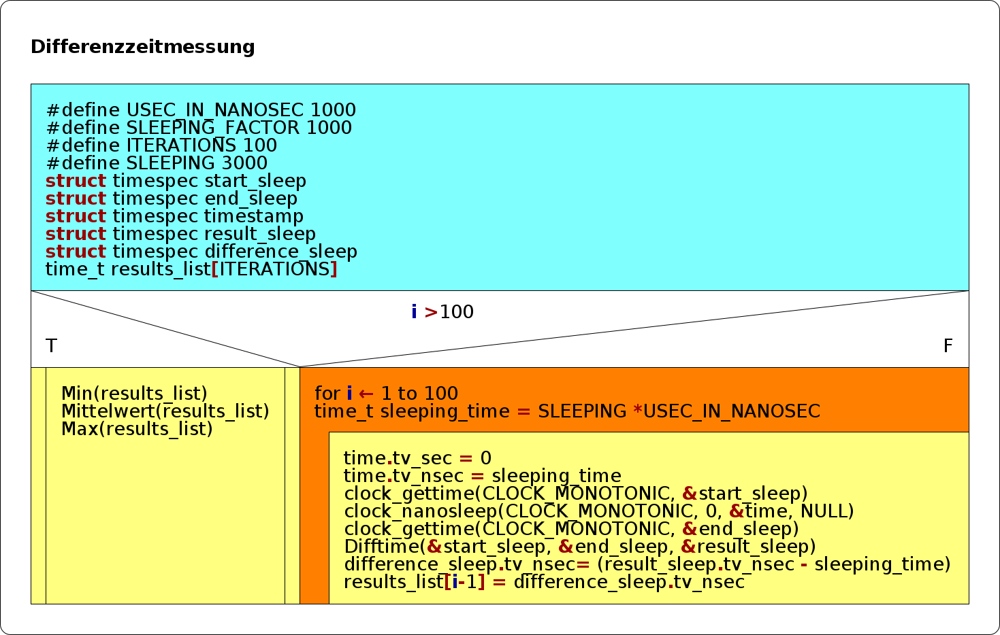
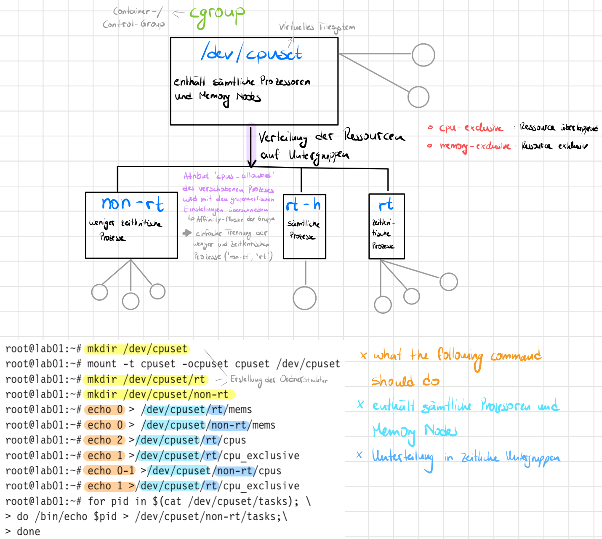
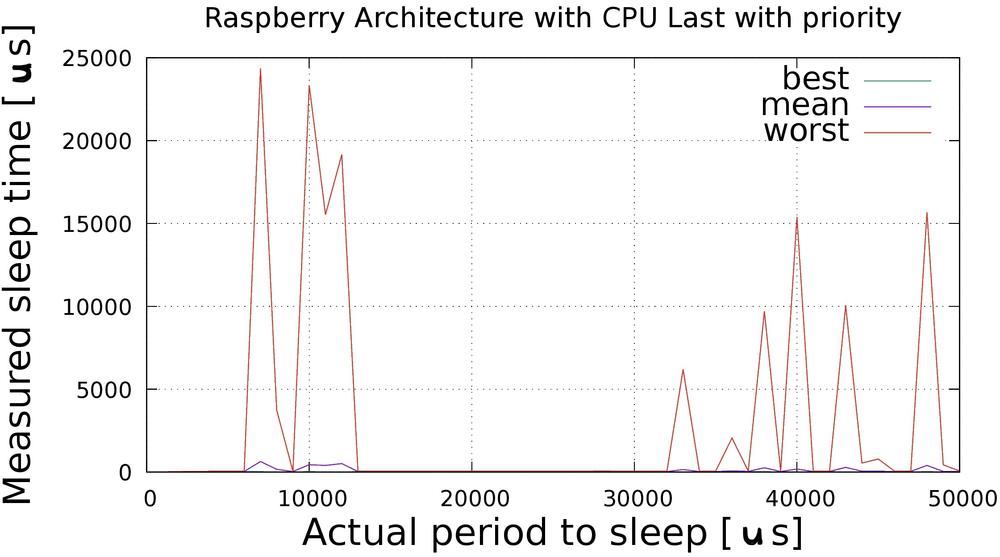
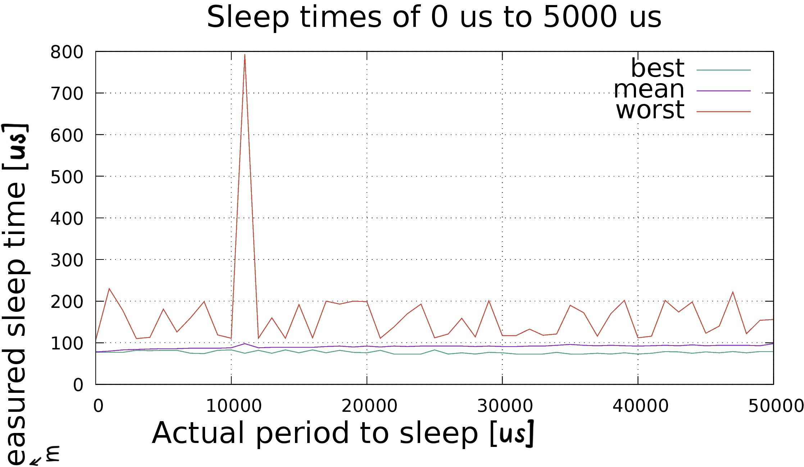
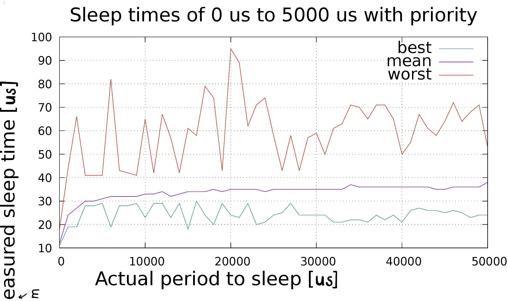
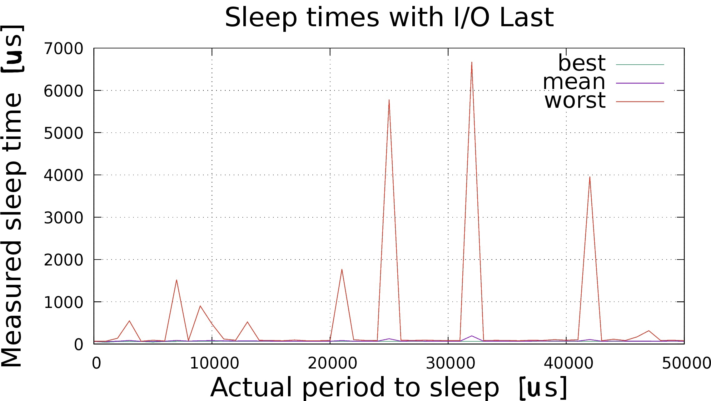
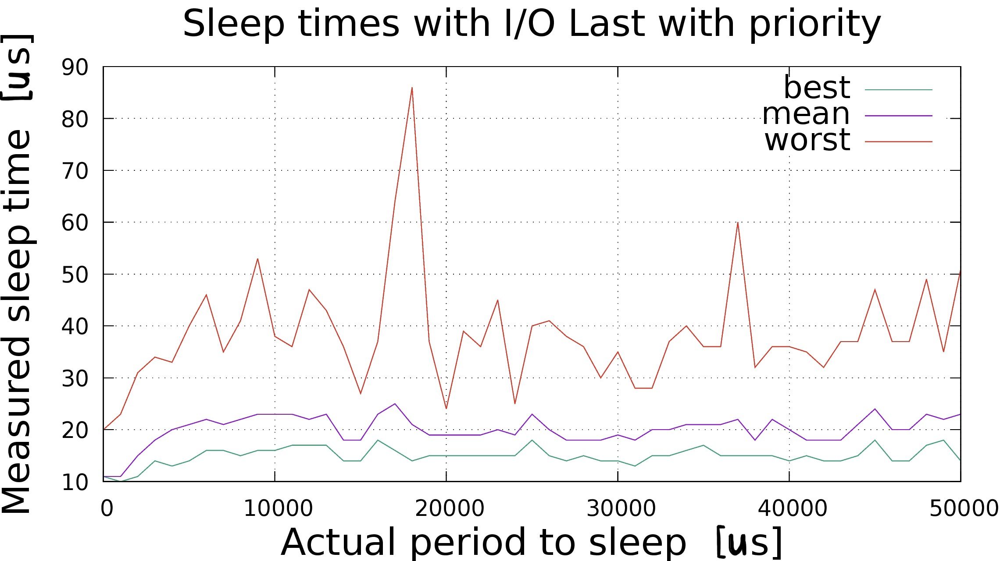
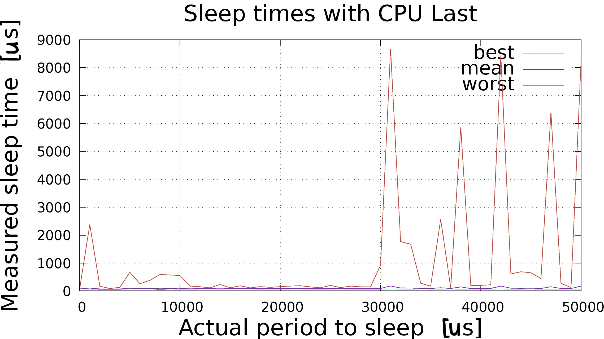
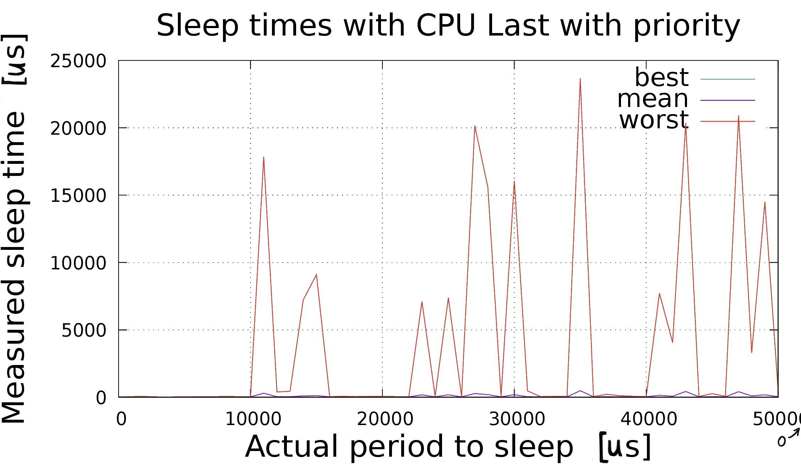

# Resy Lab Homework V2

### Gruppe: 1

### Name 1: jpkmiller

### Name 2: IsabellaSchoen

---

In dieser Hausaufgabe ging es um die Zeitmessung und die damit verbundenen Einflüsse auf die Zeit; gemessen auf unserem
Raspberry Pi. Jede Aufgabe enthält eine Beschreibung, die jeweiligen Messergebnisse und/oder Code, und die am Ende
dazugehörende ausführliche Beobachtung und Erklärung/Interpretation.

---

## Programmierung

### 1.1

> Ein Struktogramm ist eine strukturierte Darstellung von Codesequenzen. In diesem Fall stellt unser Struktogramm bzw. unser Programmablaufplan eine Zeitmessung von dem Systemcall `clock_nanosleep()` dar. Die Schlafenszeit wurde auf den Wert 3000 µs gesetzt – das sind 3000000 ns. Mit der Funktion `clock_gettime()` wird die wahre Zeitdauer der Schlafenszeit gemessen. Der Parameter **CLOCK_MONOTONIC** wurde sowohl für `nanosleep(...)` als auch für `gettime(...)`
gesetzt, da dieser Zeitgeber entsprechend seiner Auflösung vorwärtsläuft ohne dabei Zeitsprünge zu vollziehen. Außerdem wurde `nanosleep` die Flag 0 übergeben, da wir von einer relativen Zeitangabe ausgehen. Damit soll die übergebene Schlafenszeit eingehalten werden.\
Im Folgenden ist das Struktogramm dargestellt. Der aus dem Struktogramm erzeugte Code wurde als `struktogramm.c`
gekennzeichnet. Die in dem Struktogramm dargestellten Funktionen werden im Code in [Aufgabe 1.2](#12) definiert.



### 1.2

<a id="12"></a>

> Der Code `diffmessung.c` wurde aus dem Struktogramm erzeugt. Dieser wurde dennoch leicht abgändert und um einige Codezeilen ergänzt, um kompilierbar zu sein. Es wurde eine Schlafenszeit von `3000 µs` gewählt.

### 1.3

<a id="13"></a>

> Um gute Zeitmessungen mit der Realzeitpriorität durchzuführen, wird in dieser Aufgabe die Flag `-rt` eingebaut, welche die Realzeitpriorität aktiviert. Hierfür durchläuft das Programm den `arg`-Vector und führt eine `strcmp` mit diversen Flags durch. Bei Gleichheit, also Rückgabewert 0, wird das Flag aktiviert. Wie bereits in der letzten Abgabe, wurden hier Präprozessordirektiven mit angegeben. Damit lassen sich optional Debug-Nachrichten anzeigen:

```c
#ifdef
DEBUG
printf("DEBUG MESSAGE")
#endif
```

> Es wurde der Code aus dem Buch verwendet, um die Priorität zu setzen:

```c
#define
PRIORITY_OF_THIS_TASK 50
#define __USE_UNIX98 /* needed for PTHREAD_PRIO_INHERIT */
static pthread_mutex_t rtmutex;
static pthread_mutexattr_t attr;
char *Policies[] = { "SCHED_RR" };

struct sched_param SchedulingParameter;
if (flag_rt == 1)
{
    // setup rt
    pthread_mutexattr_init(&attr);
    pthread_mutexattr_setprotocol(&attr, PTHREAD_PRIO_INHERIT);
    pthread_mutex_init(&rtmutex, &attr);
    
    SchedulingParameter.sched_priority = PRIORITY_OF_THIS_TASK;
    if (sched_setscheduler(0, SCHED_RR, &SchedulingParameter) != 0)
    {
        perror("diffmessung: set scheduling priority failed\n");
        exit(-1);
    }
}
```

> Über die Funktion `pthread_mutexattr_setprotocol()` initialisieren wir einen Mutex, der mit der Prioritätsinversion umzugehen hat. Mit `__USE_UNIX98` wird die klassische Prioritätsvererbung, also Priority Inheritance, aktiviert. Wurde die Aktivierung vollzogen, wird über die Funktion `pthread_mutexattr_setprotoco()` der Wert für Priorität, hier 50, gesetzt. Das Scheduling-Verfahren orientiert sich anhand des RoundRobins:\
Jede Task wird nach einer bestimmten time slice unterbrochen, sodass jeder Prozess gleich behandelt und somit nicht vernachlässigt wird. **TO-DO**

### 1.4

<a id="14"></a>

> Der in der [Aufgabe 1.3](#13) erstellte Code, wird nun im Folgenden ausgeführt. Einmal mit und einmal ohne Realzeitpriorität. Die Ausgabe wird in [Aufgabe 1.6](#16) angezeigt.\
> `LOG-eine` enthält die Werte ohne Prioritäten und `LOG-rt-eine` die Werte mit Priorität. `Eine`, da wir hier nur eine Sleepingtime ausgewählt haben, und zwar 3000 µs.

### 1.5

<a id="15"></a>

> Wie bereits in der vorherigen Aufgabe ersichtlich wird, baut der Code auf dem Vorherigen auf, mit dem Unterschied, dass nun Schlafenszeiten im Intervall [0; 50000] µs im 1000-igen Schritt gemessen werden.\
> Dies wurde umgesetzt, indem eine weitere for-Schleife um den vorherigen Code definiert wurde. Auch hier sind die Ergebnisse wieder in [Aufgabe 1.6](#16) auffindbar.\
> `LOG` enthält die Werte ohne Prioritäten und `LOG-rt` die Werte mit Priorität.

### 1.6

<a id="16"></a>

> In dieser Aufgabe werden die Latenzzeiten  mit und ohne Realzeitpriorität gemessen. Damit die Ergebnisse später ausgewertet werden können,
> macht es Sinn, diese in eine Datei zu schreiben. Über eine `pipe` lässt sich der Ausgangskanal eines Prozesses beliebig umleiten.
> Das Speichern in einer Datei geschieht durch den Shell-Aufruf `(taskname) > (filename)`. Hierbei wird die Ausgabe von `taskname` nach `filename` umgeleitet.\
Die Ausgabe der Ergebnisse lautet: **Sollzeit | min Abweichung | durchschnittlich Abweichung | max Abweichung**

## eine Schlafenszeit

```sh
# ohne Last, ohne rt prio
pi@raspisa:~ $ ./diffmessung > LOG-eine
pi@raspisa:~ $ cat LOG-eine
3000 77 84 220
```

```sh
# ohne Last, mit rt prio
pi@raspisa:~ $ sudo ./diffmessung -rt > LOG-rt-eine
pi@raspisa:~ $ cat LOG-rt-eine
3000 19 26 42
```

## for-Schleife

```sh
# ohne Last, ohne rt prio
pi@raspisa:~ $ ./diffmessung > LOG
pi@raspisa:~ $ cat LOG
0 77 78 106
1000 77 80 230
2000 77 83 178
3000 82 84 110
4000 81 85 113
5000 82 86 181
6000 82 86 126
7000 75 87 160
8000 74 87 199
9000 82 87 119
10000 83 88 111
11000 75 98 793
12000 82 88 111
13000 75 89 160
14000 83 89 111
15000 76 89 192
16000 83 89 112
17000 76 91 200
18000 82 92 193
19000 77 90 200
20000 76 92 199
21000 82 90 111
22000 73 92 138
23000 73 91 170
24000 73 92 193
25000 83 92 112
26000 73 92 121
27000 76 92 159
28000 73 91 114
29000 77 92 201
30000 76 91 117
31000 73 91 117
32000 73 92 133
33000 73 92 118
34000 77 94 121
35000 73 96 190
36000 73 94 172
37000 75 93 116
38000 73 94 170
39000 76 93 202
40000 73 92 112
41000 75 93 116
42000 79 94 202
43000 78 93 174
44000 75 95 198
45000 78 93 123
46000 76 94 140
47000 79 94 222
48000 76 94 122
49000 79 93 154
50000 79 98 156
```

```sh
# ohne Last, mit rt prio
pi@raspisa:~ $ sudo ./diffmessung -rt > LOG-rt
pi@raspisa:~ $ cat LOG-rt
0 11 12 18
1000 19 24 44
2000 19 27 66
3000 28 30 41
4000 28 30 41
5000 29 31 41
6000 19 32 82
7000 28 32 43
8000 28 32 42
9000 29 32 41
10000 23 33 65
11000 29 33 42
12000 29 34 67
13000 23 32 57
14000 29 33 42
15000 18 34 61
16000 30 34 58
17000 24 34 79
18000 20 35 74
19000 29 34 43
20000 24 35 95
21000 23 35 89
22000 29 35 62
23000 20 35 71
24000 21 34 74
25000 24 35 58
26000 25 35 43
27000 29 35 58
28000 24 35 43
29000 24 35 57
30000 24 35 59
31000 24 35 50
32000 21 35 61
33000 21 35 63
34000 22 37 71
35000 22 36 70
36000 21 36 65
37000 24 36 71
38000 22 36 71
39000 24 36 65
40000 21 36 50
41000 26 36 55
42000 27 36 67
43000 26 36 61
44000 26 35 58
45000 25 35 64
46000 26 36 72
47000 25 36 64
48000 23 36 68
49000 24 36 71
50000 24 38 53
```

**die jeweilige Beobachtung und Interpretation findet in der Sektion [Auswertung](#Auswertung) statt, da die Messwerte
anhand der Plots deutlicher zu erkennen und somit besser zu erklären sind …**

### 1.7

## CPU-Last

> Folgendes Kommando wurde verwendet, um eine CPU-Last zu erzeugen.

```sh
$ while true; do /bin/dd if=/dev/zero of=bigfile bs=1024000 count=1024; done &
```

```sh
# mit Last, ohne rt prio
pi@raspisa:~ $ ./diffmessung > LOG-wLoad-CPU
pi@raspisa:~ $ cat LOG-wLoad-CPU
0 76 77 101
1000 69 102 2383
2000 61 72 169
3000 61 69 89
4000 61 73 131
5000 79 99 671
6000 79 89 259
7000 81 90 380
8000 48 97 589
9000 76 93 575
10000 64 96 552
11000 63 77 175
12000 73 90 152
13000 78 89 113
14000 63 74 233
15000 82 88 116
16000 72 89 183
17000 75 89 112
18000 62 84 154
19000 72 89 130
20000 65 91 153
21000 71 91 176
22000 73 90 188
23000 63 84 144
24000 64 82 114
25000 65 91 196
26000 77 91 121
27000 63 87 172
28000 66 87 147
29000 63 84 141
30000 67 92 919
31000 77 177 8669
32000 69 107 1769
33000 63 103 1676
34000 74 95 280
35000 68 88 168
36000 67 115 2564
37000 77 89 117
38000 64 146 5862
39000 68 89 192
40000 63 89 200
41000 69 90 224
42000 74 174 8431
43000 64 99 610
44000 66 95 688
45000 74 99 653
46000 63 90 446
47000 64 152 6403
48000 63 87 272
49000 68 87 124
50000 69 176 8224

```

```sh
# mit Last, mit rt prio
pi@raspisa:~ $ sudo ./diffmessung -rt > LOG-rt-wLoad-CPU
pi@raspisa:~ $ cat LOG-rt-wLoad-CPU
0 10 10 24
1000 11 19 52
2000 10 18 62
3000 11 13 29
4000 10 15 27
5000 10 13 30
6000 11 30 43
7000 29 33 43
8000 19 33 59
9000 29 33 47
10000 29 34 43
11000 12 299 17824
12000 30 41 397
13000 21 42 445
14000 12 104 7220
15000 18 125 9100
16000 28 34 44
17000 21 35 72
18000 12 28 54
19000 22 34 63
20000 14 29 71
21000 11 29 47
22000 24 34 49
23000 13 173 7107
24000 25 36 64
25000 22 182 7385
26000 24 36 57
27000 16 279 20151
28000 19 191 15573
29000 12 31 71
30000 14 193 16066
31000 26 41 471
32000 15 31 47
33000 12 33 68
34000 12 33 76
35000 17 484 23659
36000 22 37 54
37000 26 40 214
38000 11 34 116
39000 12 32 78
40000 17 30 50
41000 23 145 7711
42000 18 78 4070
43000 13 426 20353
44000 16 32 59
45000 25 40 269
46000 12 36 68
47000 12 411 20898
48000 16 101 3296
49000 15 182 14506
50000 12 43 543
```

**die jeweilige Beobachtung und Interpretation findet in der Aufgabe Auswertung statt, da die Messwerte anhand der Plots
deutlicher zu erkennen und somit besser zu erklären sind...**

## I/O-Last

> Folgendes Kommando wurde verwendet, um eine IO-Last zu erzeugen.

```sh
$ while true; do taskset -c 3 /bin/du / ; done &
```

```sh
# mit Last, ohne rt prio
pi@raspisa:~ $ ./diffmessung > LOG-wLoad-IO
pi@raspisa:~ $ cat LOG-wLoad-IO
0 60 61 69
1000 42 62 67
2000 62 68 138
3000 62 88 549
4000 62 64 67
5000 48 65 91
6000 62 67 75
7000 64 86 1521
8000 65 71 83
9000 65 80 901
10000 65 82 476
11000 67 77 119
12000 65 72 92
13000 65 78 523
14000 65 72 89
15000 64 70 88
16000 63 68 80
17000 65 68 97
18000 65 68 79
19000 64 67 81
20000 65 68 88
21000 65 84 1772
22000 64 69 103
23000 63 68 88
24000 66 68 85
25000 66 126 5780
26000 65 68 92
27000 66 72 88
28000 64 70 95
29000 65 69 86
30000 64 69 83
31000 63 69 82
32000 65 194 6671
33000 64 69 85
34000 63 69 89
35000 64 67 87
36000 65 67 81
37000 65 70 91
38000 67 72 87
39000 66 73 106
40000 66 72 92
41000 64 70 103
42000 65 107 3963
43000 64 67 80
44000 65 72 115
45000 65 71 85
46000 65 71 171
47000 65 71 318
48000 65 68 84
49000 67 72 92
50000 65 69 81
```

```sh
# mit Last, mit rt prio
pi@raspisa:~ $ sudo ./diffmessung -rt > LOG-rt-wLoad-IO
pi@raspisa:~ $ cat LOG-rt-wLoad-IO
0 11 11 20
1000 10 11 23
2000 11 15 31
3000 14 18 34
4000 13 20 33
5000 14 21 40
6000 16 22 46
7000 16 21 35
8000 15 22 41
9000 16 23 53
10000 16 23 38
11000 17 23 36
12000 17 22 47
13000 17 23 43
14000 14 18 36
15000 14 18 27
16000 18 23 37
17000 16 25 64
18000 14 21 86
19000 15 19 37
20000 15 19 24
21000 15 19 39
22000 15 19 36
23000 15 20 45
24000 15 19 25
25000 18 23 40
26000 15 20 41
27000 14 18 38
28000 15 18 36
29000 14 18 30
30000 14 19 35
31000 13 18 28
32000 15 20 28
33000 15 20 37
34000 16 21 40
35000 17 21 36
36000 15 21 36
37000 15 22 60
38000 15 18 32
39000 15 22 36
40000 14 20 36
41000 15 18 35
42000 14 18 32
43000 14 18 37
44000 15 21 37
45000 18 24 47
46000 14 20 37
47000 14 20 37
48000 17 23 49
49000 18 22 35
50000 14 23 51
```

**die jeweilige Beobachtung und Interpretation findet in der Aufgabe Auswertung statt, da die Messwerte anhand der Plots
deutlicher zu erkennen und somit besser zu erklären sind …**

### 1.8

> Unsere Raspberry Pi besitzt eine **Multicore Architektur**. Die Aufgabe von einer Mehrkernmaschine besteht in der `Einteilung von Tasks in Realzeit- und Nichtrealzeittasks`. Hierbei müssen vor allem die zeitlichen Parameter der Prozesse und die sich daraus ergebende Gesamtauslastung bestimmt werden. Außerdem müssen einzelnen CPU-Kernen Interrupts zugewiesen werden, um ein deterministisches Zeitverhalten garantieren zu können. Dafür sorgt die `Firmware BIOS`. Das BIOS steht für **Basic Input/Output System** und liegt auf einem kleinen Chip auf der Hauptplatine.\
**Interrupts**: nicht bei jeder Hardware lässt sich jedem Prozesskern ein Interrupt zuweisen. Oftmals hat dies hardwaretechnische Gründe. Um dieses Problem leicht zu umgehen, wird die Funktion `sched_setaffinity()` angewendet, womit jedem Rechenprozess eine Affinität mitgegeben wird. Die Affinität kennzeichnet auf welchen Prozessoren ein Prozess abgearbeitet werden darf.\

> Unser Vorgehen für diese Aufabe basiert auf den Buchseiten 164f.
> Die folgende Abbildung visualisiert, wie CPU Kerne für bestimmte Tasks reserviert werden können.


> **Vorgehensweise**: Das Ganze baut auf `cpuset` auf, einem pseudo-filesystem (nichts reales), das die Schnittstelle zum `cpuset` Mechanismus' des Kernels ist.
> Um damit arbeiten zu können, muss der Ordner `/dev/cpuset` angelegt werden und unter `cpuset` gemountet werden. Anschließend können sogenannte `cgroups` angelegt werden, über die die Zuordnung der Rechnerkerne funktioniert. Der Kernel erkennt sobald `cgroups` angelegt wurden und erstellt
> Dateien, über die diese konfiguriert werden können. Auf der [man-Page](https://linux.die.net/man/7/cpuset) finden sich alle Informationen zu den Konfigurationen und Beispiele.
>
> Um die Konfiguration vorzunehmen, haben wir ein separates Shell-Skript geschrieben, dass nach einem `fork()` mittels `execve` aufgerufen wird. Der Eltern-Prozess, also `diffmessung.c`, wartet bis die Konfiguration durch `rtarch.sh` vorgenommen wurde und führt anschließend die Schlafmessungen durch.
> Wir haben leider viel zu spät gesehen, dass es bereits [Bibliotheken](https://linux.die.net/man/3/cpuset) gibt, über die `cpuset` konfiguriert werden kann.
> Im Grunde genommen gibt es aber keinen Unterschied, außer, dass das Shell-Skript ohne großen Aufwand direkt ausgeführt werden konnte und damit rasch die Kombinationen aus diversen Konfigurationen ausprobiert und getestet werden konnten.\
> \
> Nachdem das Shell-Skript die Gruppen erstellt und konfiguriert hat, überträgt es alle aktiven Tasks, die sich in `/dev/cpuset/tasks` befinden, nach `/dev/cpuset/non-rt/tasks`.
> Dem Skript wird ebenfalls die `PID` vom Eltern-Prozess mitgegeben – diese wird in `/dev/cpuset/rt/tasks` geschrieben und erhält damit eine separate CPU.
> Anschließend wird der Eltern-Prozess forgesetzt.

> **Code-Erklärung**: im Folgenden ist ein Codeausschnitt, der bei `diffmessung.c` hinzugefügt wurde, dargestellt.
> Wenn das `flag_rtarch` gesetzt wurde, wird über einen `fork` ein separater Prozess gestartet, der die oben beschrieben Konfiguration vornimmt.
> Aus einer vorherigen Vorlesung bekannt, wird fork() als eine fast exakte Kopie (=child) von dem laufenden Prozess (=parent) angesehen und bevorzugt. Mittels `execve` kann das Code-Segment des forks überschrieben werden.

```c
if (flag_rtarch == 1)
{
    int parent_pid = (int)getpid();
    int child_pid = fork();
    if (child_pid <= -1)
    {
        perror("Fork failed\n");
        exit(1);
    }
    else if (child_pid == 0)
    {
        // child
#ifdef DEBUG
            printf("diffmessung: child with pid %d\n", (int)getpid());
#endif
        char pid_as_string[10];
        sprintf(pid_as_string, "%d", parent_pid);
    
        // rtarch set-ups the rt environment, needs root privilege to write to /sys/ fs
        char *argument_list_rmmod[] = {"./rtarch.sh", pid_as_string, NULL};
        execvp("./rtarch.sh", argument_list_rmmod);
    }
    else
    {
#ifdef DEBUG
            printf("diffmessung: parent with pid %d\n", parent_pid);
            printf("diffmessung: waiting for child\n");
#endif
        wait(&child_pid);
    }
}
```

### CPU-Last

```sh
# mit CPU-Last, mit rt prio
0 9 10 15
1000 10 11 19
2000 11 17 32
3000 24 30 46
4000 26 31 49
5000 29 32 48
6000 26 32 50
7000 28 637 24345
8000 12 165 3750
9000 19 31 47
10000 24 443 23328
11000 13 403 15536
12000 18 512 19159
13000 23 30 55
14000 22 30 53
15000 20 35 55
16000 29 35 49
17000 29 37 58
18000 11 29 61
19000 14 27 56
20000 18 32 55
21000 29 39 54
22000 20 37 56
23000 13 33 54
24000 17 36 54
25000 14 36 55
26000 30 40 53
27000 13 34 58
28000 14 27 65
29000 25 38 55
30000 14 34 57
31000 22 39 56
32000 15 34 58
33000 13 150 6198
34000 11 34 56
35000 14 32 57
36000 18 72 2053
37000 30 46 63
38000 21 260 9699
39000 15 34 58
40000 11 187 15387
41000 14 35 57
42000 29 41 57
43000 16 288 10052
44000 20 52 549
45000 16 55 791
46000 14 37 57
47000 13 38 57
48000 21 402 15669
49000 14 46 438
50000 14 38 71
```



### I/O-Last

Folgender Lasttest war leider nicht möglich, da `cpuset` benutzt wird, welches sich nicht von `sched_set_affinity()`
beeindrucken lässt: `$ while true; do taskset -c 3 /bin/du / ; done &`

## Interpretation

> **Beobachtung**: wird der in dieser Aufgabe getestete `CPU-Lasttest` bei Aktivierung der RT-Architektur mit dem vorherigen CPU-Lasttest ohne Architektur verglichen, sehen beide Plots zunächst sehr ähnlich aus. 
> Der Unterschied liegt darin, dass die RT-Architektur weniger Sprünge besonders bei den durchschnittlichen Abweichwerten aufweist. Ansonsten ist keine Veränderung bemerkbar.
> **Interpretation**: es gibt verschiedene Realzeitarchitekturen, in diesem Fall fokussieren wir uns sogar auf eine Betriebssystemarchitektur, womit ein Realzeitverhalten sichergestellt werden kann.\
> Zunächst wurde der Code so geschrieben, um die Prozesse nach ihrer zeitkritischen Intensität zu klassifizieren, wie bereits in der vorherigen Definition erklärt. Durch diese Unterteilung wird "der Prozessor für Tasks mit Prioritäten freigeschaufelt."
> **Weitere Verbesserungsvorschläge**:
> * Eine Möglichkeit bestünde darin, den Kernel mit `RT_PREEMT` zu patchen bzw. ein RT-Betriebssystem zu installieren. Damit erhoffen wir uns mehr Konfigurationsmöglichkeiten über `cpuset` hinaus.
> * [`nohz`](https://www.suse.com/c/cpu-isolation-nohz_full-part-3/) Bootparameter setzen, wodurch der Kernel versucht so wenig wie möglich die CPU in Anspruch zu nehmen. Diese Möglichkeit haben wir im Internet gefunden. Für diese Aufgabe hat `cpuset` jedoch vollkommen ausgereicht.

## Auswertung

<a id="Auswertung"></a>

> `gnuplot` ist ein kommandozeilengesteuertes Pogramm zur graphischen Darstellung von Messdaten. Dieses Programm wird verwendet, um die gemessenen Daten (in diesem Fall wurde sich auf die for-Schleife von Aufgabe 1.4 konzentriert mit den Sleeptimes = [0;50000] us) in eine .eps-Datei zu formatieren, um diese im weiteren Vorgang zu ploten. Jeder Plot enthält einen aussagekräftigen Titel, sodass verständlich ist, welche Messdaten der Plot darstellt. Die minimale, durchschnittliche und maximale **Abweichung von der Sollzeit** sind in jeweils anderen Farben dargestellt.

```gp
set title "{/=20 ...}"
set terminal postscript eps color colortext
set xlabel "{/=20 ... [microseconds]}\n"
set ylabel "{/=20 ... [microseconds]}"
set term eps
set output filename . '.eps'
set grid
set autoscale
set style data lines
show style data
plot filename using ($1):($2) title "{/=17 best}" lt 10,\
     filename using ($1):($3) title "{/=17 mean}" lt 9, \
     filename using ($1):($4) title "{/=17 worst}" lt 7
set output
```








### ohne Last

> **Beobachtung**: bei der Messung ohne Last, wurde ein Intervall von 0 µs bis 50000 µs gewählt, welches in 1000er Schritten für die Werte der Schlafenszeit gemessen wurde. 
> Die minimalen und durchschnittlichen Abweichwerte halten einen relativ konstanten Wert. Es sind jedoch auch starke Schwankungen bei den maximalen Abweichwerten gut erkennbar. 
> Wird nun die Realzeitpriorität mit in die Zeitmessung einbezogen, verbessern sich die Abweichwerte um ein fast 10-faches. Schwankungen sind jedoch vor allem bei maximal erkennbar, wenn auch um einiges geringer als davor.\
**Interpretation**: in der Aufgabe stand, dass es einige Abhängigkeiten zwischen der Zeitdauer eines Zeitauftrags und einem Fehler gibt und es somit bestimmte Schlafenszeiten gibt, die anhand der Werte unterschiedliche Fehler aufzeigen. 
> Mit Fehler ist hierbei die Abweichung vom Sollwert gemeint. Diese Abhängigkeit konnte sowohl mit als auch ohne Realzeitpriorität festgestellt werden, da es starke Schwankungen sowohl bei den maximalen als auch den minimalen Abweichwerten gibt. 
> Daraus folgt, dass das System pro Schlafenszeit immer ein anderes Verhalten aufweist. Es gibt Zeiten, die mehr oder eben weniger Einfluss haben. 
> Die Messung mit Priorität weist jedoch häufigere und stärkere Schwankungen auf, was anhand des Round-Robin-Schedulingverfahrens erklärt werden kann. Bei diesem Verfahren wird jede Task nach einer bestimmten time slice unterbrochen. Das führt zu einer Veränderung in der Zeitmessung. 
> Sobald ein Task unterbrochen wird, wird die Interrupt-Service-Routine im Kernel-Mode ausgeführt. Die Zeitmessung läuft dabei weiterhin.

### I/O-Last

> **Beobachtung**: die gemessenen Schlafzeiten werden über einen `printf`-Aufruf ausgegeben. `printf`s sorgen jedoch für eine I/O-Last auf dem Raspberry und verfälschen bzw. verschlimmern die jeweiligen Messwerte. Aus diesem Grund, wurde ein I/O Last-Test vollzogen, welcher diese I/O Last verstärkt, sodass die Auswirkung der Inputs und Outputs auf die Zeitmessung aufgezeigt werden kann. Diese Last wurde sowohl mit als auch ohne Realzeitpriorität durchgenommen.\
Werde die Werte betrachtet und miteinander verglichen, sind hin und wieder starke Schwankungen zu sehen, besonders für die Messung der maximalen Abweichung bei beiden Arten von Messungen. Jedoch sind die Werte mit Priorität wesentlich besser bzw. weisen eine geringere Abweichung vom Sollwert auf.\
**Interpretation**: wie auch bereits in der vorherigen Erklärung, verbessert das Round-Robin-Verfahren zwar die Werte, stärkere Schwankungen treten jedoch besonders beim maximalen Wert auf, da Interrupts.

### CPU-Last

> **Beobachtung**: beim zweiten Test wurde eine Last erzeugt, die einen direkten Einfluss auf das Betriebssystem und zwar auf die CPU welche zu 100%ig ausgelastet werden sollte. Auch hier wurde der Test mit und ohne Realzeitpriorität durchgeführt und eine wesentliche Veränderung hat stattgefunden. Waren die Abweichungen ohne dieser Last in einem ausreichenden Abweichzustand, haben sich hierbei die Werte um ein fast 100-faches verändert bzw. die Abweichung ist um ein 100-faches gestiegen. Dennoch sind, wie bereits beim I/O-Lasttest, auch hier die Abweichwerte mit Priorität wesentlich geringer. Starke Schwankungen sind beim maximalen Abweichwert dennoch stark erkennbar.\
**Interpretation**: hier ist der Einfluss des Verfahrens deutlich zu erkennen. Die Schwankungen sind bei allen drei Messwerten (minimal, durchschnittlich, maximal) stärker vorhanden, dennoch ist eine erheblich Verbesserung der Abweichwerte erkennbar. Dies lässt sich wieder auf das Scheduling-Verfahren zurückführen, welches durch die time slices Interrupts verursacht, jedoch die Tasks gleichwertig behandelt.

### alle zusammen

> **Beobachtung**: Die erste Beobachtung, die aus einem Blick auf alle Plots zusammen gewonnen werden kann, ist, dass die Werte mit Priorität wesentlich besser bzw. die Abweichung vom Sollwert geringer sind. Am besten schneidet vor allem die I/O Last mit Priorität ab, am schlechtesten hingegen die CPU-Last sowohl mit als auch ohne Realzeitpriorität.\
**Interpretation**: Wie von der Definition her bereits wissend, bedeutet Lasterzeugung meist immer ein negativer Einfluss auf das Betriebssystem oder dem uns hier vorliegenden Raspberry Pi. Abhängig jedoch von dem Code, der ausgeführt wird, hat jede Last oder die Durchführung ohne Last, einen anderen Einfluss. Hierbei wird besonders festgestellt, dasss die I/O-Last ohne Priorität den mit am höchsten Einfluss auf die Zeitmessung hat. Lassen wir zunächst die CPU-Last außen vor, denn dies ist verständlich, dass wenn die CPU zu 100% ausgelastet wird, dass dies immer einen negativen Einfluss hat. Die I/O-Last ist hierbei jedoch interessantet. Denn wie bereits in der Aufgabenstellung erwähnt, hat ein printf() in diesem Fall einen Einfluss auf unser Programm.\
Wird bei allen Tests die Realzeitpriorität aktiviert, verringern sich alle Abweichwerte, auch wenn noch einige starke Sprünge erkennbar sind. Die Realzeitpriorität arbeitet nach dem Schema des Round-Robins. Hierbei wird jede Task für eine bestimmte time slice ausgeführt, welche sich meist aus der Länge der jeweiligen Jobs ergibt. Dies hat den Vorteil, dass jede Task vorgezogen wird, somit nicht "stirbt", und die Ergebnisse deterministischer werden. Die Sprünge in den Plots zeigen jedoch auch den negativen Einfluss verursacht durch Task-Switches bzw. den Interrupts.
