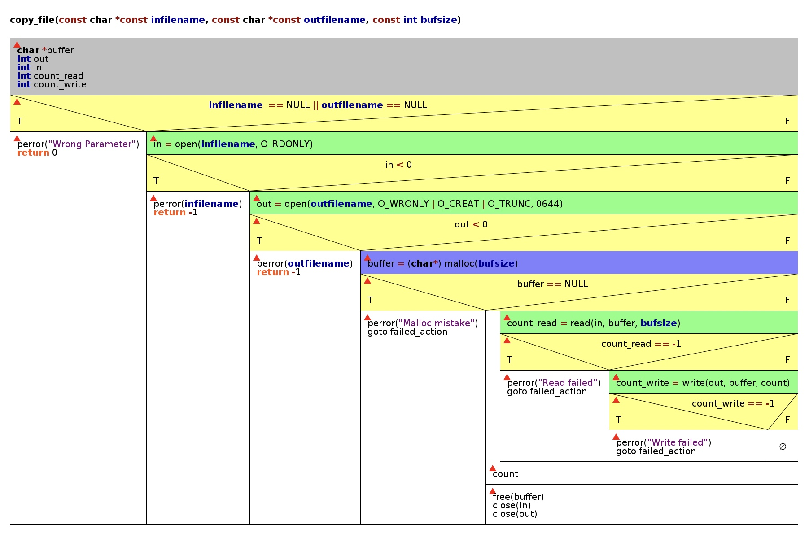
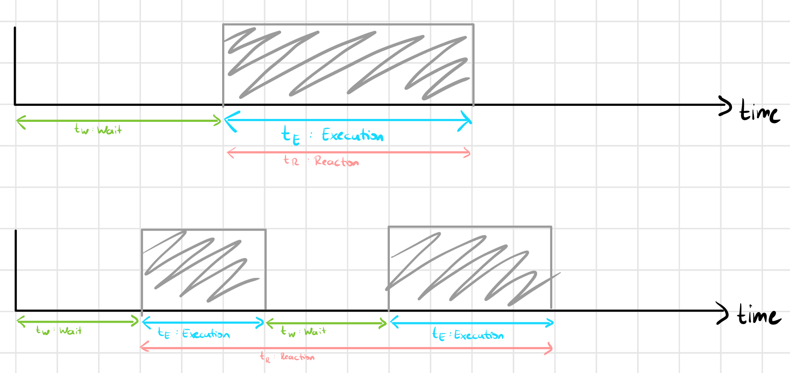
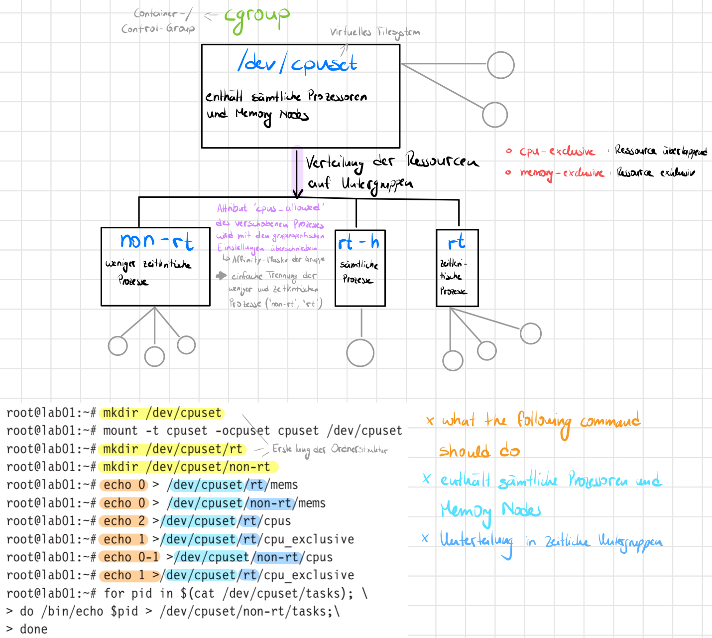

# V3

## Filecopy

---

## 1.1 - Systemcall

<a id="11"></a>

> Recherchieren Sie die Systemcalls times(), clock_gettime(), open(), close(), `read()` und write() (jeweils Funktion, Parameter, Rückgabewerte).

#### `clock_t times(struct tms *buf)`

Diese Funktion speichert die momentanen Prozesszeiten in den `struct tms`, über das mithilfe von `*buf` zugegriffen
werden kann. Der struct ist in `<sys/times.h>` definiert und ist folgendermaßen aufgebaut:

```c
struct tms
{
    clock_t tms_utime;  /* user time */
    clock_t tms_stime;  /* system time */
    clock_t tms_cutime; /* user time of children */
    clock_t tms_cstime; /* system time of children */
};
```

Die Funktion `times()` hat als Rückgabewert die Anzahl der Clock-Ticks (= clock ticks → clock_t), welche seit einem
beliebig ausgewählten Zeitpunkt in der Vergangenheit vergangen sind. Der Typ `clock_t` ist eine relative Zeitmessung von
der CPU-Zeit, die seit dem Start eines ausgewählten Zeitpunkts, also eines Prozesses, verwendet wurde. Die eigentliche
Absicht dahinter ist die Darstellung der **verwendeten CPU-Zeit**.

#### `int clock_gettime(clockid_t clk_id, struct timespec *tp)`

Diese Funktion gibt die Sekunden und Nanosekunden an, die seit dem 01.01.1970 vergangen sind. Das Argument `clk_id` ist
die Kennung einer Uhr, auf die reagiert werden soll. Die vier Varianten sind im Folgenden aufgezählt. Das Argument `*tp`
hingegen ist ein Pointer auf die Instanz `struct timespec`, die geschrieben wird.

```c
struct timespec
{
time_t   tv_sec;        /* seconds */
long tv_nsec;       /* nanoseconds */
};
```

**CLOCK_REALTIME**\
Dieser Zeitgeber repräsentiert die systemweite, aktuelle Zeit seit dem 01.01.1970 UTC (Unix-Zeit). Der Zeitgeber
reagiert sowohl auf Zeitsprünge als auch auf unterschiedliche Taktungen.\
**CLOCK_MONOTONIC**\
Dieser Zeitgeber läuft entsprechend der Auflösung stets vorwärts. Zeitsprünge werden nicht vollzogen, Taktungen dafür
schon.\
**CLOCK_MONOTONIC_RAW**\
Dieser Zeitgeber ist Linux-spezifisch und reagiert weder auf Zeitsprünge noch auf in dem Betrieb geänderte Taktungen.\
**CLOCK_PROCESS_CPUTIME_ID**\
Dieser Zeitgeber erfasst die Verarbeitungszeit des zugehörigen Prozesses, jedoch ausschließlich auf einem
Singlecore-System.\
**CLOCK_THREAD_CPUTIME_ID**\
Dieser Zeitgeber erfasst die Verarbeitungszeit des zugehörigen Threads, jedoch ausschließlich auf einem
Singlecore-System. \

Der Rückgabewert der Funktion kann 0 für success oder -1 für failure sein.\
Die Fehlermeldung könnte bedeuten, dass entweder `tp` außerhalb des zugänglichen Adressspeichers zeigt oder die
angegebene `clk_id` nicht auf dem System unterstützt wird.

### `int open(const char *pathname, int flags, mode_t mode)`

Der Systemcall `open()` öffnet eine Datei über einen angegebenen Dateipfad und gibt bei Erfolg den `filedescriptor`, der
auf diese Datei zeigt zurück. Der Filedescriptor ist eine eindeutige, positive, dezimal Zahl, über die mithilfe
einer `File Descriptor Table` die File Pointer zur `i-Node` gefunden werden können. Dabei handelt es sich um eine
Datenstruktur, die der Identifikation von Dateien und Ordnern dient.\
Der Zeiger `pathname` verweist somit auf den Dateipfad in welchem die Datei gespeichert ist - auf die Datei zeigt er
jedoch nicht direkt; `flags` gibt die Möglichkeiten an, was mit der Datei alles gemacht werden darf; und `mode` zeigt
die Rechte des Nutzers auf.\
Häufig in Betriebssysteme verwendete flags sind:\
**O_CREAT**\
Eine neue Datei darf erstellt werden, wenn beispielsweise der Dateipfad nicht existiert.\
**O_TRUNC**\
Wenn die Datei bereits existiert, darf die Datei überschrieben werden, wenn...\
**O_WRONLY**\
...dieser Flag existiert, welcher das Schreiben auf/in einer Datei bestätigt.\
**S_IRWXU**\
Rechte des Nutzers für die Datei: read, write, execute\
\
Der Rückgabewert für open() ist entweder -1, wenn zum Beispiel der Dateipfad ungültig ist, oder die Rückgabe des neuen
Filedescriptors.

### `int close(int fd)`

Der Systemcall `close()` schließt einen durch `open()` geöffneten Dateideskriptor, sodass keine weitere Verarbeitung
(Read und Write) vorgenommen werden kann und auch kein Verweis auf eine Datei vorhanden ist. Vorstellbar wie der Aufruf
von free(), welcher auch am Ende des Programms stattfindet.\
Der Rückgabewert ist entweder 0 bei success oder -1 bei failure.\
Mögliche Fehler sind beispielsweise, dass `fd` kein gültiger offener Dateideskriptor ist, der Aufruf des Systemcalls
unterbrochen oder ein I/O vorgenommen wurde.

### `ssize_t read(int fd, void *buf, size_t count)`

Mithilfe von `read()` lassen sich Inhalte von Dateien lesen. Dabei wird ein File Descriptor durch das Argument `fd`
und ein Zeiger auf einen Puffer `*buf` sowie die Anzahl an Bytes `count`, die gelesen werden sollen, übergeben. Der
Systemcall gibt die Anzahl der gelesenen Bytes zurück. Dabei kann diese Zahl geringer als `count` sein, wenn
beispielsweise von einer `pipe` oder von einer Datei gelesen wird, in der gar nicht so viele Bytes stehen. Der
Rückgabewert -1 indiziert, dass ein Fehler aufgetreten ist.

### `ssize_t write(int fd, const void *buf, size_t nbytes)`

Der Systemcall `write()` ist für das Schreiben in Dateien zuständig. Zuvor muss die Datei mittels `read` geöffnet worden
sein, da dieser Befehl einen File Descriptor `fd` erwartet. Wie auch bei `read`, wird ein Puffer `buf`, aus dem gelesen
wird, und die Anzahl zu schreibender Bytes `nbytes` übergeben.\
Sollte ein Fehler auftreten, wenn zum Beispiel der Aufruf unterbrochen wird oder der Filedescriptor nicht verfügbar ist,
wird der Wert -1 zurückgegeben.

### 1.2 - Struktogramm

> Skizzieren Sie ein Struktogramm für eine Funktion copy_file(char *infilename, char *outfilename, int bufsize).

Ein Struktogramm ist eine strukturierte Darstellung von Codesequenzen. In diesem Fall stellt unser Struktogramm
respektive unser Programmablaufplan den Ablauf unserer Funktion `copy_file()` dar. In der Funktion sollen die Daten von
einer Eingabedatei in eine Ausgabedatei kopiert werden. \
Hierfür wird zunächst der Aufruf des Systemcalls `open()`auf beide Dateien angewendet, um diese zu öffnen. Dem User wird
für die **Eingabedatei** nur das Recht des Lesens übergeben; ausdrückbar durch die Flag `O_RDONLY`. Bei der **
Ausgabedatei** hingegen wird der Flag `O_WRONYL` für das Schreiben in die Datei, `O_CREAT` für die Erstellung einer
neuen Datei und `O_TRUNC` für das Überschreiben der Datei angegeben. Der Nutzer bekommt das Recht `0664`für die
Ausgabedatei: \
0 → -, owner → write and read, users in file group → read, users not in file group → read\
Ist der Aufruf von `open()` bei beiden Dateien gelungen, wird mit der Hilfe eines Pointers `buffer` und dem
Systemcall `read()` der Inhalt der Eingabedatei in einen Puffer gespeichert und anschließend in die Ausgabedatei mit dem
Systemcall `write()` eingelesen. Für das Einlesen wird eine do-while-Schleife verwendet.\
Sind alle Daten von der Eingabedatei in die Ausgabedatei eingelesen worden, werden mit dem Aufruf `close()` beide
Dateien geschlossen, um eine Wiederverwendung zu umgehen.\
Im Folgenden ist das Struktogramm dargestellt. Der aus dem Struktogramm erzeugte Code wurde als struktogramm.c
gekennzeichnet. Die in dem Struktogramm dargestellten Funktionen werden im Code in [Aufgabe 1.4](#14) definiert.



### 1.3 - Konsoleneingabe

> Erzeugen Sie eine Datei /tmp/foo, sodass diese eine Größe von genau 50 MByte hat.

<a id="13"></a>

In dieser Aufgabe sollte für die kommenden Aufgaben eine Datei erstellt werden. Für den Aufruf wurden folgende Parameter
verwendet:

* `bs`: sowohl für Ein- und Ausgabe sollen Bytes verwendet werden. Damit wird auch angegeben, wie viele Bytes
  geschrieben werden sollen. Hier: 1k
* `count`: Anzahl an Wiederholungen. Hier: 50k (50000)

Wenn `bs` mit `count` multipliziert wird, also 1.000 Bytes * 50.000 = 50.000.000 Bytes = 50 MByte

```sh
$ dd if=/dev/urandom of=/tmp/foo bs=1k count=50k
51200+0 records in
51200+0 records out
52428800 bytes (52 MB, 50 MiB) copied, 3.3064 s, 15.9 MB/s
```

Hierbei wird eine Datei mit dem Namen `foo` in dem Unterordner `tmp` abgespeichert. Die Größe für die Datei beträgt 50k,
hier ist k als MByte zu interpretieren. Das `urandom` wird als random interpretiert.\
Dieser Aufruf geschieht mit dem Befehl `dd`, welcher im Internet wie folgt interpretiert wird:\
`dd is an application that will “convert and copy a file”`. Somit kann mit diesem Befehl eine Datei erstellt werden, wie
hier für uns gewollt.\
Fazi für die Bedeutung des Befehls im Terminal: **make a file of 1k random bytes**

### 1.4 - Code schreiben

> Setzen Sie das Struktogramm in C-Code um. Ergänzen Sie noch die Funktion main(), die copy_file() mit den Parametern "/tmp/foo", "/tmp/copy" und einer Buffergröße von 128 aufruft. Verwenden Sie intern zum Lesen und Schreiben die Systemcalls `read()` und `write()`.

<a id="14"></a>

In dieser Aufgabe sollten wir das vorgegebene Codefragment um eine main() Funktion sowie um den eigentlichen
Kopiervorgang erweitern. Die Funktion nimmt die Parameter `infilename`, `outfilename` sowie `bufsize` entgegen.

Zunächst wird die `main()` Funktion beschrieben:
Diese bereitet alles für den Kopiervorgang vor und ruft die `copy_file` Funktion mit den Parametern "/tmp/foo" als
Ausgangsdatei, "tmp/copy" als Eingangsdatei und 128 als Puffergröße auf.

In der Funktion `copy_file` wird zunächst die Eingangsdatei "/tmp/copy" und anschließend die Ausgangsdatei "/tmp/foo"
mithilfe von `open()` geöffnet. Dabei wird jeweils ein Filedescriptor zurückgegeben. Nachdem diese auf Fehler überprüft
wurden, wird ein 128 Byte großer Puffer reserviert, in den mithilfe von `read()` reingelesen und mit `write()`
rausgelesen wird. Wenn die Reservierung des Speichers und weiter unten im Code andere Methoden fehlschlagen, springt das
Programm mittels `goto` Befehl an eine Stelle nach `return 0` und schließt alle Filedescriptoren.

Wenn das Programm ohne Fehler läuft wird nach der Reservierung die Schleife ausgeführt. In dieser wird `read()` der
Filedescriptor für die Eingangsdatei, der Zeiger auf den reservierten Puffer sowie die Anzahl zu lesenden
gegeben. `read()` schreibt dann aus der Datei in den Puffer und gibt anschließend die Anzahl gelesener Bytes zurück.
Dieser Rückgabewert wird dazu genutzt die Schleife abzubrechen, wenn es nichts mehr zu lesen hat - also 0 Bytes - und um
den Lesevorgang auf Fehler zu überprüfen.

Anschließend findet der Schreibvorgang statt, bei dem `write()` 128 Bytes aus dem Puffer liest und mithilfe des
Filedescriptors auf die Ausgangsdatei zugreift und reinschreibt. Auch hier wird wieder überprüft, ob Fehler
stattgefunden haben.\
Hierbei muss auf Folgendes geachtet werden: **sind alle Bytes von read() in write() übernommen word?***\
Dies findet mit folgender Abfrage statt:

```c
ret = 0;
while (ret != count)
{
  int tmp = write(out, buffer + ret, count - ret);
  if(tmp == -1)
  {
    perror("copy_file: write\n");
    goto failed_action;
  }
  ret += tmp;
}  
```

Wir wollen wissen, ob alle Bytes von `write` auch wirklich in die Eingabedatei geschrieben wurden. Dafür haben wir die
Hilfsvaribale `ret`, welche mit der Anzahl der von `read` ausgelesenen Bytes verglichen wird. Sind alle übergebenen
Bytes geschrieben, sind wir fertig. Ansonsten wird `write` immer wieder
aufgerufen: `write(out, buffer + ret, count - ret)`. Zu beachten sind die zwei Parameter `buffer` und `count`. Der
Startpunkt für das Schreiben muss angepasst werden, damit die noch zu fehlenden Bytes (`+`) und nicht zu viel
geschrieben wird. So auch die Byteanzahl, indem wir die durch `read` ausgelesenen Bytes mit den momentanen,
geschriebenen Bytes voneinander abziehen (`-`). Wie bereits bekannt, gibt uns `write` die Anzahl der zu schreibenden
Bytes zurück. Damit dies auch korrekt funktioniert, wird am Ende der Wert von `ret` mit dem Rückgabewert von `write`
erhöht. Dadurch findet die eigentliche Kontrolle, ob alle zu schreibenden Bytes auch wirklich geschrieben wurden,
statt.\
`count` -> Anzahl der gelesenen Bytes \
`tmp` -> Anzahl der geschriebenen Bytes \
`ret` -> was bereits geschrieben wurde

Nach der Schleife wird lediglich der reservierte Speicher freigegeben und die Filedescriptoren mittels `close()`
geschlossen.

## Zeitmessung

---

### 2.1 - sysconf(_SC_CLK_TCK)

> Geben Sie die Formel an mit denen Sie mit Hilfe der Funktion sysconf(_SC_CLK_TCK) einen in Clockticks gegebenen Zeitstempel in Millisekunden umrechnen.

Die Funktion `sysconf()` gibt zunächst einmal die Anzahl der Clocks pro Sekunde an. Dieser Funktion können verschiedene
Parameter mit unterschiedlichen Bedeutungen übergeben werden. Hier übergeben wir das Argument `_SC_CLK_TCK`. Dies steht
für einen Rückwert von Clockticks, also der Anzahl der Clockticks pro Sekunde.\
Hier war unsere Aufgabe nun die Clocks in Millisekunden statt in Sekunden anzugeben. Dafür haben wir uns an der Formel
im Buch Realzeitsysteme auf Seite 114 in Abbildung 4-10 orientiert.\
Um die Dauer eines Ticks in Millisekunden zu erhalten, teilen wir 1000 (-> steht hier für ms, weil 1 sec = 1000 ms)
durch die Clockticks pro Sekunde. Dieses Ergebnis multiplizieren wir nun mit der jeweils zu berechneten Zeit:

``` c
/* print out all times */
ticks_per_second = sysconf(_SC_CLK_TCK);
tickduration_ms = 1000 / ticks_per_second;

printf("| %7.1d | %6.1d | %5.1d | %5.1d | %5.1d | %5.1d |\n",
time->bufsize,
(int) (time->user * tickduration_ms),
           (int) (time->sys * tickduration_ms),
           (int) (te * tickduration_ms),
           (int) (tw * tickduration_ms),
           (int) (tr * tickduration_ms));
}
```

Die Formel für die Berechnung der Clockticks in Millisekunden lautet:\
**Zeitergebnis * 1000 / CLOCKTICKS** \
Somit erhalten wir unsere Zeitmessung in Millisekunden, teilen dies durch die Clockticks pro Sekund und bekommen als
Ergebnis die Dauer eines Ticks pro Millisekunde.

### 2.2 - fields in times()

> Informieren Sie sich über die Bedeutung die Zeiten von times(). Wie lassen sich aus den oben genannten Zeiten die in der Vorlesung verwendeten Zeiten t_E , t_W​ und t_R​ ableiten?

#### `tms_utime`

Das Feld `tms_utime` von `times` enthält die CPU Zeit, die **mit** der Ausführung von den **Anweisungen** für den
aufzurufenden Prozess verbracht wurde. -> der Prozess wird aufgerufen

#### `tms_stime`

Das Feld `tms_stime` von `times` enthält die CPU Zeit, die **für** die Ausführung, die innerhalb des **Kernels**
verbracht wird, während Aufgaben für den aufzurufenden Prozess ausgeführt werden. -> die Aufgaben von dem Prozess werden
ausgeführt

### Rückgabewert

Diese Zeit ist kein Feld von `times`, jedoch eine wichtig zu betrachtende Zeit. Diese gibt an wie viel Zeit verstrichen
ist, seit der Laptop hochgefahren ist.

#### `tms_cutime`

**Nicht betrachtenswert**\
Das Feld `tms_cutime` von `times` enthält die Summe aller beendeten Kinderprozesse, auf welche gewartet wurden. \
Die Summe ergibt sich aus der Formel: `tms_stime` + `tms_cutime`

#### `tms_cstime`

**Nicht betrachtenswert**\
Das Feld `tms_cutime` von `times` enthält die Summe aller beendeten Kinderprozesse, auf welche gewartet wurden. \
Die Summe ergibt sich aus der Formel: `tms_stime` + `tms_cutime`

#### `t_E`

t_E steht für die Ausführungszeit und beschreibt die Zeit, in welcher ein Prozess **nur** läuft. Der Prozess kann in
einem Stück ablaufen oder gesplittet sein. Die Wartezeit wird hierbei nicht beachtet.\
-> t_E = t_User + t_System\
t_User -> Zeit, in der die Applikation aktiv ist, aber keine Dienste in Anspruch nimmt: `tms_utime`\
t_System -> Zeit, in der der Rechner im Auftrag der Applikation arbeitet: `tms_stime`

#### `t_W`

t_W steht für die Wartezeit, somit die Zeit, wenn auf die Ausführung einer Task gewartet wird. Das Warten kann
entstehen, wenn beispielsweise der Prozess aufgeteilt wird.\
-> t_W = t_R - t_E (end_time_task - start_time_task)

#### `t_R`

t_R beschreibt die Reaktionszeit und ist damit die Summe aus t_E und t_W. Die Gesamtzeit von Beginn einer
Rechenzeitanforderung bis zum finalen Abschluss mit den jeweiligen Wartezeiten integriert.\
-> t_R = t_E + t_W



### 2.3

> Erweitern Sie Ihr Programm, so dass die Zeit für das Kopieren der Datei mit Hilfe der Systemfunktion times() gemessen wird.

Erweitern Sie Ihr Programm, sodass die Zeit für das Kopieren der Datei mithilfe der Systemfunktion `times()` gemessen
wird. Für die (formatierte) Ausgabe müssen alle Zeiten in Millisekunden (ms) umgewandelt werden. Die Ausgabe soll die
User-Zeit, die Systemzeit, t_E, t_W und t_R umfassen.

<a id="23"></a>

Die Funktion `times()` gibt, wie bereits in [Aufgabe 1.1](#11) beschrieben, die verschiedene Clock-Times zurück. Im
Folgenden werden die Vorgehensweisen für die verschiedenen Zeitmessungen beschreiben:

* `user`: Die User-Zeit beschreibt die Zeit, die der Prozess im Userspace arbeitet. Da `read()` und `write()`
  Systemcalls sind und damit vom Betriebssystem verarbeitet werden, ist die Zeit, die im Userspace verbracht wird, recht
  kurz. Es werden lediglich ein zwei Vorbereitungen getroffen, bevor _getrapt_ wird.
* `system`: Die Systemzeit ist die Zeit, die der Prozess im Kernel verbringt.

Die Zeiten werden vor Beginn und nach Ende des Kopiervorgangs gemessen.

```c
clock_t start_tr, end_tr;

start_tr = times(&start_copy);
do {
...
} while ();
end_tr = times(&end_copy);
```

Das `struct tms` beinhaltet sowohl die User- als auch die Systemzeit, wodurch die beiden Werte einfach ausgelesen werden
können.

* `te`: Diese Zeit beschreibt die Ausführungszeit, also, wie lange der Kopiervorgang gelaufen wird. Der Wert ergibt sich
  als Summe aus der User- und Systemzeit.
* `tr`: Die Reaktionszeit ist die Zeit, die vergeht, bis eine Reaktion erfolgt ist. Genauer gesagt ist es die Zeit, die
  vom Start bis zum Ende des Kopiervorgangs vergeht.

Die `tw` wird bei der Ausgabe rasch berechnet, da sie die Differenz aus Reaktions- und Ausführungszeit ist.

Da die Zeiten nicht in Sekunden, sondern in Clockticks gemessen werden, muss später bei der Ausgabe die Anzahl an Ticks
pro Sekunde mit einberechnet, um die Zeit in Millisekunden zu erhalten.

#### Output

```
|  buffer |user[ms]|sys[ms]| te[ms]| tw[ms]| tr[ms]|
|---------+--------+-------+-------+-------+-------|
|      16 |   2600 | 88030 | 90630 |  1930 | 92560 |
|      32 |   1560 | 43790 | 45350 |  1030 | 46380 |
|      64 |    730 | 23480 | 24210 |   570 | 24780 |
|     128 |    470 | 11750 | 12220 |   320 | 12540 |
|     256 |    150 |  6000 |  6150 |    80 |  6230 |
|     512 |    140 |  3020 |  3160 |   110 |  3270 |
|    1024 |     30 |  1670 |  1700 |    20 |  1720 |
|    2048 |     30 |   960 |   990 |    30 |  1020 |
|    4096 |     30 |   560 |   590 |    30 |   620 |
|    8192 |      0 |   430 |   430 |     0 |   430 |
|   16384 |     10 |   340 |   350 |    10 |   360 |
|   32768 |      0 |   350 |   350 |     0 |   350 |
|   65536 |      0 |   350 |   350 |     0 |   350 |
|  131072 |      0 |   280 |   280 |     0 |   280 |
|  262144 |      0 |   280 |   280 |     0 |   280 |
|  524288 |     10 |   350 |   360 |    10 |   370 |
| 1048576 |      0 |   310 |   310 |     0 |   310 |
| 2097152 |      0 |   340 |   340 |     0 |   340 |
```

### 2.4

<a id="24"></a>

> Erweitern Sie hierzu Ihr Programm, so dass sich die Größe des beim Kopieren verwendeten Buffers variieren läßt. Messen Sie später die Dauer für das Kopieren bei variierenden Buffergrößen (von 16 Byte bis 4096 kByte) gemäss dem vorgegebenen Codestück.

In dieser Aufgabe ging es um die Einstellung der Puffergröße. Der Puffer ist notwendig, um die Dateien von der
Eingabedatei in die Ausgabedatei zu kopieren, weshalb die Größe eine wichtige Rolle spielt. Denn diese entscheidet über
die Anzahl der Schleifendurchläufe und der damit verbundenen Laufzeit des Programms. Somit ist hier nun die Aufgabe die
Buffergröße beim Kopieren der Daten zu variieren und die dafür verbundene Zeitdauer zu messen.\
In der for-Schleife stehen folgende Informationen für uns:\
die Größe des Buffers variiert zwischen 16 Byte und 4096 kByte. Um die kByte in Bytes umzuwandeln, wird eine
Mulitpliktaion mit 1024 vorgenommen. Wichtig hierbei ist die Addition des Buffers mit den zweier Potenzen, weshalb wir
die Buffergröße nach jedem Schritt um ein zweifaches zu multiplizieren.

```c
for (buffer_size = 16; buffer_size <= 4096 * 1024; buffer_size *= 2)
{
    printf("copy_file: copying now with buffersize of %d\n", buffer_size);
    copy_file(infilename, outfilename, buffer_size);
    ++times_index;
}
```

Innerhalb der for-Schleife wird dann wiederum die Funktion `copy_file()` aufgerufen, sodass in den Puffer die Dateien
eingelesen und ausgelesen werden können. Der `times_index` wird benötigt und beim Aufruft der Vorschleife erhöht, um
herauszufinden wie oft die for-Schleife durchlaufen werden muss. Der Endwert wird nämlich für unsere spätere
Zeitrechnung verwendet,

```c
static void print_time(struct copy_time *time, long tickduration_ms)

for (print_time_index = 0; print_time_index < 18; print_time_index++)
{
    print_time(&copy_times[print_time_index], tickduration_ms);
}
```

indem dieser unserer Funktion `print_time()` übergeben wird, welche alle Zeiten für das Kopieren berechnet. Dazu gehören
die User-Zeit, die Systemzeit, t_E, t_W​ und t_R. Diese Zeiten wurden in der [Aufgabe 2.3](#23) berechnet. Die Erklärung
ist dort auffindbar.\
\
**Fazit:** mithilfe dieser Anwendung von der for-Schleife für unsere Puffergröße erreichen wir die beste Balance
zwischen `read()`, write() und der Puffergröße > wie viele Bytes aus der Datei in den Puffer eingelesen werden sollen.

## Auswertung

---

### 3.1

> Sorgen Sie dafür, dass Ihr Programm eine gut lesbare Ausgabe gemäß dem vorgegebenen Schema bekommt.

Um eine gut lesbare Ausgabe über alle Zeiten zu haben, ist hier die Aufgabe die vorgegebene Formatierung mit richtiger
Ausgabe der Datentypen umzusetzen:

```sh
printf("|  buffer |user[ms]|sys[ms]| te[ms]| tw[ms]| tr[ms]|\n");
printf("|---------+--------+-------+-------+-------+-------|\n");
...
printf("| %7.1d | %6.1d | %5.1d | %5.1d | %5.1d | %5.1d |\n", ...);
```

Es wurde eine Funktion geschrieben, der ein Zeiger auf ein selbstdefiniertes `struct copy_time` übergeben wird. Die
Funktion berechnet zudem die Wartezeit aus der Ausführungs- und Reaktionszeit. Sie wird am Ende der Messung ausgeführt.

### 3.2 -rt

> Erweitern Sie Ihr Programm um die Möglichkeit, es unter einer Realzeitpriorität laufen zu lassen (Schaltbar via Parameter -rt beim Aufruf).

<a id="32"></a>

Um gute Zeitmessungen mit der Realzeitpriorität durchzuführen, wird in dieser Aufgabe die Flag -rt eingebaut, welche die
Realzeitpriorität aktiviert. Hierfür durchläuft das Programm den arg-Vector und führt eine strcmp mit diversen Flags
durch. Bei Gleichheit, also Rückgabewert 0, wird das Flag aktiviert. Wie bereits in der letzten Abgabe, wurden hier
Präprozessordirektiven mit angegeben. Damit lassen sich optional Debug-Nachrichten anzeigen:

```c
#ifdef
DEBUG
printf("DEBUG MESSAGE")
#endif
```

Es wurde der Code aus dem Buch verwendet, um die Priorität zu setzen:

```c
#define PRIORITY_OF_THIS_TASK 50
#define __USE_UNIX98 /* needed for PTHREAD_PRIO_INHERIT */
static pthread_mutex_t rtmutex;
static pthread_mutexattr_t attr;
char *Policies[] = { "SCHED_RR" };

struct sched_param SchedulingParameter;
if (flag_rt == 1)
{
    // setup rt
    pthread_mutexattr_init(&attr);
    pthread_mutexattr_setprotocol(&attr, PTHREAD_PRIO_INHERIT);
    pthread_mutex_init(&rtmutex, &attr);
    
    SchedulingParameter.sched_priority = PRIORITY_OF_THIS_TASK;
    if (sched_setscheduler(0, SCHED_RR, &SchedulingParameter) != 0)
    {
        perror("copy_file: set scheduling priority failed\n");
        exit(-1);
    }
}
```

Über die Funktion `pthread_mutexattr_setprotocol()` initialisieren wir einen Mutex, der mit der Prioritätsinversion
umzugehen hat. Mit `__USE_UNIX98` wird die klassische Prioritätsvererbung, also Priority Inheritance, aktiviert. Wurde
die Aktivierung vollzogen, wird über die Funktion `pthread_mutexattr_setprotoco()` der Wert für Priorität, hier 50,
gesetzt. Das Scheduling-Verfahren orientiert sich anhand des RoundRobins:\
Jeder Task wird nach einer bestimmten time slice unterbrochen, sodass jeder Prozess gleich behandelt und somit nicht
vernachlässigt wird.

### 3.3

> Wiederholen Sie die Messungen nun, wenn das System belastet wird (vgl. V1).

In dieser Aufgabe sollen die Zeiten für das Kopieren auf unserem Raspberry Pi gemessen werden, während jedoch eine Last
auf dem Pi übertragen wird. Der Test soll einmal mit und einmal ohne Realzeitpriorität stattfinden. Wie die
Realzeitpriorität aktiviert wird, wurde in der [Aufgabe 3.2](#32) bereits beschrieben. Damit die Ergebnisse später
ausgewertet werden können, werden diese in eine Datei geschrieben. Über eine `pipe` lässt sich der Ausgangskanal eines
Prozesses beliebig umleiten.\
Das Speichern in eine Datei geschieht durch den Shell-Aufruf `(taskname) > (filename)`. Hierbei wird die Ausgabe
von `taskname` nach `filename` umgeleitet.\
Die jeweilige Erklärung für die Ergebnisse der Lasttests, befinden sich bei [Aufgabe 4.4](#44)

#### I/O-Last

Folgendes Kommando wurde verwendet, um eine IO-Last zu erzeugen:

```sh
while true; do taskset -c 3 /bin/du / ; done &
```

```
# I/O-Last ohne -rt
$ ./copy_file > LOG-wLoad-IO
$ cat LOG-wLoad-IO
|  buffer |user[ms]|sys[ms]| te[ms]| tw[ms]| tr[ms]|
|---------+--------+-------+-------+-------+-------|
|      16 |   1060 | 34980 | 36040 |   120 | 36160 |
|      32 |    550 | 17580 | 18130 |    40 | 18170 |
|      64 |    240 | 10330 | 10570 |    30 | 10600 |
|     128 |    140 |  5210 |  5350 |    10 |  5360 |
|     256 |     70 |  2670 |  2740 |    10 |  2750 |
|     512 |     50 |  1410 |  1460 |    10 |  1470 |
|    1024 |     20 |   800 |   820 |    20 |   840 |
|    2048 |     20 |   480 |   500 |     0 |   500 |
|    4096 |      0 |   360 |   360 |    30 |   390 |
|    8192 |      0 |   340 |   340 |     0 |   340 |
|   16384 |      0 |   330 |   330 |     0 |   330 |
|   32768 |      0 |   330 |   330 |     0 |   330 |
|   65536 |      0 |   340 |   340 |    40 |   380 |
|  131072 |      0 |   340 |   340 |    10 |   350 |
|  262144 |      0 |   360 |   360 |    30 |   390 |
|  524288 |      0 |   360 |   360 |    10 |   370 |
| 1048576 |      0 |   330 |   330 |    40 |   370 |
| 2097152 |      0 |   320 |   320 |     0 |   320 |
```

```
# I/O-Last mit -rt
$ sudo ./copy_file -rt > LOG-rt-wLoad-IO
$ cat LOG-rt-wLoad-IO
|  buffer |user[ms]|sys[ms]| te[ms]| tw[ms]| tr[ms]|
|---------+--------+-------+-------+-------+-------|
|      16 |    880 | 34970 | 35850 |  1850 | 37700 |
|      32 |    540 | 17450 | 17990 |   920 | 18910 |
|      64 |    250 | 10220 | 10470 |   500 | 10970 |
|     128 |     60 |  5260 |  5320 |   260 |  5580 |
|     256 |     60 |  2670 |  2730 |   100 |  2830 |
|     512 |      0 |  1450 |  1450 |    20 |  1470 |
|    1024 |     10 |   810 |   820 |    10 |   830 |
|    2048 |      0 |   500 |   500 |     0 |   500 |
|    4096 |     10 |   310 |   320 |     0 |   320 |
|    8192 |     10 |   300 |   310 |     0 |   310 |
|   16384 |      0 |   300 |   300 |     0 |   300 |
|   32768 |     10 |   290 |   300 |     0 |   300 |
|   65536 |      0 |   300 |   300 |     0 |   300 |
|  131072 |      0 |   310 |   310 |     0 |   310 |
|  262144 |      0 |   320 |   320 |     0 |   320 |
|  524288 |      0 |   320 |   320 |     0 |   320 |
| 1048576 |      0 |   320 |   320 |     0 |   320 |
| 2097152 |      0 |   320 |   320 |     0 |   320 |
```

#### CPU-Last

Folgendes Kommando wurde verwendet, um eine CPU-Last zu erzeugen.

```sh
while true; do /bin/dd if=/dev/zero of=bigfile bs=1024000 count=1024; done &
```

```
# CPU-Last ohne -rt
$ ./copy_file > LOG-wLoad-CPU
$ cat LOG-wLoad-CPU
|  buffer |user[ms]|sys[ms]| te[ms]| tw[ms]| tr[ms]|
|---------+--------+-------+-------+-------+-------|
|      16 |   1000 | 35260 | 36260 | 29850 | 66110 |
|      32 |    390 | 17040 | 17430 |  9850 | 27280 |
|      64 |    220 | 10120 | 10340 | 11300 | 21640 |
|     128 |    120 |  5210 |  5330 |  5020 | 10350 |
|     256 |     30 |  2720 |  2750 |  7470 | 10220 |
|     512 |     40 |  1420 |  1460 |  7840 |  9300 |
|    1024 |     20 |   840 |   860 |  5900 |  6760 |
|    2048 |     20 |   510 |   530 |  6260 |  6790 |
|    4096 |     20 |   340 |   360 |  5580 |  5940 |
|    8192 |      0 |   320 |   320 |  7980 |  8300 |
|   16384 |     10 |   330 |   340 |  7180 |  7520 |
|   32768 |      0 |   320 |   320 |  7540 |  7860 |
|   65536 |     10 |   320 |   330 |  7110 |  7440 |
|  131072 |     10 |   320 |   330 |  5520 |  5850 |
|  262144 |      0 |   350 |   350 |  6400 |  6750 |
|  524288 |     10 |   340 |   350 |  5520 |  5870 |
| 1048576 |      0 |   340 |   340 |  4920 |  5260 |
| 2097152 |     10 |   340 |   350 |  6730 |  7080 |
```

```
# CPU-Last mit -rt
$ sudo ./copy_file -rt > LOG-rt-wLoad-CPU
$ cat LOG-rt-wLoad-CPU
|  buffer |user[ms]|sys[ms]| te[ms]| tw[ms]| tr[ms]|
|---------+--------+-------+-------+-------+-------|
|      16 |    970 | 33240 | 34210 |  9680 | 43890 |
|      32 |    570 | 16980 | 17550 | 10310 | 27860 |
|      64 |    300 |  9940 | 10240 |  1670 | 11910 |
|     128 |    130 |  5180 |  5310 |  4420 |  9730 |
|     256 |     60 |  2650 |  2710 |  5590 |  8300 |
|     512 |     90 |  1390 |  1480 |  5720 |  7200 |
|    1024 |     30 |   800 |   830 |  2100 |  2930 |
|    2048 |     20 |   500 |   520 |  4770 |  5290 |
|    4096 |     10 |   330 |   340 |  2500 |  2840 |
|    8192 |      0 |   310 |   310 |  3040 |  3350 |
|   16384 |      0 |   300 |   300 |  5650 |  5950 |
|   32768 |     10 |   300 |   310 |  1750 |  2060 |
|   65536 |      0 |   310 |   310 |  4120 |  4430 |
|  131072 |     10 |   310 |   320 |  5880 |  6200 |
|  262144 |      0 |   330 |   330 |  5660 |  5990 |
|  524288 |     10 |   330 |   340 |  1490 |  1830 |
| 1048576 |      0 |   330 |   330 |   410 |   740 |
| 2097152 |      0 |   330 |   330 |  5040 |  5370 |
```

### 3.4 -rtarch

> Welche Architektur bietet sich hier an, um eine ‘Verbesserung’ zu erreichen? Zeigen Sie Ihre Umsetzung mit dem -rtarch Flag.

Unsere Raspberry Pi besitzt eine **Multicore Architektur**. Die Aufgabe von einer Mehrkernmaschine besteht in
der `Einteilung von Tasks in Realzeit- und Nichtrealzeittasks`. Hierbei müssen vor allem die zeitlichen Parameter der
Prozesse und die sich daraus ergebende Gesamtauslastung bestimmt werden. Außerdem müssen einzelnen CPU-Kernen Interrupts
zugewiesen werden, um ein deterministisches Zeitverhalten garantieren zu können. Dafür sorgt die `Firmware BIOS`. Das
BIOS steht für **Basic Input/Output System** und liegt auf einem kleinen Chip auf der Hauptplatine.\
**Interrupts**: nicht bei jeder Hardware lässt sich jedem Prozesskern ein Interrupt zuweisen. Oftmals hat dies
hardwaretechnische Gründe. Um dieses Problem leicht zu umgehen, wird die Funktion `sched_setaffinity()` angewendet,
womit jedem Rechenprozess eine Affinität mitgegeben wird. Die Affinität kennzeichnet auf welchen Prozessoren ein Prozess
abgearbeitet werden darf.\

Unser Vorgehen für diese Aufgabe basiert auf den Buchseiten 164f. Die folgende Abbildung visualisiert, wie CPU Kerne für
bestimmte Tasks reserviert werden können.


**Vorgehensweise**: Das Ganze baut auf `cpuset` auf, einem pseudo-Dateisystem (nichts reales), das die Schnittstelle
zum `cpuset` Mechanismus des Kernels ist. Um damit arbeiten zu können, muss der Ordner `/dev/cpuset` angelegt werden und
unter `cpuset` gemountet werden. Anschließend können sogenannte `cgroups` angelegt werden, über die die Zuordnung der
Rechnerkerne funktioniert. Der Kernel erkennt, sobald `cgroups` angelegt wurden und erstellt Dateien, über die diese
konfiguriert werden können. Auf der [man-Page](https://linux.die.net/man/7/cpuset) finden sich alle Informationen zu den
Konfigurationen und Beispiele.

Um die Konfiguration vorzunehmen, haben wir ein separates Shell-Skript geschrieben, das nach einem `fork()`
mittels `execve` aufgerufen wird. Der Eltern-Prozess, also `copy_file.c`, wartet bis die Konfiguration durch `rtarch.sh`
vorgenommen wurde und führt anschließend die Schlafmessungen durch. Wir haben leider viel zu spät gesehen, dass es
bereits [Bibliotheken](https://linux.die.net/man/3/cpuset) gibt, über die `cpuset` konfiguriert werden kann. Im Grunde
genommen, gibt es aber keinen Unterschied, außer, dass das Shell-Skript ohne großen Aufwand direkt ausgeführt werden
konnte und damit rasch die Kombinationen aus diversen Konfigurationen ausprobiert und getestet werden konnten.\
\
Nachdem das Shell-Skript die Gruppen erstellt und konfiguriert hat, überträgt es alle aktiven Tasks, die sich
in `/dev/cpuset/tasks` befinden, nach `/dev/cpuset/non-rt/tasks`. Dem Skript wird ebenfalls die `PID` vom Eltern-Prozess
mitgegeben – diese wird in `/dev/cpuset/rt/tasks` geschrieben und erhält damit eine separate CPU. Anschließend wird der
Eltern-Prozess fortgesetzt.

**Code-Erklärung**: im Folgenden ist ein Codeausschnitt, der bei `copy_file.c` hinzugefügt wurde, dargestellt. Wenn
das `flag_rtarch` gesetzt wurde, wird über einen `fork` ein separater Prozess gestartet, der die oben beschrieben
Konfiguration vornimmt. Aus einer vorherigen Vorlesung bekannt, wird fork() als eine fast exakte Kopie (=child) von dem
laufenden Prozess (=parent) angesehen und bevorzugt. Mittels `execve` kann das Code-Segment des forks überschrieben
werden.

``` c
if (flag_rtarch == 1)
{
int parent_pid = (int)getpid();
int child_pid = fork();
if (child_pid < 0)
{
perror("Fork failed\n");
exit(1);
}
else if (child_pid == 0)
{
// child
#ifdef
DEBUG
printf("copy_file: child with pid %d\n", (int)getpid());
#endif
char pid_as_string[10];
sprintf(pid_as_string, "%d", parent_pid);

// rtarch set-ups the rt environment, needs root privilege to write to /sys/ fs
char *argument_list_rmmod[] = { "./rtarch.sh", pid_as_string, NULL };
execvp("./rtarch.sh", argument_list_rmmod);
}
else
{
#ifdef
DEBUG
printf("copy_file: parent with pid %d\n", parent_pid);
printf("copy_file: waiting for child\n");
#endif
wait(&child_pid);
}
}
```

#### CPU

```
# CPU-Last mit prio -rt -rtarch
$ sudo ./copy_file -rt -rtarch > LOG-rtarch-wLoad-CPU
$ cat LOG-rtarch-wLoad-CPU
|  buffer |user[ms]|sys[ms]| te[ms]| tw[ms]| tr[ms]|
|---------+--------+-------+-------+-------+-------|
|      16 |    960 | 36130 | 37090 |  4840 | 41930 |
|      32 |    450 | 18340 | 18790 |  8050 | 26840 |
|      64 |    270 | 10640 | 10910 |  6570 | 17480 |
|     128 |    150 |  5580 |  5730 |  6170 | 11900 |
|     256 |     40 |  2810 |  2850 |   210 |  3060 |
|     512 |     20 |  1560 |  1580 |  6870 |  8450 |
|    1024 |     10 |   880 |   890 |  5920 |  6810 |
|    2048 |     20 |   530 |   550 |  3340 |  3890 |
|    4096 |      0 |   350 |   350 |   820 |  1170 |
|    8192 |     10 |   320 |   330 |  5660 |  5990 |
|   16384 |      0 |   320 |   320 |  1840 |  2160 |
|   32768 |      0 |   320 |   320 |  3390 |  3710 |
|   65536 |     10 |   340 |   350 |  5330 |  5680 |
|  131072 |      0 |   340 |   340 |  3830 |  4170 |
|  262144 |      0 |   340 |   340 |  4810 |  5150 |
|  524288 |     10 |   360 |   370 |  5780 |  6150 |
| 1048576 |      0 |   360 |   360 |  6830 |  7190 |
| 2097152 |      0 |   350 |   350 |  7410 |  7760 |
```

## Interpretation

### 4.1 Welche der Spalten ist relevant, wenn es darum geht, die sinnvollste Puffergröße für das Kopieren von Daten auszuwählen?

Bei Betrachtung der Tabelle wird klar, dass die Kernelzeit mit der Puffergröße zusammenhängt – je größer der Puffer,
desto kleiner wird die Zeit. Deshalb könnte man sagen, dass diese Zeit relevant für die Auswahl einer sinnvollen
Puffergröße sein könnte. Da das Programm jedoch als Einheit ausgeführt wird und man damit sowohl einen Teil im Usermode
als auch im Kernelmode ausführt, darf auch die Usertime nicht außer Acht gelassen werden. Daraus ergibt sich die
Ausführungszeit – Summe aus System (Kernel)- und Usertime.

Die Reaktionszeit spielt keine Rolle, da diese sich aus der Ausführungs- und Wartezeit gibt. Die Wartezeit lässt sich
ohne weitere Änderungen beispielsweise am I/O-Scheduling nicht beeinflussen und scheint unserer Tabelle nach auch nicht
von der Puffergröße abzuhängen.

**Deshalb**: Die Ausführungszeit ist relevant, wenn es um die Auswahl der sinnvollsten Puffergröße geht.

### 4.2 Welche Puffergröße wählen Sie dementsprechend?

Bis zu einer bestimmten wachsenden Puffergröße wird die Systemzeit kürzer. Das liegt daran, dass die SD-Kate ein
Blockgerät ist und daher das Lesen von größeren Blöcken einfacher ist, als das von kleineren Blöcken. Hinzu kommt, dass
bei jedem Schleifendurchlauf aus der Datei in einen Puffer gelesen werden muss. Konkret muss damit Speicher von einem
Ort in einen anderen verschoben werden. Dann muss bei der Schreiboperation aus dem Puffer gelesen und in eine andere
Datei geschrieben werden. Das erfordert wieder eine gewisse Zeit. Vor allem darf dabei nicht vergessen werden: `read()`
und `write()` sind Systemcalls, bei denen jedes Mal der Userspace weggesichert und der Kernelspace hergeholt werden
muss. Je kleiner der Puffer, desto häufiger müssen diese Vorgänge ausgeführt werden. Insgesamt entsteht ein ziemlich
großer overhead.\

Für die Wahl der richtigen Puffergröße gilt folgende Begründung:

Das Programm sollte speichereffizient sein. Das heißt, dass es bei der Ausführung möglichst wenig Arbeitsspeicher nutzen
sollte. Zu viel Arbeitsspeicher bedeutet, dass im Worst-Case Speicher aus dem RAM in den Swap-Space ausgelagert werden
muss. Das kann zu einem unnötigen Overhead führen. Da die Zeitwerte ab einer Puffergröße von **4096** Bytes nahezu
konstant sind und sich bei größeren Puffern nicht verbessern (eher verschlechtern), wäre das eine **optimale
Puffergröße**.

Weiterführend: Wenn man sich die
maximalen [Lese- und Schreibgeschwindigkeiten](https://www.jeffgeerling.com/blog/2019/raspberry-pi-microsd-card-performance-comparison-2019)
des PIs anschaut, sollte man eigentlich meinen, dass größere Puffer besser sind. Insbesondere, da der RAM
sowieso [hohe Lese- und Schreibgeschwindigkeiten](https://www.crucial.com/support/memory-speeds-compatability) besitzt
und damit mehrere KB/MB schnell hin- und hergeschoben werden können.

**Wir bleiben jedoch bei 4 KB Puffergröße. Das Thema ist jedoch sehr interessant und wir bleiben dran :)**

```
|  buffer |user[ms]|sys[ms]| te[ms]| tw[ms]| tr[ms]|
|---------+--------+-------+-------+-------+-------|
|      16 |   2600 | 88030 | 90630 |  1930 | 92560 |
|      32 |   1560 | 43790 | 45350 |  1030 | 46380 |
|      64 |    730 | 23480 | 24210 |   570 | 24780 |
|     128 |    470 | 11750 | 12220 |   320 | 12540 |
|     256 |    150 |  6000 |  6150 |    80 |  6230 |
|     512 |    140 |  3020 |  3160 |   110 |  3270 |
|    1024 |     30 |  1670 |  1700 |    20 |  1720 |
|    2048 |     30 |   960 |   990 |    30 |  1020 |
|    4096 |     30 |   560 |   590 |    30 |   620 |
|    8192 |      0 |   430 |   430 |     0 |   430 |
|   16384 |     10 |   340 |   350 |    10 |   360 |
|   32768 |      0 |   350 |   350 |     0 |   350 |
|   65536 |      0 |   350 |   350 |     0 |   350 |
|  131072 |      0 |   280 |   280 |     0 |   280 |
|  262144 |      0 |   280 |   280 |     0 |   280 |
|  524288 |     10 |   350 |   360 |    10 |   370 |
| 1048576 |      0 |   310 |   310 |     0 |   310 |
| 2097152 |      0 |   340 |   340 |     0 |   340 |
```

### 4.3 Warum ist es ungünstig einen Puffer zu verwenden, der größer ist, als eigentlich notwendig?

Das hat verschiedene Gründe.

1. Es wird mehr Speicher alloziert. Das heißt, der Arbeitsspeicher wird unnötig befüllt, aber nicht vollständig
   verwendet. Nach Ende des Kopiervorgangs muss dieser reservierte Speicher auch wieder freigegeben werden. Das
   bedeutet, dass nicht nur unnötig Speicher reserviert wird, sondern die Allokierung und die Freigabe des Speichers
   ebenfalls einiges an Zeit benötigt.

2. Wenn der Speicher mit `malloc()` reserviert wird, kann es sein, dass an der Stelle bereits andere Informationen als 0
   stehen. Zwar würde `read()` nur die Anzahl an notwendigen Bytes aus der Datei lesen, aber `write()` könnte mehr als
   notwendig lesen.

3. Im **Worst-Case-Szenario** laufen mehrere solcher Programme gleichzeitig. Das würde so lange gut laufen, bis alle
   Tasks mehr Arbeitsspeicher reservieren als vorhanden. Dann müsste in den Swap-Space ausgelagert werden und der Task
   wäre nur so schnell, wie der MMC/SD Karten-Bus.

### 4.4 Wie wirken sich Realzeit und gewählte Architektur auf die Ergebnisse aus und warum (Erklärung!)?

<a id="44"></a>

#### I/O-Last mit RT und Architektur

**Beobachtung**: Angefangen bei der I/O Last scheint die Realzeitarchitektur keinen besonders großen Einfluss auf die
Zeiten zu haben. Abgesehen von der zeitlichen Verbesserung bei 16 Bytes um 200 in der User-Zeit, unterscheiden sich die
Messungen kaum voneinander.
**Vermutung**: Eine mögliche Erklärung könnte sein, dass alle I/O-Tasks wie auch unser Task im Kernel
ausgeführte `read()` und `write()` Aufrufe haben und damit keine Bevorzugung gegenüber der I/O-Last stattfindet.

**Der Lasttest mit Architektur konnte nicht ausgeführt weden, da cpuset benutzt wird, welches sich nicht von
sched_set_affinity() beeindrucken lässt: `$ while true; do taskset -c 3 /bin/du / ; done &`**

#### CPU-Last mit RT und Architektur

**Beobachtung**: Bei Betrachtung der Werte ist erkennbar, dass die Verwendung von Realzeit zu besseren Ergebnissen
führt. Insbesondere die Reaktionszeit bei 16 Bytes ist 20000 ms kürzer als ohne Realzeit. Mit Realzeitarchitektur ist
diese Zeit noch einmal besser.
**Erklärung**: Das liegt daran, dass der RoundRobin-Scheduler, der zum Einsatz kommt die Tasks besser priorisieren kann.
Weiterhin sind I/O-Tasks nicht besonders von der CPU beeinflusst, da diese im Hintergrund laufen können, während die
CPU-Last die CPU direkt beansprucht. Je kleiner natürlich der Puffer, desto häufiger muss in den Kernelspace gesprungen
werden, wodurch die CPU ebenfalls für eine gewisse Zeit beansprucht wird. Erklärt ist dies, wenn wir uns die Funktion
der Architektur genauer anschauen. In dieser sortieren wir nach den zeitkritischen Tasks, also die, die Priorität haben,
kommen in den `-rt`-Ordner, die die keine Priorität haben, kommen zu `-non-rt`. Diese Sortierung beansprucht wiederum
die CPU, welches wiederum Zeit in Anspruch nimmt. Weshalb bei einem CPU-Lasttest mit Aktualisierung der Architektur die
Zeitwerte schlechter ausfallen als ohne Architektur.

#### Quellen

- man page
- <https://man7.org/linux/man-pages/man2/times.2.html>\
- <https://linux.die.net/man/3/clock_gettime>\
- <https://stackoverflow.com/questions/12240059/what-is-the-difference-between-clock-t-time-t-and-struct-tm> \
- <https://en.wikipedia.org/wiki/Write_(system_call>) \
- <https://stackoverflow.com/questions/45763679/how-to-use-clock-gettime> \
- <https://linux.die.net/man/3/clock_gettime> \
- Three Easy Pieces (Buch für die Vorlesung Betriebssysteme)
