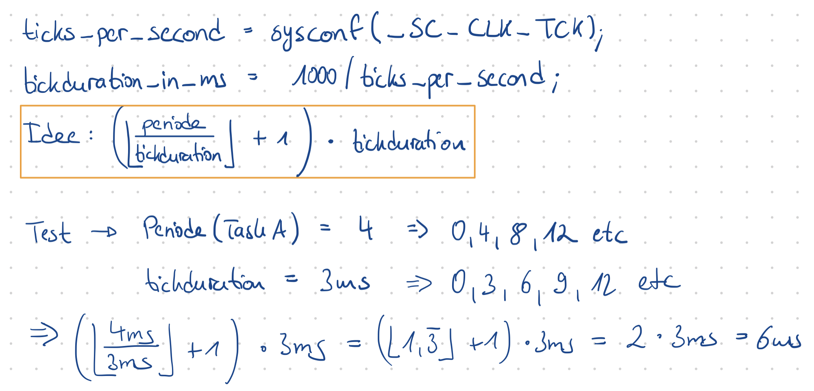
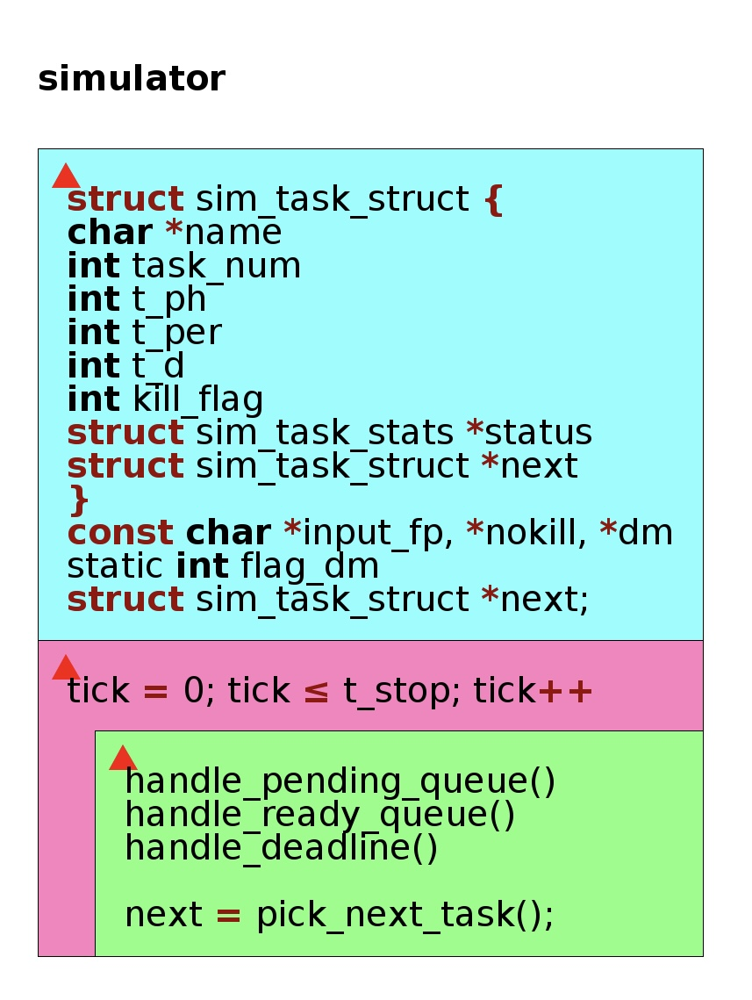
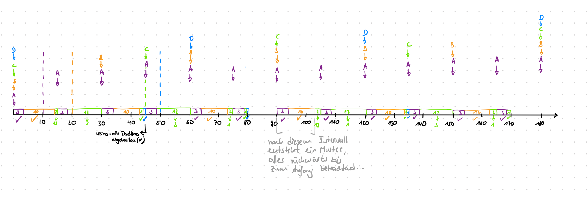

# V4

Gruppe1 \
jpkmiller (Josef Müller), IsabellaSchoen (Isabella Schön)

Inhaltsverzeichnis:

- [V4](#v4)
  - [Planung](#planung)
    - [1.1 Wie berechnet sich die tatsächliche Release-Time der Jobs (Formel)?](#11-wie-berechnet-sich-die-tatsächliche-release-time-der-jobs-formel)
    - [1.2 Erstellen Sie vor der Programmierung mithilfe des Programms Structorizer ein Struktogramm für den Scheduling Simulator](#12-erstellen-sie-vor-der-programmierung-mithilfe-des-programms-structorizer-ein-struktogramm-für-den-scheduling-simulator)
    - [1.3 Der Time-based Simulator erhöht die Clocks jeweils um eine Einheit (oder Tick). Für die Zeitangaben in der Input Datei sollen nicht-negative Integer Zahlen angenommen werden. Implementieren Sie die Funktion zum Einlesen der Datei](#13-der-time-based-simulator-erhöht-die-clocks-jeweils-um-eine-einheit-oder-tick-für-die-zeitangaben-in-der-input-datei-sollen-nicht-negative-integer-zahlen-angenommen-werden-implementieren-sie-die-funktion-zum-einlesen-der-datei)
  - [Entwicklung](#entwicklung)
    - [1.1 Setzen Sie Ihr Struktogramm um, und implementieren Sie den Simulator nach DM](#11-setzen-sie-ihr-struktogramm-um-und-implementieren-sie-den-simulator-nach-dm)
    - [1.2 Testen Sie Ihr Programm mit der folgenden Input-Datei](#12-testen-sie-ihr-programm-mit-der-folgenden-input-datei)
    - [1.3 Erweitern Sie die Actions Ausgabe um den Status "Preempted"](#13-erweitern-sie-die-actions-ausgabe-um-den-status-preempted)
    - [1.4 Wie Sie ja aus der Vorlesung wissen, arbeitet das EDF Verfahren optimal. Gibt es Bedingungen, in denen das DM-Verfahren ebenfalls optimal arbeitet? Zeigen Sie dies anhand einer geeigneten INPUT Datei](#14-wie-sie-ja-aus-der-vorlesung-wissen-arbeitet-das-edf-verfahren-optimal-gibt-es-bedingungen-in-denen-das-dm-verfahren-ebenfalls-optimal-arbeitet-zeigen-sie-dies-anhand-einer-geeigneten-input-datei)
    - [1.5 Geben Sie zusätzlich am Ende der Simulation die maximalen Reaktionszeiten der Tasks im untersuchten Intervall aus](#15-geben-sie-zusätzlich-am-ende-der-simulation-die-maximalen-reaktionszeiten-der-tasks-im-untersuchten-intervall-aus)
    - [1.6](#16)
      - [1.6.1 Bestimmen Sie rechnerisch die maximalen Reaktionszeiten der Tasks](#161-bestimmen-sie-rechnerisch-die-maximalen-reaktionszeiten-der-tasks)
      - [1.6.2 Vergleichen Sie die rechnerisch ermittelten Ergebnisse mit den Ergebnissen aus der Simulation und interpretieren Sie das Ergebnis. Hätte die Simulation auch kleinere Maximalwerte liefern können? Beweisen Sie Ihre Überlegungen mit einer geeigneten INPUT Datei](#162-vergleichen-sie-die-rechnerisch-ermittelten-ergebnisse-mit-den-ergebnissen-aus-der-simulation-und-interpretieren-sie-das-ergebnis-hätte-die-simulation-auch-kleinere-maximalwerte-liefern-können-beweisen-sie-ihre-überlegungen-mit-einer-geeigneten-input-datei)
    - [1.7 Der Simulator verwendet für Jobs gleicher Priorität das FIFO Verfahren](#17-der-simulator-verwendet-für-jobs-gleicher-priorität-das-fifo-verfahren)
      - [1.7.1 Welche maximalen Reaktionszeiten ergeben sich aufgrund des Simulationslaufs für die INPUT Datei](#171-welche-maximalen-reaktionszeiten-ergeben-sich-aufgrund-des-simulationslaufs-für-die-input-datei)
      - [1.7.2 Überprüfen/Erweitern Sie die Gleichung für TDA geeignet, um mit Tasks gleicher Prioritätsebene umgehen zu können. Überlegen Sie sich die Auswirkungen, wenn innerhalb der gleichen Proriotätsebene einer der Scheduler `FIFO` oder `Round-Robin` ausgewählt wird](#172-überprüfenerweitern-sie-die-gleichung-für-tda-geeignet-um-mit-tasks-gleicher-prioritätsebene-umgehen-zu-können-überlegen-sie-sich-die-auswirkungen-wenn-innerhalb-der-gleichen-proriotätsebene-einer-der-scheduler-fifo-oder-round-robin-ausgewählt-wird)
  - [Verwendete Links](#verwendete-links)

## Planung

### 1.1 Wie berechnet sich die tatsächliche Release-Time der Jobs (Formel)?

<a id="11"></a>

> Was wir wissen ist, dass die Release-Time der Zeitpunkt ist, zu dem eine Rechenzeitanforderung auftritt. (S. 8)\
> Haben wir von einer Task die Phase gegeben, z.B. Task A hat die Periode 10ms, dann treten alle 10ms bei t = 0
> beginnend Anforderungen auf. Die Release-Time ist somit gegeben = 10ms.\
> In unserem Fall betrachten wir aber nun ein timergesteuertes Schedulingverfahren, den DM-Scheduler. Dieser vergibt
> den Tasks ihre Priorität anhand ihrer Deadline; je kleiner die maximale Deadline, desto höher die Priorität des Tasks.\
> Das Vorgehen geschieht wie folgt: wir können mit `1000/sysconf()` die Dauer eines Ticks in ms angeben und wissen somit
> wann immer ein Tick auftritt, welcher auch wiederum den Auruf des DM-Schedules bestimmt. Nehmen wir als Beispiel
> hierfür **3ms**, der Scheduler läuft also alle 3ms.\
> Die Tasks werden also bei jedem Tick (beginnend bei t = 0) in eine Pending-Queue gelagert, welche die lauffähigen
> Tasks darstellt. Bei jedem Tick wird der DM-Scheduler aktiviert, so also auch beginnend bei t = 0. Der DM-Scheduler
> schaut nun in die Pending-Queue und verlagert alle `ready` Tasks in eine Ready-Queue, entsprechend ihrer Priorität
> sortiert. Dann nimmt er sich aus dieser Queue die Task mit der kleinsten Deadline und lässt diese laufen.
>
> Die Aufgabe bestand darin eine Formel aufzustellen, die die tatsächliche Release-Time des Jobs wiedergibt.\
> Das folgende Bild soll die Idee dahinter genauer darstellen und erklären. Haben wir eine Task A mit der Periode 4,
> so läuft Task A zu 0ms, 4ms, 8ms etc. Unser Tick und somit auch DM-Scheduler wird alle 3ms aufgerufen, also 0ms, 3ms,
> 6ms, 9ms etc.\
> Die tatsächliche Release-Time der Task wäre bei (Periode Task -> Tick-DM): 0ms->0ms, 4ms->6ms, 8ms->9ms, 12ms->12ms.
> Somit wäre die eigentliche Release-Time ist erst dann, wenn bei einem Tick Aufruf der Scheduler die Task von der
> Pending-Queue in die Ready-Queue reinsetzt. Gedanke: die tatsächliche Release-Time ist immer ein Vielfaches von dem
> Timer-Scheduling…
>
> 

### 1.2 Erstellen Sie vor der Programmierung mithilfe des Programms Structorizer ein Struktogramm für den Scheduling Simulator

<a id="12"></a>

> Das folgende Struktogramm stellt die Vorgehensweise des DM-Schedulers dar. Hierbei haben wir uns sehr kurz gehalten.
> Dies liegt daran, dass in unserem Code mit vielen Methoden gearbeitet wird, die im Folgenden auf das Wesentliche
> erläutert werden.\
> Der DM-Scheduler wählt seine Jobs anhand der Deadline. Ist eine maximale Deadline am kleinsten, wird die Priorität des
> Jobs erhöht. Die Tasks sind in vorgegebenen input-Dateien mit allen wichtigen Zeitdaten aufgelistet, welche durch eine
> selbst geschriebene Methode eingelesen werden, wie in [Aufgabe 1.3](#13) erklärt, und die Vorgehensweise wie in
> [Aufgabe 1.1](#11) vorgeht.\
> 
>
> Die jeweiligen Methoden werden im Folgenden erklärt:\
> Wie bereits erwähnt, lesen wir verschiedene Dateien ein, die unterschiedliche Tasks mit ihren jeweiligen Daten für
> Execution, Periode, Deadline etc. haben. Wichtig hierbei ist das Intervall zu beachten in welchem die Tasks untersucht
> werden sollen. Dafür haben wir eine for-Schleife erstellt…

```c
for (tick = 0; tick <= t_stop; tick+)
{
    handle_pending_queue();
    handle_ready_queue();
    handle_deadline();
    pending_queue = NULL; /*!< reset pending queue */

    prev = next;
    next = pick_next_task();
    handle_reaction_time();

    if (next != NULL)
    {
        handle_preemption(next, prev)
        next->t_remaining_e--
        if (tick >= t_start)
        {
            printf("%d\t%s%d\t", tick, next->name, next->task_num); /* time & job */
            printf("\t\t\t%s", actions_status); /* action */
        }
        handle_tasks_to_delete();
    }
```

> ...in welcher die jeweiligen Methoden innerhalb des Intervalls abgearbeitet werden.

```c
1)
handling_pending_queue()
{
    if ((tick >= tmp_task_list->t_ph + tmp_task_list->t_per &&
        (tick - tmp_task_list->t_ph) % tmp_task_list->t_per == 0) ||
        (tick < tmp_task_list->t_ph + tmp_task_list->t_per && tick == tmp_task_list->t_ph))
    {
        create_copy(tmp_task, tmp_task_list);
        tmp_task_list->task_num++;

        if (pending_queue == NULL)
        {
            pending_queue = tmp_task;
        }
        else
        {
            goto_last_list_element(pending_queue)->next = tmp_task;
        }
    }
    tmp_task_list = tmp_task_list->next; /* select next task */
}
```

> Die Erste sorgt dafür, dass die Tasks, die zu dem jeweiligen Tick und der damit resultierten Aktivierung des DM-Schedulers, in die pending_queue eingetragen werden.\
> Bei der Abfrage werden zwei Bedingungen abgefragt:

1. ob der Tick größer gleich der Summe aus Phase und Periode ist und die Periode ein Vielfaches vom Tick ist
2. oder ob der Tick kleiner als der Summer aus der Phase und Periode ist und der Tick der Phase entspricht ist eine der Bedingungen erfüllt, wird der Task in die Pending-Queue getan und …

```c
2)
handle_ready_queue()
{
    tmp_task_list = pending_queue;
    while (tmp_task_list != NULL)
    {
        create_copy(tmp_task, tmp_task_list);
        tmp_task->next = NULL;

        if (ready_queue == NULL) /* erstes Befüllen der ReadyQueue */
        {
            ready_queue = tmp_task;
        }
        else
        {
            /* add new task to ready_queue */
            tmp_task->next = ready_queue->next;
            ready_queue->next = tmp_task;
        }

        tmp_task_list = tmp_task_list->next;
    }
}
```

> … dann in die bestehende ready_queue, die als LinkedList implementiert ist, eingefügt, indem die bekannte Vorgehensweise mit den Referenzen auf den Nachfolger erfolgt.
>
> Wie bereits bekannt, kann es passieren, dass ein Task seine Deadline nicht einhält. Für diese Kontrolle ist die folgende Methode zuständig…

```c
3)
handle_deadline()
{
    if (tmp_task_list->t_remaining_d-- <= 0 && tmp_task_list->t_remaining_e > 0)
    {
        if (flag_kill)
        {
            tmp_task_list->kill_flag = KILL_TASK;

            tmp_task_list_kill = ready_queue;
            while (tmp_task_list_kill != NULL)
            {
                if (strcmp(tmp_task_list->name, tmp_task_list_kill->name) == 0)
                {
                    tmp_task_list_kill->kill_flag = KILL_TASK;
                }
                tmp_task_list_kill = tmp_task_list_kill->next;
            }
        }
        else if (flag_nokill)
        {
            tmp_task_list->kill_flag = REMOVE_TASK;
        }
    }
    tmp_task_list = tmp_task_list->next;
}
```

> … in welcher zunächst kontrolliert wird, welche Flag gesetzt ist. Dabei kann es sich um `-nokill`, der Task wird aus der Ready-Queue entfernt, oder `-nokill`, der Task wird sowohl aus der Ready-Queue
> als auch aus dem gesamten Scheduler-Ablauf entfernt, handeln. Die Tasks werden in einer zuständigen Methode für die Entfernung aus der Ready-Queue entfernt. In [Aufgabe 1.1](#11-entwicklung) wird diese Methode `handle_tasks_to_delete()` und die Vorgehensweise >genauer erläutert.

> Nun stellt sich die Frage _wie wird überhaupt ein Task aus der Ready-Queue gewählt_? Dafür gibt es die beschriebene Methode:

```c
4)
pick_next_task()
{
    while (tmp_task_list != NULL)
    {
        if (tmp_task_list->next != NULL)
        {
            if (next_task->t_d > tmp_task_list->next->t_d)
            {
                next_task = tmp_task_list->next;
                next_task_same_deadline = NULL;
            }
            else if (next_task->t_d == tmp_task_list->next->t_d)
            {
                if (next_task_same_deadline == NULL)
                {
                    next_task_same_deadline = tmp_task_list->next;
                }
            }
        }
        tmp_task_list = tmp_task_list->next;
}
```

> Wird die Flag `-dm` gesetzt, wird der DM-Scheduler aktiviert und dessen Vorgehensweise angewendet. Hierbei wird über die Ready-Queue iteriert und die Tasks werden auf ihre Deadline miteinander verglichen.
> Ist die kleinste Deadline gefunden, so wird dieser Task gewählt und ausgeführt.

> Das war die grobe Umsetzung des Codes. Wichtige und interessante Punkte kamen ständig hinzu. So z. B. was passiert, wenn die momentan ausführende Task durch einen anderen Task, der eine kleinere Deadline aufweist und somit die Bedingung des DM-Schedulers erfüllt, > unterbrochen (= preempted) wird. Diese Methode `handle_preemption()` wird in der darauffolgenden [Aufgabe 1.3](#13-entwicklung) erklärt.

### 1.3 Der Time-based Simulator erhöht die Clocks jeweils um eine Einheit (oder Tick). Für die Zeitangaben in der Input Datei sollen nicht-negative Integer Zahlen angenommen werden. Implementieren Sie die Funktion zum Einlesen der Datei

<a id="13"></a>

> Für das Einlesen der Datei wurde die Methode `read_and_parse_input()` erstellt.
>
> Der Funktion wird zunächst der Dateipfad übergeben. Mittels `fopen(..., "r")` wird die Datei nur mit Lese-Zugriff geöffnet. Hierbei wird eine Referenz vom Typen `FILE` übergeben.
> Dieser Pointer wird dann `getline()` übergeben, das jede Zeile der Datei in einen Puffer schreibt. Anschließend kann mithilfe von `strtok_r()` die Zeile in einzelne Tokens gespalten werden, die dann analysiert werden.
> Zunächst wird nach "Start" und "Stop" gesucht und anschließend wird der Wert danach ebenfalls ausgelesen und mit `strol()` in eine Zahl umgewandelt.
> Für die Tabelle wird folgendes Verfahren verwendet. Ein `token_counter` wird verwendet, um zu überprüfen, ob immer der vorherige Wert erfolgreich geparst werden konnte. Wenn das nicht der Fall ist, wird der Zähler auf -1 gesetzt.
> Mit jedem erfolgreich geparsten Token werden die Werte der allozierten Task geschrieben.
> Wenn die Zeile erfolgreich geparst wurde, hat der Zähler den Wert 5. Dann wird die Task in eine Taskliste `tasks` eingehangen.
>
> Damit bei der Ausführung auch die Reaktionszeit gemessen werden kann, wird zusätzlich ein Speicherbereich für `struct stats` reserviert. Der Task wird dann eine Referenz auf diese Struktur übergeben.

## Entwicklung

### 1.1 Setzen Sie Ihr Struktogramm um, und implementieren Sie den Simulator nach DM

<a id="11-entwicklung"></a>

> In dieser Aufgabe wurde das Struktogramm aus [Aufgabe 1.2](#12) umgesetzt. Die jeweiligen Erklärungen sind auch in
> der [Aufgabe 1.2](#12) auffindbar.\
> Zusätzlich sollte der Flag `-nokill` hinzugefügt werden. Dieser hat die Aufgabe die Tasks aus der Ready-Queue zu
> entfernen, die ihre Deadline nicht einhalten konnten. Die Task wird jedoch nicht komplett aus dem Verlauf des
> Schedulers entnommen, sondern nur die, die ihre vorgegebene Deadline verpasst hat.\
> Um die Flag zu setzen wurde folgender Code verwendet...

```c
...
/* parsing arguments */
for (arg_index = 1; arg_index < argc; arg_index++)
{
    ...
    if (strcmp(argv[arg_index], nokill) == 0)
    {
        flag_nokill = 1;
    }
    ...
}
...
```

> ...mit welchem kontrolliert wird, ob innerhalb der Eingabe im Terminal diese Flag gesetzt wird und die darauffolgende
> Codesequenz letzendlich aufgerufen wird...

```c
handle_deadline()
{
    ....
    if (flag_kill)
    {
        sprintf(actions_status, "%s%d missed deadline at %d and was aborted", tmp_task_list->name,
        mp_task_list->task_num, tick);
        tmp_task_list->kill_flag = KILL_TASK;
    }
    else if (flag_nokill)
    {
        ...
    }
    ...
}
```

> ...welche eine Abfrage enthält, ob die kill_flag gesetzt wurde. Wenn das der Fall ist, wird die kill_flag der Task gesetzt und folgender Code ausgeführt:

```c
handle_tasks_to_delete()
{
    if (tmp_task_ready_queue->kill_flag == REMOVE_TASK)
    {
        ...
        if (tmp_task_ready_queue->kill_flag == KILL_TASK)
        {
            tmp_task_tasks_list = tasks;
            while (tmp_task_tasks_list != NULL)
            {
                if (strcmp(tmp_task_tasks_list->name, tmp_task_ready_queue->name) == 0)
                {
                    /* update elapsed job time */
                    ...

                    /* completely remove task from tasks */
                    if (tmp_task_tasks_list == tasks)
                    {
                        tasks = tmp_task_tasks_list->next;
                    }
                    else
                    {
                        tmp_prev_tasks_list->next = tmp_task_tasks_list->next;
                    }
                }
                tmp_prev_tasks_list = tmp_task_tasks_list;
                tmp_task_tasks_list = tmp_task_tasks_list->next;
            }
        }
    }
    ...
}
```

> Dabei wird über die ready_queue iteriert. Sobald eine Task gefunden wurde, bei dem das kill_flag gesetzt wurde, wird dieser je nach "Kill-Modus" entweder nur aus der Ready-Queue oder auch aus der Task-Liste entfernt.

### 1.2 Testen Sie Ihr Programm mit der folgenden Input-Datei

> In dieser Aufgabe wird das erste Mal eine Input-Datei zum Testen genommen. \
> Input-2.txt:

```shell
 Start 0
 Stop 32

 Task  Phase  Period Exectime Deadline
    A    0      3        1       3
    B    0      5        2       5
    C    0      8        3       8
```

> Resultierender Output: in der `output_kill.txt` \
> Resultierender Output: in der `output_nokill.txt` \
> Da mit der Flag -kill alle Tasks aus dem Scheduler-Verfahren gelöscht werden, ist eine Veränderung auch in den Reaktionszeiten erkennbar. Die Werte verbessern sich, das C0 seine Deadline verpasst und somit im Scheduler-Verfahren nicht mehr aufpasst. Task A und Task B laufen deshalb schneller ihre Realzeitanforderungen ab.

### 1.3 Erweitern Sie die Actions Ausgabe um den Status "Preempted"

<a id="13-entwicklung"></a>

> In dieser Aufgabe soll zunächst eine weiterer Status hinzugefügt werden. Bei diesem handelt es sich um `Preempted`.
> Wie bereits bekannt, heißt das Wort ins Deutsche übersetzt unterbrechbar. Somit ist hierbei gemeint, dass eine Task
> von einer höherpriorisierten Task (aufgrund minimaler Deadline) unterbrochen werden kann. Wie davor, soll dies wieder
> mit weiteren Input-Dateien getestet werden:\

```shell
Input-3.txt:

 Start 0
 Stop 40

 Task  Phase Periode Exectime Deadline
  X      0       4       2       4
  Y      1       5       2       2
  Z      0      10       1       10
```

> Resultierender Output: in der `output_kill.txt` \
> Resultierender Output: in der `output_nokill.txt` \
> Auch hier ist eine Verbesserung der Reaktionszeit bei Z zu erkennen; diese ist bei -kill weniger. Liegt daran, dass die Task ihre Deadline verpasst und deshalb aus dem Scheduler-Simulator verbannt wird. Eine Auswirkung auf die anderen Tasks ist jedoch nicht erkennbar. Dies liegt daran, dass Z zunächst eine Periode von 10ms und eine Executiontime von 1ms hat. Somit gibt hat dies in diesem Fall keinen weiteren Einfluss auf Task X und Task Y.

```shell
Input-4.txt:

 Start 0
 Stop 30

 Task  Phase  Period Exectime Deadline
    A      2    8      3       8
    B      0    10     3       10
    C      0    14     2       14
```

> Resultierender Output: in der `output_kill.txt` \
> Resultierender Output: in der `output_nokill.txt` \
> Keine Veränderung bei beiden Outputs erkennbar, da alle Tasks ihre Deadline einhalten können.

### 1.4 Wie Sie ja aus der Vorlesung wissen, arbeitet das EDF Verfahren optimal. Gibt es Bedingungen, in denen das DM-Verfahren ebenfalls optimal arbeitet? Zeigen Sie dies anhand einer geeigneten INPUT Datei

> Das EDF-Verfahren arbeitet nach dem Prinzip: `Earliest Deadline First`; bedeutet in der Liste der Ready-Tasks wird
> nach der maximalen Deadline geschaut, die dem Momentanzeitpunkt am nächsten ist. Somit wird die Task als erste
> ausgesucht, die am ehesten fertig sein muss. Diese Task darf solange laufen bis diese fertig ist, sich schlafen legt
> oder von einer anderen Task unterbrochen wird.\
> Bei dem EDF-Scheduling-Verfahren handelt es sich um eine optimale Abarbeitung der Tasks; Starvation wird vermieden. \
> Nun soll diese Optimierung auch beim DM-Scheduling-Verfahren angewendet werden. Der DM-Scheduler könnte optimal laufen, wenn alle Tasks ihre Deadline einhalten. Dies könnte am besten realisiert werden, wenn die Tasks, die die höchste Prio habe, dementsprechend ihrer Phase verschoben wird. Die Reaktionszeit ändert sich dadurch nicht. Das Intervall hat keinen Einfluss darauf, da wir die Tasks optimieren wollen und nicht das Intervall.
> Betrachten wir nun das Intervall [0;30] und haben drei Tasks. A und C sind höherpriorisiert als B. Wir verzögern die Tasks so hinaus, dass diese kurz vor ihrer Deadline ablaufen. So bleiben sie gleich priorisiert, halten alle ihre Deadline ein und Task B kann bevorzugt und verbessert werden.
> Eine mögliche Input Datei ist unter `input-dm-optimal.txt` auffindbar.\
> -> B würde zuerst laufen für 2ms und hat dann noch 1ms übrig\
> -> dann läuft C für 2ms und hat die Deadline geschafft\
> -> danach läuft direkt A für 3ms und hat auch die Deadline geschafft\
> -> am Ende nach A läuft B für ein 1ms wieder und hat auch die Deadline geschafft\
> \
> Eine weitere Möglichkeit wäre natürlich, dass Task A und Task C so verschoben werden, dass Task B trotz maximaler Deadline zuerst ausgeführt wird.

### 1.5 Geben Sie zusätzlich am Ende der Simulation die maximalen Reaktionszeiten der Tasks im untersuchten Intervall aus

> Als weiteren Zusatz soll zu jeder Input-Datei die benötigte maximale Reaktionszeit der Tasks in dem untersuchten
> Intervall ausgegeben werden. Die Reaktionszeiten sind jeweils in den Dateien `output_kill.txt` und `output_nokill.txt` mit ausgegeben worden.\
> Für die Berechnung ist folgendermaßen vorgegangen worden:

```c

/* when task is removed, update stats */
if (tmp_task_ready_queue->t_elapsed > tmp_task_ready_queue->stats->t_elapsed)
{
    tmp_task_ready_queue->stats->t_elapsed = tmp_task_ready_queue->t_elapsed;
}

/* update all times */
...
tmp_task_list = ready_queue;
while (tmp_task_list != NULL)
{
    tmp_task_list->t_elapsed++;
    tmp_task_list = tmp_task_list->next;
}

/* print max. reaction-time */
stat = stats;
while (stat != NULL)
{
    printf("Task: %s\tmax. Reaktionszeit: %d\n", stat->name, stat->t_elapsed);
    stat = stat->next;
}
```

> Die Reaktionszeit beschreibt die Zeit, die vergeht, bis die Reaktion, angefangen vom Auftreten der Rechenzeitanforderung, erfolgt ist. Sie setzt sich aus Ausführungs- und Wartezeit zusammen.
> Eine "preemptete" Task wartet und damit erhöht sich ihre Reaktionszeit. Die Ausführungszeit fließt, wie bereits erwähnt, auch in die Reaktionszeit.
> In unserer ersten Abgabe haben wir die Reaktionszeit berechnet, indem wir die Warte- und Ausführungszeit von allen Jobs eines Tasks zusammengezählt haben – dieser Ansatz hat zu fehlerhaften Ergebnissen geführt.
> Der korrekte Weg wäre, dass jede Instanz eines Tasks die eigene Zeit jeden Tick hochzählt und nach Ende der Ausführung die eigene Reaktionszeit mit der Reaktionszeit der anderen Tasks verglichen wird. Dabei wird dann die größte Zeit ausgewählt.

> Die Lösung besteht also darin jeden Tick über alle Tasks in der ready_queue zu iterieren und einen lokalen Zähler hochzuzählen.
> Wenn die Instanz entfernt wird, wird über den `struct sim_task_stats` - auf diesen hat jede Instanz eines Tasks Zugriff – der bisherige `t_elapsed` Wert mit der lokalen Zeit verglichen.
> Wenn der lokale Wert höher ist, wird der globale `t_elapsed` aktualisiert.

> Bei der Ausgabe der maximalen Reaktionszeiten wird nur über das `sim_task_stats` struct iteriert und der `t_elapsed` Wert ausgelesen.

### 1.6

> Input-Datei:

```shell
 Start 0
 Stop  180

 Task Phase Period Exectime Deadline
 A    0       15      3       10
 B    0       30      10      20
 C    0       45      15      45
 D    0       60      1       50
```

#### 1.6.1 Bestimmen Sie rechnerisch die maximalen Reaktionszeiten der Tasks

> Die maximale Reaktionszeit ist die Zeit, die sich aus der Wartezeit und aus der Ausführungszeit eines Jobs ergibt.
> Hierbei zu beachten ist, dass eine Task mehrmals in einem Intervall vorkommt, so auch bei unserem Beispiel. Die
> Reaktionszeit darf jedoch nur betrachtet und somit auch rechnerisch bestimmt werden, wenn eine Rechenzeitanforderung
> der Task auftritt. Zum Beispiel haben wir eine Task C, die alle 45ms eintritt und eine Ausführungszeit von 15ms
> aufweist. Wollen wir nun deren maximale Reaktionszeit berechnen, schauen wir zunächst wann diese Task immer auftritt
> und bestimmen ab diesem Zeitpunkt die Reaktionszeit. Wichtig dabei ist, dass beim ersten Durchlauf die Deadline
> nicht überschritten wurde, also Deadline_max <= Processtime_min. In unserem Beispiel wurden alle Deadlines eingehalten.
> Das folgende Bild zeigt die Berechnung der Reaktionszeit mit dazugehörigem Graphen, um die Denkweise und Rechnung
> einfacher zu gestalten.\
> Hierbei geht man wie oben erläutert vor: immer wenn die Task eine Rechenzeitanforderung
> aufweist, wird ab diesem Zeitpunk gezählt, wie lange die Task warten muss, bis sie ihre Anforderung vollständig bearbeitet
> hat.\
> Für die Berechnung wurde folgender Python-Code aus den Ausgaben verwendet. Je nachdem, welche Reaktionszeit berechnet wird, müssen die Werte mit größerer Deadline aus dem taskset entfernt werden.

```python
import math

# Pmin, Emax, #Dmax
taskset = [(15, 3, 10), (30, 10, 20), (45, 15, 45), (60, 1, 50)]
t_Emax = 15
t = t_Emax

for _ in range(10):
    print(t)
    _t = 0
    for task in taskset:
        _t += math.ceil(t / task[0]) * task[1]
    t = _t
```

> Folgende Ergebnisse für die maximale Reaktionszeit wurde rechnerisch (mit dem Python-Skript) bestimmt:\

- Task A → 3
- Task B → 13
- Task C → 44
- Task D → 45

> 
>
> Die Zeiten lassen sich folgendermaßen erkären:

- Task A: Dieses Task wartet auf keine andere Task und wird vom DM-Scheduler bei Eintritt direkt ausgewählt. Da keine tWait, ist tR = tExec ⇒ 3 ticks
- Task B: Muss nur auf A warten. B wartet 3 ticks und läuft dann 10 ticks. Da es nur von A preempted werden könnte, dessen Periode aber größer als die Ausführungszeit und die Wartezeit ist, läuft es ohne Unterbrechung. Das heißt, tR = 3 (tWait) + 10 (tExec) ⇒ 13 ticks.
- Task C: Muss auf A und B warten. In der Zeit, in der C wartet, wird B zweimal und A dreimal ausgeführt. Deren Ausführungszeit ist Cs Wartezeit also, tR = 29 (tWait) + 15 (tExec) ⇒ 44 ticks.
- Task D: Da C nach Zeitpunkt 44 fertig ist und A alle 15 ticks läuft, kann D noch den einen tick laufen. tR ⇒ 45 ticks.

#### 1.6.2 Vergleichen Sie die rechnerisch ermittelten Ergebnisse mit den Ergebnissen aus der Simulation und interpretieren Sie das Ergebnis. Hätte die Simulation auch kleinere Maximalwerte liefern können? Beweisen Sie Ihre Überlegungen mit einer geeigneten INPUT Datei

> Die maximale Reaktionszeit der Tasks wurde mit der Simulation -nokill berechnet und hat folgendes Ergebnis:

- Task A → 3
- Task B → 13
- Task C → 44
- Task D → 45

> Werden nun beide Ergebnisse miteinander verglichen, sind beide Werte von der Rechnung und Simulation identisch.\
> Um diese Werte zu verbessern, kann die Input-Datei für die Simulation folgendermaßen optimiert werden:

1. man könnte den Task A und Task B um Phasen verschieben, und zwar so, dass diese direkt vor seiner Deadline ihre Anforderung ausführen. Da diese Tasks sowieso die kleinste Deadline aufweisen, können sie auch verschoben werden, sodass Task D und Task C bevorzugt werden.

   > Die Input-Datei ist unter `input-5-optimal.txt` auffindbar und hat folgenden Output:

   - Task A → 3
   - Task B → 10
   - Task C → 31
   - Task D ⇾ 21

   > Bis auf Task A haben sich alle anderen Werte, besonders die der Tasks C und D, verbessert. Somit ist unser Ziel erreicht: eine optimale Verbesserung konnte erzielt werden.

2. Natürlich hätte man auch das Intervall verändern können. Dies hätte jedoch nichts an den Reaktionszeiten von Task C und D geändert, da immer noch Tasks A und B aufgrund ihrer minimalen Deadline bevorzugt werden.

### 1.7 Der Simulator verwendet für Jobs gleicher Priorität das FIFO Verfahren

> In dieser Aufgabe soll das Verfahren von FIFO umgesetzt werden. Wie bereits bekannt, heißt FIFO `FirstInFirstOut` und arbeitet
> nach dem Prinzip, _was als Erstes in die Ready-Queue gepackt wurde, soll auch als Erstes ausgeführt werden_. Hierbei
> gibt es nun keine Priorität und dieses Scheduling-Verfahren arbeitet als non-preemption, also nicht unterbrechbar.

```c
if (next_task->t_d > tmp_task_list->next->t_d)
{
    next_task = tmp_task_list->next;
    next_task_same_deadline = NULL;
}
else if (next_task->t_d == tmp_task_list->next->t_d)
{
    if (next_task_same_deadline == NULL)
    {
        next_task_same_deadline = tmp_task_list->next;
    }
}
```

> Die Abfrage für das FIFO-Verfahren findet in der Methoden `pick_next_task_dm()` statt, wo auch der DM-Scheduler aufgerufen wird.\
> Ist die Deadline von der momentanen Task nun gleich mit der von der nächsten Task, so wird das FIFO-Verfahren aktiviert, indem diese Task übergeben wird.

#### 1.7.1 Welche maximalen Reaktionszeiten ergeben sich aufgrund des Simulationslaufs für die INPUT Datei

> Für die folgende Input-Datei...

```shell
 Start 0
 Stop 32

 Task Phase Period Exectime Deadline
 C    1      8      1         8
 B    0      8      1         2
 A    0      8      2         8
 D    1      16     4         16
 E    0      16     1         16
 F    0      32     6         32
```

> ...ergeben sich die, mit der Simulation berechneten, maximalen Reaktionszeiten:\

```shell
$ ./simulator -dm input-6.txt

...

Task: C max. Reaktionszeit: 3
Task: F max. Reaktionszeit: 32
Task: E max. Reaktionszeit: 5
Task: D max. Reaktionszeit: 12
Task: A max. Reaktionszeit: 3
Task: B max. Reaktionszeit: 1
```

#### 1.7.2 Überprüfen/Erweitern Sie die Gleichung für TDA geeignet, um mit Tasks gleicher Prioritätsebene umgehen zu können. Überlegen Sie sich die Auswirkungen, wenn innerhalb der gleichen Proriotätsebene einer der Scheduler `FIFO` oder `Round-Robin` ausgewählt wird

> TDA heißt ausgeschrieben `Time-Demand-Analysis` und ist ein Verfahren zur Überprüfung der zweiten Realzeitbedingung: t_Dmin <= t_Rmin <= t_Rmax <= t_Dmax.\
> Konkret wird hier überprüft, ob die Reaktion eines Tasks innerhalb der minimalen und maximalen Deadline stattfindet.
>
> Laut Buch S. 225 Gleichung 8-2 kann die TDA bereits mit gleichen Prioritäten umgehen und muss daher nicht erweitert werden.
>
> FIFO funktioniert, indem wir bei zwei Tasks mit gleicher Deadline das Schlangen-Prinzip anwenden.\
> Heißt, die Task, die zuerst in der Queue war, wird auch als Erste ausgeführt. Selbes gilt für das Round-Robin-Verfahren. Nur ist hier der Unterschied, dass alle Tasks für eine bestimmte `timeslice` laufen sollen.\
> Hierbei muss jedoch beachtet werden, dass die Länge dieser Tasks einen Einfluss auf die Reaktionszeit haben können. Ist die Task A lang und die Task B kurz, so wirkt sich das wie folgt aus:\
> FIFO: lange Task zuerst --> kurze Task weist eine große Reaktionszeit auf\
> RR: jede Task weist eine längere Reaktionszeit aufgrund der vorhandenen timeslice auf; längere Task haben augenscheinlich eine noch größere Reaktionszeit.

## Verwendete Links

- <https://elixir.bootlin.com/linux/latest/source/kernel/sched/core.c#L4954>
