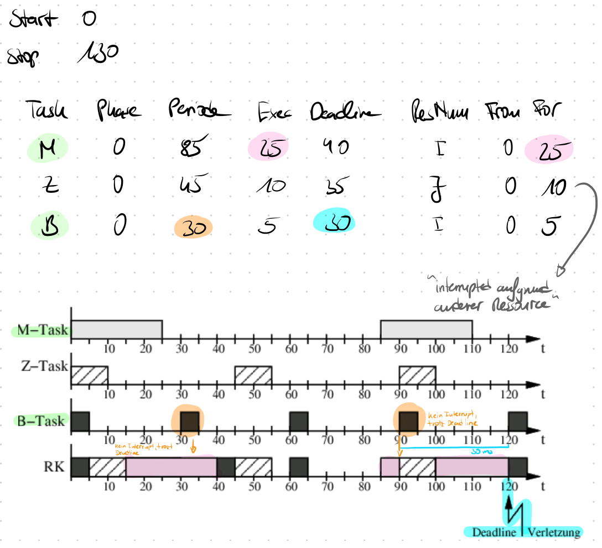

# V5

Gruppe1 \
jpkmiller (Josef Müller), IsabellaSchoen (Isabella Schön)

## EDF Scheduling Verfahren

> In dieser Aufgabe ging es um den EDF-Scheduler, auch Earliest-Deadline-First oder kurz Deadline-Scheduling genannt.\
> Dabei geht es, wie in der vorheringen Aufgabe auch, um einen Scheduling-Simulator. Der Fokus liegt hierbei auf der Deadline.\
> In der vorheringen Aufgabe haben wir den DM-Scheduling kennen gelernt. Auch dieser Fokus ist auf der Deadline. Die Task, die die minimalste Deadline aufweist, bekommt eine höhere Priorität zugeordnet.\
> Das EDF-Scheduling hingegen, wählt sich die Task aus, die zwar auch die minimalste Deadline hat, jedoch liegt der Fokus nicht auf dem Wert der Deadline, sondern darauf wie schnell die Task anhand seiner Deadline fertig sein soll.

### 1 Erweiterung des Struktogramms für das EDF-Schedlung

<a id="1"></a>

> Das EDF-Scheduling soll in dem folgenden Struktogramm dargestellt wurden. Dies gilt als Möglichkeit für eine Orientierung und der damit effiziente Umsetzung unseres Codes.\
> Die jeweiligen Methoden werden in den folgenden Aufgaben genauer erläutert.


### 2 Implementierung des -kill Parameters

<a id="2"></a>

#### 2.1 Ausgabe von -kill Information

> Um die Option `-kill` in unserem EDF-Scheduler-Simulator einzubinden, wurde der Codeteil aus V4 übernommen und effizienter
> geschrieben. Wir haben nun eine Methode `handle_tasks_to_delete()`, die...

```c
...
    if ((tmp_list->task->task_state == killed) || (tmp_list->task->task_state == removed))
    {
        if (killed == (tmp_list->task->task_state))
        {
            /* add killed task to list */
            kill_task = create_node(sim_task_kill_t);
            kill_task->name = strdup(tmp_list->task->name);
            kill_task->task_kill_time = tick;
            kill_task->task_num = tmp_list->task->task_num;
            create_and_add_node_to_list(&killed_tasks, kill_task, sim_task_kill_t);

            /* iterate through tasks and remove task */
            tmp_task_tasks_list = tasks;
            tmp_prev_tasks_list = tasks;
            while (NULL != tmp_task_tasks_list)
            {
                if (0 == strcmp(tmp_task_tasks_list->task->name, tmp_list->task->name))
                {
                    unlock_resources(tmp_task_tasks_list->task, pick_next_task);
                    remove_node_from_list(&tasks, tmp_task_tasks_list, &tmp_prev_tasks_list);
                }
                tmp_prev_tasks_list = tmp_task_tasks_list;
                tmp_task_tasks_list = tmp_task_tasks_list->next;
            }
        }
        unlock_resources(tmp_list->task, pick_next_task);
        remove_node_from_list(list, tmp_list, &tmp_prev_list);
    }
    tmp_prev_list = tmp_list;
    tmp_list = tmp_list->next;
```

> ...zuerst den Status einer Task kontrolliert und je nachdem, ob es sich um `killed` oder `removed` handelt, die entsprechende Abfrage geschieht.\
> Dementsprechend wird die Task der dazugehörigen Liste hinzugefügt, über diese iteriert und die Task aus der Ready-Queue entfernt.\

> Sollte der Status für die Task nun `kill`, was bedeutet, dass die Task ihre Deadline verpasst hat, dann wir die Methode `handle_deadline()` aufgerufen, die...

```c
if (flag_kill)
{
    snprintf(actions_status, ACTIONS_STATUS_LENGTH, "%s%d missed Deadline (aborted)",
    task->name,
    task->task_num);
    task->task_state = killed;

    /* all other instances of task should be killed too. */
    tmp_queue = kill_from_queue;
    while (tmp_queue != NULL)
    {
        if (0 == strcmp(task->name, tmp_queue->task->name))
        {
            tmp_queue->task->task_state = killed;
        }
        tmp_queue = tmp_queue->next;
    }
}
```

> ...die entsprechende Ausgabe beim Aufruf der Methode am Simulationsende ausgibt und die Task aus der Ready-Queue und dem gesamten Scheduler-Verlauf entfernt.

#### 2.2 Ausgabe aller abgebrochenen Jobs inklusive des Zeitpunktes am Ende der Simulation

> Für die Ausgabe aller killed Tasks, wurde eine extra Methode in der `simulator.h` geschrieben...

```c
void print_killed_task (list_node *head)
{
    if ((NULL != head) && (NULL != head->task_kill))
    {
        printf("%s%d(t:%d)", head->task_kill->name, head->task_kill->task_num, head->task_kill->task_kill_time);
        if (NULL != head->next)
        {
            printf(", ");
        }
    }
}
```

> ...in welcher über die jeweilige Liste, beginnend bei head, iteriert wird und die jeweiligen Tasks mit deren Nummer und der Deadline-Zeit beim Abbruch...

```c
    print_list(killed_tasks, type_task_kill);
```

> ...am Ende der Schedulersimulation ausgegeben werden. Wann der Abbruch stattfindet, wird in der `handle_tasks_to_delete()` Methode abgefragt...

```c
if (killed == (tmp_list->task->task_state))
{
    while (NULL != tmp_task_tasks_list)
    {
        if (0 == strcmp(tmp_task_tasks_list->task->name, tmp_list->task->name))
        {
            unlock_resources(tmp_task_tasks_list->task);
            remove_node_from_list(&tasks, tmp_task_tasks_list, &tmp_prev_tasks_list);
        }
        tmp_prev_tasks_list = tmp_task_tasks_list;
        tmp_task_tasks_list = tmp_task_tasks_list->next;
    }
}
```

> ...indem zunächst eine Abfrge begzüglich des Status stattfindet. Ist dieser auf `killed` gesetzt, wird diese Task in
> die erstellte Liste für die killed Tasks hinzugefügt, welche alle Informationen der Task, wie den Name, die Nummer und
> den Tick, enthält, darüber iteriert und die Task aus der Ready-Queue entfernt.

> Für die Umsetzung wurde allgemein der Code überschrieben und die Ausgabe von Tasks effizienter gestaltet.\
> Wir haben nun die Methode `print_list()`...

```c
void print_list(list_node *head, node_type node_type)
{
    if (node_type == type_task)
    {
        iterator(head, &print_task);
    }
    else if (node_type == type_task_stats)
    {
        iterator(head, &print_task_stats);
    }
    else if (node_type == type_task_kill)
    {
        iterator(head, &print_killed_task);
    }
}
```

> ...welcher zwei Parameter, einmal der Pointer `head` und der enum `node_type` übergeben wird.\
> Der enum enthält, wie in der Abfrage zu sehen ist, mehrere Zeiger, die auf die jeweilige Liste mit entsprechenden Tasks zeigt.\
> Entspricht der enum einer Liste, wird die entsprechende Methode `iterator()` aufgerufen...

```c
while (tmp_task != NULL)
{
    if (tmp_task == tmp_task->next)
    {
        fprintf(stderr, "iterator: Self assigned next pointer. Exiting to avoid recursion.\n");
        exit(-1);
    }
    fct(tmp_task);
    tmp_task = tmp_task->next;
}
```

> ...in welcher, wie der Methodenname bereits hinweist, über die Liste iteriert und die Tasks ausgibt.
> Die entsprechenden Tasks werden in der definierten Methode `create_and_add_node_to_list()` der Liste hinzugefügt...

```c
if (node_type == type_task)
{
    new_node->task = (sim_task *) node;
}
else if (node_type == type_task_kill)
{
    new_node->task_kill = (sim_task_kill *) node;
}
else if (node_type == type_task_ressource)
{
    new_node->task_resource_stats = (sim_task_resource_stats *) node;
}
else if (node_type == type_task_stats)
{
    new_node->task_stats = (sim_task_stats *) node;
}
```

> ...in welcher die mit wichtigste Codesequenz vorhanden ist; die Übergabe der Pointers für die entsprechende Liste.

### 3 Implementierung des -edf Algorithmus

> Für die Umsetzung des EDF-Schedulings wurde sich an dem Code aus der vorherigen Aufgabe orientiert. \
> Wie bereits in V4 erwähnt, wurden für die Scheduling-Verfahren anhand Flags aufgerufen. Für das DM-Verfahrend, wurde der flag_dm verwendet. In unserem Fall haben wir nun die Flags auf `flag_edf` erweitert...

```c
if (flag_dm)
{
    scheduler = &pick_next_task_dm;
}
else if (flag_edf)
{
    scheduler = &pick_next_task_edf;
}
else
{
    scheduler = NULL;
}
```

> ...wodurch wie unseren EDF-Alogrithmus aktivieren...

```c
while (tmp_ready_queue != NULL)
{
    if (tmp_ready_queue->next != NULL)
    {
        /* choosing min(deadline) */
        if (next_task->t_remaining_d > tmp_ready_queue->next->t_remaining_d)
        {
            next_task = tmp_ready_queue->next;
        }
    }
    tmp_ready_queue = tmp_ready_queue->next;
}
```

> ...wobei hier der Fokus, wie bei der anfänglichen Erklärung erklärt, darauf liegt, dass die Deadline, von dem momentanen Task
> zu Ende ausgeführt wird. Dabei wird die Task zum Ausführen gewählt, die die minimalste Deadline hat. Sollte der Task
> seine Deadline abgearbeitet haben, wird in der Ready-Queue die nächste Task mit der minimalsten Deadline, also der
> höchsten Priorität, gewählt.

### 4 EDF-Schedlung und DM-Scheduling im Vergleich ohne kill

> Um eine gute Gegenüberstellung der beiden Verfahren zu haben, wurde die Input-Dateien `1` und `4` aus der V4 genommen.
> \
> Die jeweiligen Outputs sind in `Outputs.txt` mit entsprechender Beschreibung vorhanden.

> Fazit - Input-1a.txt:\
> Bei diesem Beispiel ist der genaue Unteschied noch nicht ersichtlich geworden. Das einzige ist, dass C0 bei EDF bei der 8. ms läuft, bei DM jedoch erst bei 10ms, was zu einem Nichteinhalten der Deadline führt.
> Fazit - Input-4a.txt:\
> Hier ist der Unteschied nun etwas genauer erkennbarer. Zunächst einmal haben sich die Reaktionszeiten um einiges verbessert,
> was damit zusammenhänge kann, dass B0 bei EDF nicht unterbrochen wurde, sondern darauf geachtet wurde, dass es seine
> Deadline einhält, da diese früher ist, als andere und Task B0 nicht unterbrochen wird.

### 5 Gegenüberstellung bei Überlast ohne kill

> In dieser Aufgabe ging es um den Vergleich zwischen dem Verhalten der beiden Scheduler bei Überlast.
>
> Bei diesem Vergleich betrachtet man die Tasksets, die zu einer Überlast des Systems führen.
> Die maximale Auslastung des Systems ist 100%. Das heißt, in der Summe ist der Rechenkern voll mit Rechenzeitanforderungen ausgelastet, aber nicht überlastet.
>
> Eine Überlast tritt auf, wenn in der Summe mehr Rechenzeit beansprucht wird, als das System zur Verfügung hat. Konkret, alles über 100% Auslastung.
> Die Auslastung eines Systems errechnet sich folgendermaßen: `Auslastung = Summe((tEmax(i)/tPmin(i))` wobei `i` ein Task ist. Wenn `Auslastung > 1` gilt, ist das System überlastet.\
> Folgendes Taskset führt zu einer 100% Auslastung des Systems.

```text
Start 0
Stop 10

Task Phase Period Exectime Deadline
A      0     4     2        4
B      0     4     1        4
C      0     8     2        8
```

> Das lässt sich folgendermaßen errechnen: 2/4 + 1/4 + 2/8 = 1.
>
> Hingegen würde folgendes Taskset zu einer Überlast führen.

```text
Start 0
Stop 10

Task Phase Period Exectime Deadline
A      0     4     2        4
B      0     4     1        4
C      0     8     2        8
D      0     10    1        8
```

> Das lässt sich folgendermaßen errechnen: 2/4 + 1/4 + 2/8 + 1/10 = 1.1 => 110%.
<a id="ueberlast-beispiel"></a>

> Die Auslastung des Systems beschreibt die erste Realzeitbedingung. Wenn diese, wie bereits oben erläutert, größer als 100 %, ist das System überlastet.
> Es handelt sich hierbei um eine notwendige Bedingung. Wenn diese also verletzt ist, ist kein schritthaltendes Scheduling möglich.
> Beim Betrachten des Tasksets beim DM-Scheduling lässt sich meistens erahnen, welche Tasks die Deadline verpassen werden. Der DM-Scheduler wählt den nächsten Task abhängig von seiner Deadline aus. Der Task mit der kleinsten Deadline wird aus der Ready-Queue ausgewählt und läuft.
> Wenn man die Tasks nach aufsteigender Deadline sortiert, wird jeder Task, der nach der Aufsummierung über 1 hinausgeht, früher oder später die Deadline verpassen.
>
> Bei [diesem Beispiel](ueberlast-beispiel) geht mit der Addition von 1/10 die Summer über 1. Da dieser Task die größte Deadline hat, ist es für den Scheduler am unwichtigsten und wird somit als letztes ausgewählt und ausgeführt. Wenn bei keinem Task die Phase verschoben wurde, lässt sich sogar sagen, dass der Task immer bei der Periode seine Deadline verpasst.
>
> Beim EDF Scheduling ist es schwieriger vorherzusagen, welche Tasks die Deadlines verpassen, da hier pro Tick die nächste Task gewählt wird. Wir haben mit verschiedensten Parametern rumgespielt und versucht ein Muster darin zu erkennen, aber leider haben wir nichts erkennen können.\
> Es muss beim EDF Scheduling bei jedem Tick eine Berechnung der Tasksets erfolgen. Diese Berechnung beinhaltet die Kontrolle:

- Wann ist die nächste Deadline bzw. bei welchem Task läuft die Deadline als nächstes aus?
- Wie lange muss der Task noch laufen?
- Wann tritt der Task wieder auf?

> Diese ständige Kontrolle macht es schwierig beim direkten Betrachten des Tasksets festzustellen, wann welcher Task seine Deadline verpassen wird und somit abbricht.

### 6 Gegenüberstellung der Schedulingverfahren mit -kill Option

> Um nun das Verfahren von EDF und DM beim `-kill` gegeünber zu stellen, wurde die Input-Datei `input-1a.txt` genommen.
> Die Funktion der `-kill` Option wurde in [Aufgabe 2](#2) gezeigt.\
> Der jeweilige Output befindet sich in der `outputs.txt` mit Kennzeichnung.\
> Der Unterschied der beiden Scheduler konnte bei dieser Input-Datei gut aufgezeigt werden.
>
> Wie wir aus V4 wissen: wenn wir den DM-Scheduler aktivieren, wird immer der Task mit der kleinsten Deadline ausgewählt.
> Auch wenn eine weitere Task immer zu ihrer Periode in die Ready-Queue kommt.\
> Legen wir unseren Fokus auf die Task `C0`, wird diese innerhalb ihrer Deadline nicht ausgeführt und durch die kill-Option
> sowohl aus der Ready-Queue als auch aus dem gesamten Scheduling-Verfahren gelöscht.\
> Beim EDF-Scheduling wird die Task `C0` jedoch zum Zeitpunkt = 8ms ausgeführt. Dies liegt daran, dass alle anderen Tasks,
> die eine minimalere Deadline als Task C aufweisen, liefen und diese Ausführung innerhalb ihrer Deadline geschah.
> Diese Ausführungen gelingen so, dass die Task C noch innerhalb ihrer Deadline laufen kann, denn beim EDF wird zwar auch
> auf die minimalste Deadline geschaut, jedoch darauf geachtet, wann eine Task eher ihre Deadline aufweist und diese
> dadurch eine höhere Priorität bekommt, wenn es um die Interruption geht.\
> \
> Zusammenfassung: DM -> Task mit kleinster Deadline wird ausgewählt; EDF -> Task mit kleinster Deadline wird ausgewählt
> und wir innerhalb ihrer Deadline zu Ende ausgeführt - Fokus somit auf die zu erreichende Deadline der Rechnezeitanforderung
> einer Task\
> \
> Fazit: DM->Task C0 wird entfernt; EDF->Task C0 läuft innerhalb der Deadline\

## Ressourcen Locking

### 1 Erweiterung des Struktogramms für das Ressourcen Locking

> Die Scheduling-Verfahren sollen nun um das Locking-/Unlocking-Verfahren erweitert werden.\
> Das abegbildete Struktogramm gilt wiederum als Möglichkeit für eine Orientierung und der damit effizienten Erweiterung unseres Codes.\
> Wie zu sehen ist, haben wir mit sehr vielen Methoden gearbeitet. Wir wollten unseren Code dieses Mal noch effizienter,
> einfacher und übersichtlicher gestalten.\
> Die jeweiligen Methoden werden in den folgenden Aufgaben genauer erläutert.


### 2 Einlesen der neuen Parameter

<a id="2"></a>

> Um die nun neuen Informationen einer Task, also die jeweils verwendeten Ressourcen mit Zugriffs- und Ausfühungszeit, zu
> lesen, wurde wie folgt vorgegangen: (nur die wichtigsten Codeteile werden hier betrachtet)

```c
if (0 == resc_token_counter)
{
    resc_name = strdup(token);
    resc_token_counter = 1;
}
else if (1 == resc_token_counter)
{
    t_from = tok_num_val;
    resc_token_counter = 2;
}
else
{
    ++resc_index;
    if (!check_if_resource_exists(resc_name))
    {
        task_resc = create_node(sim_task_resource_t);
        if (resc_name != NULL)
        {
        task_resc->name = strdup(resc_name);
        }
    task_resc->used_by = NULL;
    create_and_add_node_to_list(&resources, task_resc, sim_task_resource_t);
    }
    resc_token_counter = 0;
    create_and_add_node_to_list(&resc_list_task, task_resc_stat, sim_task_resource_stats_t);
}
```

> Diese Codesequenz findet sich in der Methode `read_and_parse_input()` wieder.\
> Wie in der V4, haben wir den switch-case angewendet, welcher zu dem jeweiligen `resc_token_counter` die dazugehörigen Argumente einließt.\
> Für die V5, also um die Ressourcen einzulesen, wurde dieser Teil erweitert. Mit dem `task_token_counter` wird wieder das nächste Argument
> gelesen und gespeichert. Am Ende wird alles in einer Liste mit dem Methodenaufruf `create_node()` gespeichert.

### 3 Das Ressource-Locking-Scheduling soll nun umgesetzt werden

<a id="3"></a>

> In diesem Aufgabenteil soll das Struktogramm nun umgesetzt werden mit dazugehörigen Features, die im Folgenden erläutert werden.\
> Dies ist der wichtigste Teil, denn hier wird nun unsere Idee für die Ressourcen Umsetzung erklärt. \
> \
> Das Einlesen für die Ressourcen für die jeweilige Task wurde bereits in [Aufgabe 2](#2) besprochen und erklärt.\
> Wir sind nun wie folgt vorgegangen:\
> Wir haben zwei Listen erstellt: `sims_task_resource_stats` soll allgemein Informatinen zu einer Ressource speichern. Also zum Beispiel ihren Namen, wie lange diese
> für die Task laufen soll, wie lange diese bereits geblockt wurde etc.
> Die zweite Liste dient zur Hilfe zu kontrollieren, welche Ressource von welchen Tasks in dem Verfahren blockiert werden. Gespeichert und dem Namen `sim_task_resource`.\
> Dann soll natürlich auch geprüft werden, ob die Ressource, die von der Task gebraucht wird, auch vorhanden ist. Dies geschieht mit folgender Methoden...

```c
bool check_if_resource_exists(const char *resc_name)
{
    list_node *tmp = resources;
    while (NULL != tmp)
    {
        if (0 == strcmp(tmp->task_resource->name, resc_name))
        {
            return true;
        }
        tmp = tmp->next;
    }
    return false;
}
```

> wodurch wir die Ressource zu unserer Liste `sim_task_resource_stats` hinzufügen können. Wenn nun die Task ausgewählt wird, die diese Ressource blockieren soll, geschieht der Aufruf der Methode...

```c
void lock_resources(sim_task *task)
{
    if (task != NULL)
    {
        list_node *task_resources = task->resources;
        while (task_resources != NULL)
        {
            lock_resource(task, task_resources->task_resource_stats);
            task_resources = task_resources->next;
        }
    }
}
```

> ...welche eine der wichtigsten Methoden für das Blockieren und der dazugehörigen Features aufruft: `lock_resource()`.\
> Dieser Methode werden zunächst zwei Parameter übergeben: die Task, die laufen soll, und die Ressource, die geblockt werden soll. Mit folgendem Aufruf, soll kontrolliert werden, ob die Ressource ihre Ausführungszeit innerhalb der Task vollendet hat:

```c
((resource->t_from_elapsed < resource->t_from) || (resource->t_for_elapsed >= resource->t_for))
```

> Ist die Ressource fertig oder wird die Task aufgrund des Nichteinhaltens seiner Deadline befreit, wird diese mit der Methode `unlock_resources(tmp_task_tasks_list->task)` gefreed und von der nächsten Task, die in der Ready- oder Blocked-Queue mit der nächst höheren Priorität wartet, blockiert.
> Diese Kontrolle geschieht mit dem Aufruf der Methode und der jeweils richtig Zuordnung zur Ready- oder Blocked-Queue...

```c
add_tasks_from_blocked_queue_to_ready_queue()
{
    while (tmp_blocked != NULL)
    {
        if (0 == strcmp(tmp_blocked->task->blocked_by_resc, tmp_resource->task_resource->name))
        {
            add_node_to_list(&tmp_blocked_queue, tmp_blocked);
        }
        tmp_blocked = tmp_blocked->next;
    }

    if (tmp_blocked_queue != NULL)
    {
        picked_task = pick_next_task(tmp_blocked_queue);
        picked_task->task_state = ready;
        create_and_add_node_to_list(&ready_queue, copy_node(picked_task, sim_task_t), sim_task_t);
        picked_task->task_state = removed;
    }
}
```

> Ist nun der Fall passiert, dass eine Task gekilled oder removed wurde, so wir dies mit dem Aufruf...

```c
if ((tmp_list->task->task_state == killed) || (tmp_list->task->task_state == removed))
```

...abefragt und dementsprechen die Ressource befreit und bei `killed` die Task in die `killed_tasks`-List eingebunden:

```c
kill_task = create_node(sim_task_kill_t);
kill_task->name = strdup(tmp_list->task->name);
kill_task->task_kill_time = tick;
kill_task->task_num = tmp_list->task->task_num;
create_and_add_node_to_list(&killed_tasks, kill_task, sim_task_kill_t);
```

#### 3.1 Ausgabe der Blocked-Queue

> Um nun die Blocked-Queue auszugeben, sind wir wie folgt vorgegangen:\
> Wir haben bereits in [Aufgabe 3](#3) erklärt wie es dazu kommen kann, dass eine Task in einer BLocked-Queue landet.
> Dies kann passieren, wenn die Task auf eine Ressource zugreift, diese aber gerade durch eine andere Task blockiert ist.
> Geschehen tut diese Abfrage in folgender Methode....

```c
if (NULL == tmp_resource->task_resource->used_by)
{
    tmp_blocked_queue = NULL;
    tmp_blocked = blocked_queue;
    while (tmp_blocked != NULL)
    {
        if (0 == strcmp(tmp_blocked->task->blocked_by_resc, tmp_resource->task_resource->name))
        {
            add_node_to_list(&tmp_blocked_queue, tmp_blocked);
        }
        tmp_blocked = tmp_blocked->next;
    }
}
```

> ...indem das `used_by` von der Liste `sim_task_resource` abefragt wird, also ob die Ressource bereits blockiert wird durch eine andere Task.
> Und um nun die Blocked-Queue auszugeben, gehen wir wie folgt vor:

```c
print_list(blocked_queue); /* print blocked queue */
```

> Wir haben eine Methode geschrieben, in welcher wir abfragen um welche Liste, die ausgegeben werden soll, es sich handelt und dementsprechend
> mit dem richtigen Pointer darauf zugegriffen wird und diese ausgegeben wird:

```c
void print_list(list_node *head)
{
    if (NULL != head)
    {
        switch (head->node_type)
        {
            case sim_task_stats_t:
                iterator(head, &print_task_stats);
                break;
            case sim_task_kill_t:
                iterator(head, &print_killed_task);
                break;
            default:
                iterator(head, &print_task);
                break;
        }
    }
}
```

#### 3.2 Ausgabe bei Actions von locked und unlocked

> Wie davor sollen hier nun die Actions ausgegeben werden, also ob eine Task ihre Ressource lockt oder unlockt.\
> Die Abfrage von `locked` findet in folgender Methode statt...

```c
void lock_resource()
{
    .....
if (NULL == tmp_resource->task_resource->used_by)
{
    tmp_resource->task_resource->used_by = task;
    snprintf(resource_status, RESOURCE_STATUS_LENGTH, "%s%d locks %s -> ok", task->name, task->task_num, resource->name);
}
```

> ...wo auch hier wieder `ùsed_by` ins Spiel kommt, womit gespeichert wird, ob eine Ressource bereits in Verwendung ist, also gelocked.
> Ist dies der Fall, wird die Task gelocked und in die Blocked-Queue gepackt.

> Die Abfrage für `unlocked` geschieht in der Methode...

```c
void unlock_resource()
{
    ...
    if ((0 == strcmp(tmp_resource->task_resource->name, resource->name)) && (tmp_resource->task_resource->used_by == task))
    {
        snprintf(resource_status, RESOURCE_STATUS_LENGTH, "%s%d unlocks: %s", task->name,task->task_num, resource->name);
        ...
        tmp_resource->task_resource->used_by = NULL;
    }
}
```

> ...in welcher die Abfrage passiert, ob die folgende Ressource der Ressource für die Task, welche diese braucht, auch
> benötigt und geblockt wird.

> Diese Actions wurden durch `snprintf()` in `rescource_status` gespeichert und am Ende der Simulation ausgegeben:

```c
printf("\t\t\t%s", resource_status);
```

### 4 Der Scheduling-Simulator soll nun mit einer Input-Datei getestet werden

> In dieser Aufgabe passiert der erste Test mit unserem Ressourcen-Verfahren. Hierfür wird die `ìnput-8.txt` als Input-Datei verwendet.
> Und der Output ist in der `outputs.txt` mit der jeweiligen Beschriftung auffindbar.

### 5 Ressourcen Konflikt der MARS Mission von 1997 (Path Finder) soll mit einer Input-Datei konstruiert werden

> In dieser Aufgabe sollten wir uns mit dem Mars Pathfinder beschäftigen und anhand von diesem eine geeignete Input Datei erstellen. \
> Mars Pathfinder war Ende der 90er eine Mission, um mithilfe von Roboterdaten wichtige Informationen von und über den Mars zu erfassen. Allerdings verlief diese Mission nicht reibungslos, denn nach
> einiger Zeit traten Softwarefehler auf, die eine lange Analyse benötigten. Das Problem lag an der ‚‘Prioritäten-Inversion‘.\
> Wie wir bereits kennengelernt habe, werden einzelnen Prozessen eine maximale Reaktionszeit zugewiesen. Wir befinden uns hierbei in einem Echtzeitsystem. Um diese Prozesse effizient umzusetzen, wurden
> diesen jeweils unterschiedliche Prioritäten zugewiesen. Ein Prozess mit niedrigerer Priorität kann somit von einem Prozess mit einer höheren Priorität unterbrochen werden. \
> Dabei gilt es jedoch nun auf die Ressourcen zu achten. Jeder Prozess hat für eine bestimmte Zeit ein oder mehrere Ressourcen blockiert. Diese werden durch sogenannte Semaphoren geschützt, sodass ein
> Prozess, welcher momentan eine Ressource blockiert, mit beispielsweise einer niedrigeren Priorität nicht unterbrochen werden kann. Der Fokus liegt also bei den Ressourcen.\
> Auf dieses wurde beim Mars Pathfinder anfangs nicht genau geachtet, weshalb es zu Softwareproblemen kam und wird dieses Verfahren mit einer geeigneten Input-Datei nun konstruieren sollten.\
> Im Folgenden ist eine Abbildung vorhanden. Diese zeigt die Rechenkernbelegung durch die Task M, Task Z und Task B und stellt das Problem mit der Nichtbeachtung der Prioritätsinversion dar. \
> Wie bereits bekannt, wird die Task lauffähig, die die kleinste Deadline hat und während dem Laufen eine Ressource blockiert. Hier konkurieren Task M und Task B um die gleiche Ressource. Beide Tasks
> blockieren während ihrer gesamtem Executiontime die Ressource, wie vor allem am Ende zu sehen ist, da Task M es nicht schafft die Task B zu unterbrechen trotz minimaler Deadline. Die Task Z schafft es
> die Task M zu unterbrechen, da kleinere Deadline und daraus resultierend greift es auf eine andere Ressource zu.

> Die Input-Datei ist unter dem Namen `input-9.txt` und der dazugehörige Output in der `outputs.txt` mit dazugehöriger Beschreibung auffindbar.



### 6 Alle obigen Input-Dateien sollen nun mit dem EDF-Scheduling-Verfahren ausprobiert werden

> In dieser Aufgabe sollen nun die Input-Dateien mit dem EDF-Scheduling getestet werden. der Output ist in der
> `outputs.txt`mit der jeweiligen Beschriftung auffindbar.

### 7 Fazit wenn EDF und DM durch die Input-Dateien miteinander verglichen werden

> Wenn nun alle Schedulers und ihre Reaktionszeiten bei EDF und DM miteinander vergliche werden, fallen folgende Punkte auf:\
>
> 1. Bei Input-8 ist keine Veränderung sichtbar. Dies liegt daran, dass die Tasks so geschickt um ihre Phase verschoben wurden,
>    dass die Blockierung der Tasks zwar einen Einfluss auf das Laufen einer Task haben, durch die Phasenverschiebung der starke
>    Einfluss jedoch verzögert wurde und durch diese Phasenverschiebung auch die Deadlines eingehalten werden können. Die Reaktionszeit
>    hat sich deshalb auch nicht verändert und ist bei beiden Schedulingverfahren gleich.
> 2. Bei Input-9 ist jedoch eine starke Veränderung erkennbar. Die Reaktionszeit hat sich bei den Tasks M und Z verbessert, bei B
>    hat es sich jedoch verschlechtert, wenn wir uns EDF betrachten. Jedoch ist das positive, dass bei EDF keine Jobs gekilled werden,
>    woraus interpretiert werden kann, dass alle ihre Deadlines einhalten konnten.\
>    \
>    **Fazit**: Mit Sicherheit ist EDF ein effizienteres und damit auch angesehenes Scheduling-Verfahren, weil Tasks ihre Deadline einhalten
>    können und somit nicht gekilled werden. Denn wenn eine Task gekilled wird und die darauffolgende Task diese wichtigen Informationen benötigt,
>    stellt das ein Problem für den gesamten Verlauf dar, wenn wir uns nun auf den Mars Expedition beziehen. Jedoch ist das DM Verfahren auch wichtig,
>    denn es kann natürlich sein, dass die Tasks unterbrochen werden müssen, deshalb auch die Prioritäten, weil diese Tasks schneller
>    Informationen geben, die auch schneller benötigt werden. Durch EDF kann dies zum Beispiel nicht hundertprozentig gesichert weden.\
>    \
>    -> wenn es um Weitergabe von wichtigen Informationen geht, ist DM gut\
>    ->wenn es um Erhalt von Informationen geht ist EDF gut\
>    \

## Reflexion über diese Aufgabe V5 - Bericht

> Nun stellt sich die Frage, was haben wir in dieser Aufgabe gelernt und warum haben wir diese überhaupt gemacht?\
> In Realzeitsysteme beschäftigen wir uns mit Systemen, die viel mit der Zeit zu tun haben und von Zeiten abhängig sind. In dieser Aufgabenstellung haben wir uns weiter mit den Scheduling-Verfahren beschäftigt. Fokus lag dieses Mal auf dem EDF- und DM-Scheduling-Verfahren.
> Dieses Mal jedoch mit Ressourcen. Dabei spielen zwei Faktoren eine wichtige Rolle: die Deadline, da die beiden Scheduler von der Deadline ihre Priorität an die Tasks verteilen, und die Nutzung von den Ressourcen während die Tasks laufen.\
> Ressourcen spielen eine wichtige Rolle, wie wir beim Mars Pathfinder gesehen haben. Jede Task hat eine bestimmte Aufgabe, wie zum Beispiel der Transport von Information oder Abfrage eines Zustandes, wofür oftmals sogar mehrere Ressourcen notwendig sind.
> Diese können beispielsweise Zugriff auf Peripherie-Geräte, wie Tastatur oder Maus sein, aber auch Input-Dateien, wie bei uns der Fall.\
> Die beiden Scheduler, EDF und DM, klingen im ersten Moment sehr ähnlich. Durch diese Aufgabe ist der wesentliche Unterschied jedoch bewusster geworden. Zwar sind die Deadlines für die Verteilung von Prioritäten entscheidend, beim DM ist der Fokus jedoch wirklich auf dem Wert der
> Deadline, beim EDF spielt auch der Wert der Deadline eine Rolle, aber die Deadline und die einhergehenden Perioden entscheiden hier, welche Task nach ihrer Rechenzeitanforderung zuerst fertig sein muss. Wenn eine Task läuft und eine andere Task, die eine kleinere Deadline
> aufweist diese jedoch später als die der momentan laufenden Task gehandhabt worden sein muss, wird die momentan laufende Task nicht unterbrochen.\
> Nun kommen die Ressourcen ins Spiel. Sollte eine Ressource von mehreren Tasks verwendet werden, kommt es nun zunächst auf das Scheduling-Verfahren mit der Handhabung der Deadlines an und wann die Ressource für, welche Task frei ist. Eine Ressource sollte allgemein nicht unterbrochen
> werden, denn sie kann notwendige Informationen für die nächste laufende Task bereitstellen. Bei einer Unterbrechung ist die Datenweitergabe somit unvollständig und es kommt zu einem nicht deterministischen Ergebnis.\
> Bei dem Beispiel mit dem Mars, konnte der Unterschied zwischen DM und EDF mit Ressourcen gut dargestellt werden. Da wir in diesem Beispiel keine Prioritätsinversion integriert haben, legen wir den Fokus somit auf die Ressource und die Deadline einer Task. Beim DM-Verfahren wird
> eine Task aufgrund ihrer Priorität schneller unterbrochen als beim EDF-Verfahren. Der Grund hierfür wurde bereits erklärt. Die sicherer Datenweitergabe und das Nicht-unterbrechen einer Ressource ist beim EDF-Scheduler effizienter. Allgemein wird gesagt, dass das EDF-Scheduling eine
> wesentlich besser und effizientere Herangehensweise von Abläufen von Tasks ist.

Fazit:\

1. Es gibt EDF- und DM-Verfahren. Beide handhaben die Tasks anhand ihrer Deadline. DM schaut auf den Wert der Deadline, EDF legt den Fokus auf das frühzeitige Beenden einer Task innerhalb der eigenen Deadline.\
2. Tasks verwenden Ressourcen, die das Laufen einer Task und dessen Reaktionszeit stark beeinflussen können. Sollte eine Task eine Ressource blockieren und die nächste Task, die aufgrund ihrer Priorität vorgezogen wird, auch auf diese Ressource zugreifen möchte, wird die Task blockiert.\
   -> größere Reaktionszeit, da längere Wartezeit \
   -> Deadline kann nicht eingehalten werden \
   -> wichtige Task, da höhere Priorität, wird vernachlässigt und wichtige Informationen gehen verloren \
