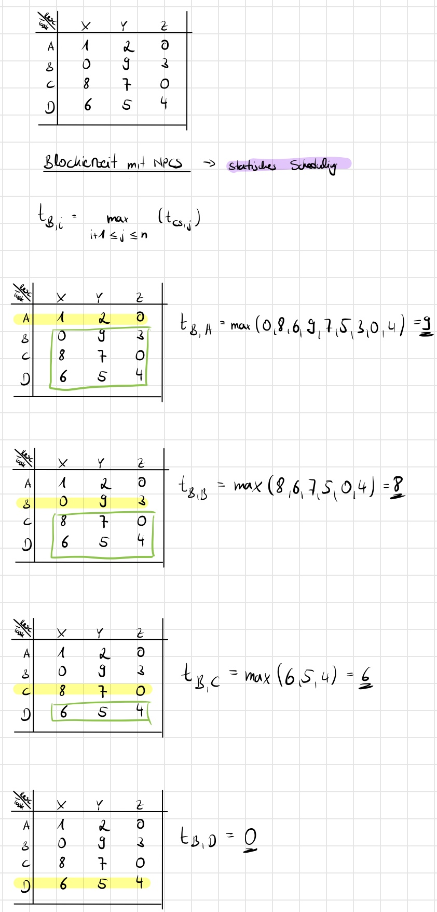
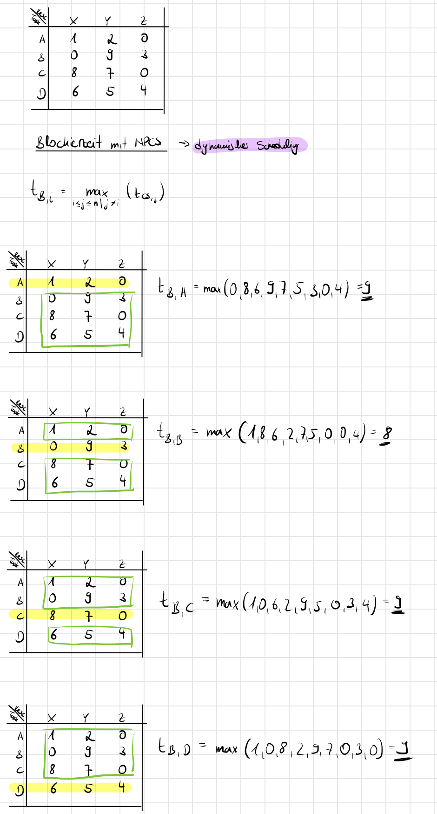
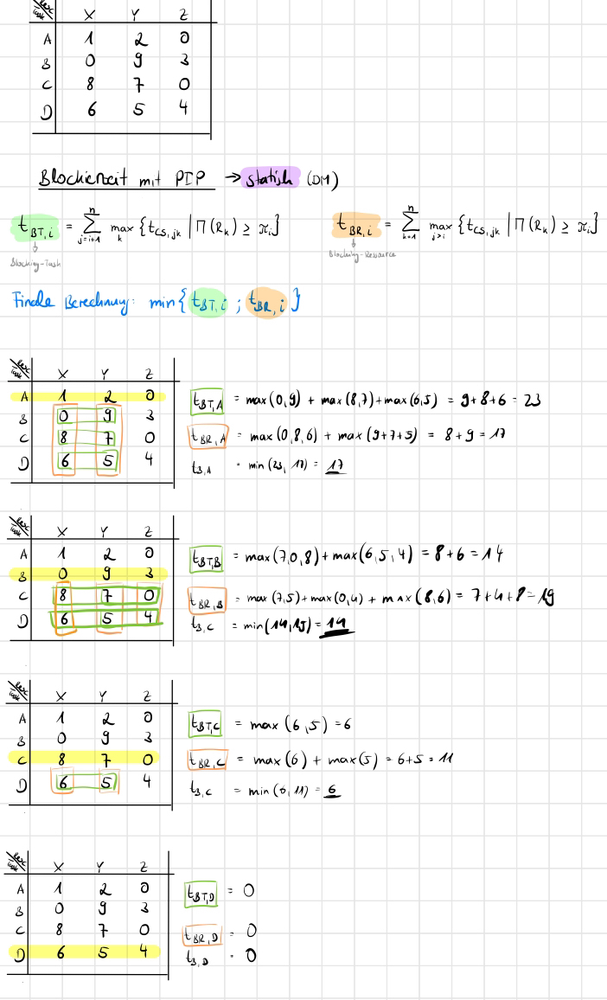
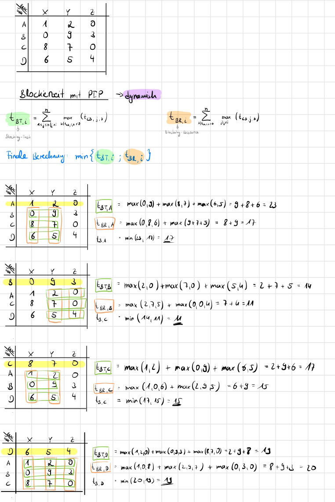
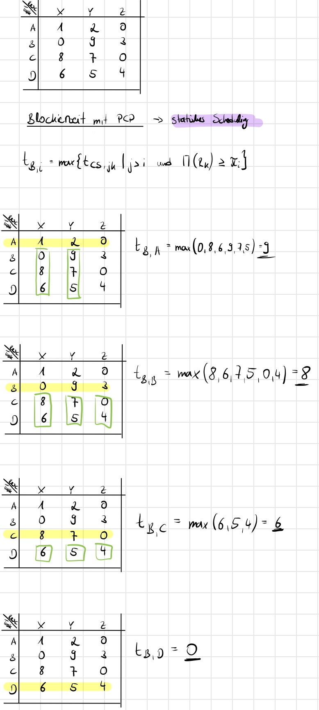
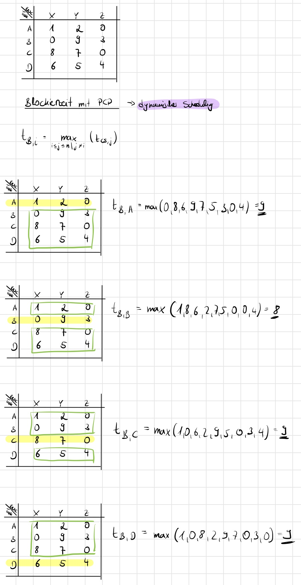
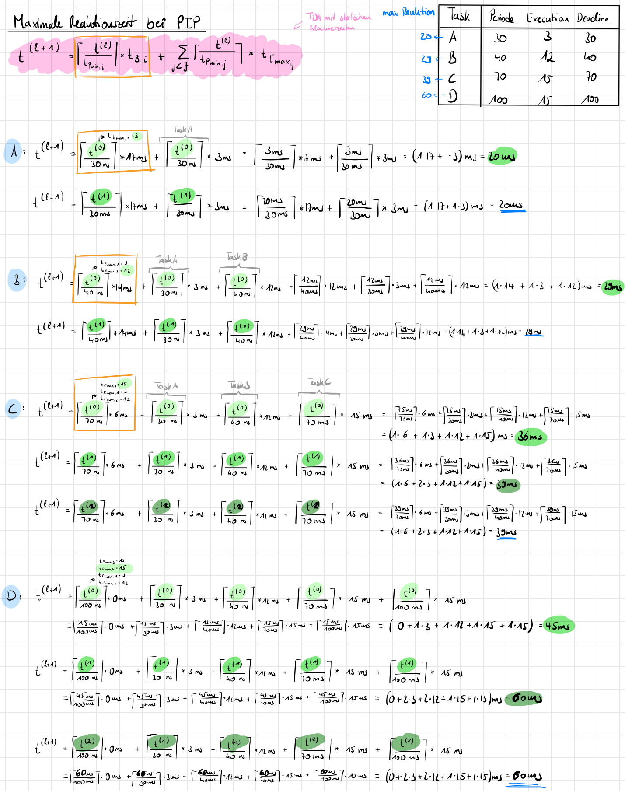
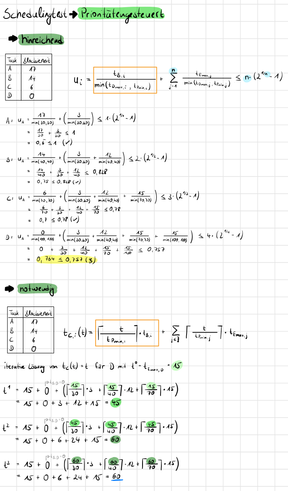
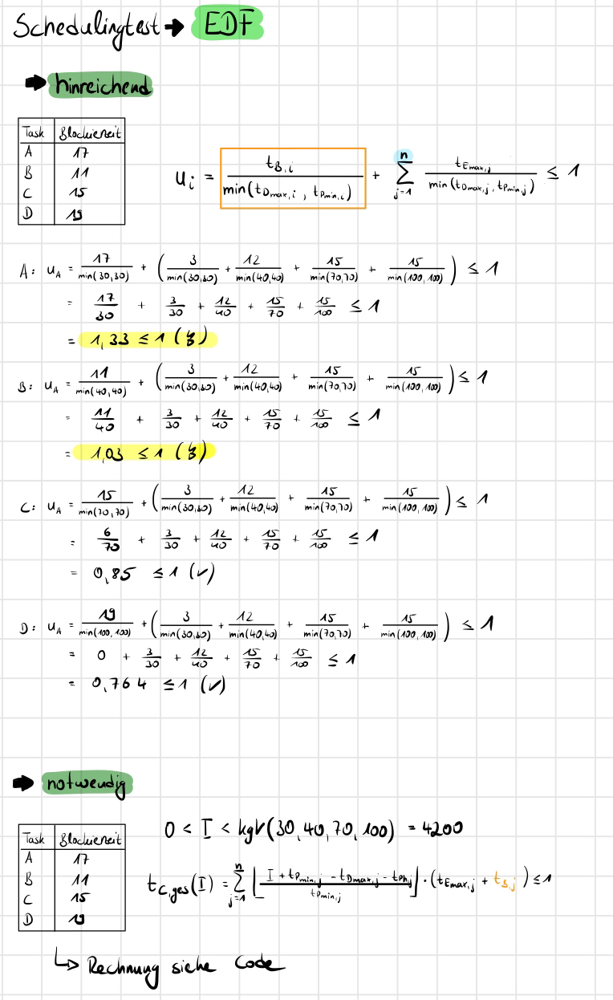

# V6

Gruppe1 \
jpkmiller (Josef Müller), IsabellaSchoen (Isabella Schön)

## Aufgabenstellung

### 1. Priority Inheritance Protokoll implementieren und mit Mars Aufgabe testen

> Unser Simulator soll in dieser Aufgabe das erste Mal mit unserer Mars Pathfinder Input-Datei (Input-9.txt) getestet werden.\
> Der Output befindet sich in `Outputs.txt`.\
> \
> **Code-Erklärung**: um unsere Simulation zu erweitern, haben wir zunächst eine weitere Flag `flag_pip` hinzugefügt, die bei einer Aktivierung das Verfahrens des PIP-Proktokoll aktiviert.\
> Die Methoden `prioritize_task_dm()` und `prioritize_task_edf()` wurden dafür geschrieben, die die pip-Flag bei Aktivierung behandeln sollen.

```c
--> lock_resource()

if (flag_pip && tmp_resource->global_task_resource->used_by->task_priority < task->task_priority)
{
  task->local_stats->resource_name = strdup(resource->name);
  create_and_add_node_to_list(&tmp_resource->global_task_resource->used_by->task_priorities, copy_node(task->local_stats, local_task_stats_t), local_task_stats_t);
}
```

> Die Methode `lock_resource()` wurde auch um diese Abfrage erweiter, womit das Geschehen `if blocked task has lower priority it gets a new priority` passieren soll.

```c
--> prioritize_task_edf()

if ((flag_pip) && (NULL != task->task->task_priorities))
{
  tmp_priorities = task->task->task_priorities;
  while (tmp_priorities != NULL)
  {
    if (min_remaining_deadline > tmp_priorities->local_task_stats->t_remaining_d && 0 >= tmp_priorities->local_task_stats->t_remaining_d)
    {
      min_remaining_deadline = tmp_priorities->local_task_stats->t_remaining_d;
    }
    tmp_priorities = tmp_priorities->next;
  }
}
```

> In dieser Methode passiert bei Aktivierung der PIP-Flag zuerst die Abfrage, ob überhaupt eine Priorität durch die Deadline und Ressource erkennbar ist und wenn ja, dann soll die Task laufen, die
> anhand der noch übrigen Deadline laufen die höchte Priorität hat.

```c
--> prioritize_task_dm()

if (flag_pip && NULL != task->task->task_priorities)
{
  tmp_priorities = task->task->task_priorities;
  while (tmp_priorities != NULL)
  {
    if (min_deadline > tmp_priorities->local_task_stats->t_d)
    {
      min_deadline = tmp_priorities->local_task_stats->t_d;
    }
    tmp_priorities = tmp_priorities->next;
  }
}
```

> Wohin gegen bei dieser Methode bei Aktivierung der PIP-Flag passiert dasselbe wie bei EDF mit dem Unterschied anhand der Deadline -> die kleinste Deadline, erhält die höchste Priorität.

### 2. Mit und ohne PIP testen

> Der Output befindet sich in `Outputs.txt`.\
> Was können wir erkennen?\
> **DM:** Bei diesem Output hat es sowohl mit als auch ohne PIP keine killed Jobs gegeben. Dies liegt aufgrund der gelungen Werte bei Phase, Period und Deadline. Jedoch die maximale Reaktionszeit hat sich minimal bei einigen Werten verbessert,
> da E0 nun früher auf die Ressource zugreifen konnte.\
> **EDF:** Mit und ohne PIP gibt es keine Unterschiede. Die Outputs sind beide identisch.

### 3. Simulator testen

#### 3.1 ...ohne PIP - Verhalten?

> Der Output befindet sich in `Outputs.txt`.\
> Verhalten: Es wird ersichtlich, dass in der Simulation ein Deadlock auftritt. A und B sowie D und E konkurrieren um dieselben Ressourcen. Insbesondere ist die Reihenfolge des Lockings entscheidend, dass > hier ein Deadlock auftreten konnte.
> Der Deadlock tritt hier auf, weil beispielsweise E Y lockt, prempted wird und D versucht zuerst X dann Y zu locken. Da Y von E gehalten wird, wird D geblockt. Anschließend versucht E X zu locken und > > > wird geblockt. Aus diesem Zustand kommt keines der beiden Tasks mehr r> aus, da es auf die Freigabe der Ressource durch das jeweils andere Task wartet.

#### 3.2 ...mit PIP - Verhalten?

> Der Output befindet sich in `Outputs.txt`.\
> Verhalten: Wie auch ohne PIP kann hier der Deadlock nicht verhindert werden, da das PIP nicht dafür gemacht wurde. Stattdessen versucht PIP die Prioritätsinversion, die entsteht, wenn eine niederpriore Task eine Ressource blockiert, die von einer höherprioren Task benötigt wird, zu umgehen, indem es der niederprioren Task die Priorität der höherprioren Task vererbt - Priority Inheritance/Priorirätsvererbung.

#### 3.3 Welche Protokolle verhindern dieses Verhalten?

> Um einen Deadlock zu verhindern bräuchte es Protokolle wie NPCS, die in kritischen Bereichen die Unterbrechung verhindern und damit für eine atomare Abarbeitung sorgen.

### 4. Input testen

> In diesem Teil der Aufgabe sollten wir uns mit der Input-Datei12.txt beschäftigen und anhand dieser das Thema
> Blockierzeiten handhaben.

#### 4.1 ...mit Berechnung von Blockierzeiten

> Die Blockierzeit setzt sich aus der Wartezeit (= die Zeit in der keine Ausführung der Rechenzeitanforderung stattfindet) und Latenzzeit (= die Zeit, die zwischen dem Auftreten eines Ergeignissen und dem Start der dazugehörigen Task vergeht) zusammen.\
> Im Folgenden sind alle Protokolle erklärt und die jeweilige Berechnung als Abbidlung dargestellt.

##### 4.1.1 ...mit NPCS

> **Non Preemptive Critical Section**\
> NPCS ist eine Unterbrechungssperre, bei der Interrupts und Task-Wechsel gesperrt werden und eine atomare/ungeteilte Abarbeitung eine Codesequenz stattfindet.\
> Sollte also eine Task auf mehrere Ressourcen zugreifen wollen, wird die durch dieses Protokoll verhindert.\
> Deadlocks können somit nicht entstehen.

<p float="left" width="100%">
  
  
</p>

##### 4.1.2 ...mit PIP

> **Priority Inheritance Protocol**\
> Wenn eine höherpriore Task auf eine Ressource zugreifen möchte, diese aber gerade von einer niederprioren Task reserviert ist, dann wird die höherpriore Task blockiert und deren Priorität auf die Priorität der niederprioren Task übertragen.\
> Sollte eine weitere Task, die eine noch höhere Priorität hat, auch auf die blockierte Ressource zugreifen wollen, wird diese wiederum schlafen gelegt und deren Prorität wieder auf die niederpriore Task übergeben.\
> Wird die Task, die die Ressource blockiert, wieder freigegeben, so wird die ursprüngliche Priorität wieder angenommen und die Prioritäten der anderen Tasks wieder auf diese übertragen.\
> Die Task, die auf die Ressource gewartet hat und eine höhrer Priorität aufweist, greift als nächstes auf die Ressource zu.\
> --> **transitive Prioritätsvererbung**

<p float="left" width="100%">
  
  
</p>

##### 4.1.2 ...mit PCP

> **Priority Ceiling Protocol**\
> Dieses Protokoll ist PIP ziemlich ähnlich. Jedoch wird der Task, die zuletzt nach einer Ressource fragt und ihre höhere Prirotät somit abgibt, als erstes die angefrage Ressource übergeben.\
> Dadurch wird verhindert, dass eine Task mehrfach auf Ressourcen warten muss. Somit wird maximal auf eine Ressource gewartet.\
> Dieses Protokoll verhindert somit auch Deadlocks.

> Beispiel:\
> Tasks: A(höchste), B(mittlere), C(niedrigste)\
> Ressourcen: R1, R2\
> zuerst C reserviert R1; dann wird R2 durch B reserviert; A möchte nun R2 -> legt sich schlafen; dann gibt B die R2 frei und A greift auf R2 zu; dann will A auf R1 zugreifen -> A wird blockiert und C wird daduch aktiv; somit wird R1 freigegeben und A greift auf R1 zu.
> An diesem kurzen Beispiel wird gezeigt: `wenn eine höherpriore Task auf mehrere Ressourcen wartet, die von niedriprioren Tasks reserviert werden, dann sorgt PCP dafür, dass diese Tasks aktiviert werden, sodass die höherpriore Task nicht lange auf die Ressourcen warten muss.`

<p float="left" width="100%">
  
  
</p>

#### 4.2 Welche Gleichung müssen Sie nun lösen, um die maximale Reaktionszeiten der einzelnen Tasks zu berechnen? Welche maximalen Reaktionszeiten ergeben sich für die Tasks (A-D) bei Einsatz des PIP?

> In dieser Aufgabe mussten wir nun die maximale Reaktionszeit mit der Aktualisierung des Protokolls PIP für jede Task bestimmten. \
> Hierbei wurde sich an der Formel des TDA orientiert.\
> TDA steht hier für `Time-Demand-Analysis`.\
> Mit der TDA wird allgemein geprüft, ob die Task ihre Deadline einhalten wird.\
> Wird die Formel um die Blockierzeit erweitert, so ergibt sich die Berechnung für den notwendigen Schedulingtest mit der Blockierzeit jeder Task und den statischen Prioritäten als Parameter.\
> TDA basiert auf der Prüfung der zweiten Realzeitbedinung `Reaktionszeit jeder Task muss größer gleich der minimalen zulässigen Reaktion sein, aber kleiner gleich der maximalen zulässen Reaktionszeit`.\
> Die Idee dahinter ist nun die `maximale Reaktionszeit` zu bestimmen, womit die Aussage fällt `zu welchem Zeitpunkt genauso viel Rechenzeit zur Verfügung steht wie von der uns betrachtenden Task benötigt wird`.

<p float="left" width="100%">
  
</p>

> Die Abbildung zeigt also das Ergebnis für die maximale Reaktionszeit mit statischen Prioritäten -> DM\
> A: 20ms, B: 29ms; C: 39ms; D: 60ms\

> Für EDF wurde jedoch keine Lösung gefunden, da bei einer Überlast die Abschätzung der maximalen Reaktionszeit schwierig ist. Somit wurde in diesem Aufgabenteil nur die Reaktionszeit von DM bestimmt.

#### 4.3 Welche Reaktionszeiten liefert der Simulator für PIP? Stimmen die Ergebnisse überein?

> Nun sollen die Reaktionszeiten dieser Task von PIP mit dem Simulator berechnet werden. Die Ergebnisse sind für DM und EDF in einer Tabelle sichtbar:\

| Tasks | Rechnerisch-DM | Simulator-DM |
| ----- | -------------- | ------------ |
| A     | 20ms           | 27           |
| B     | 29ms           | 19           |
| C     | 39ms           | 28           |
| D     | 60ms           | 44           |

| Tasks | Rechnerisch-EDF | Simulator-EDF |
| ----- | --------------- | ------------- |
| A     | -               | 27            |
| B     | -               | 17            |
| C     | -               | 28            |
| D     | -               | 44            |

> Vergleichen wir die Ergebnisse von DM, fällt auf, dass die Werte sich um ungefährt den Wert 10 unterscheiden. Keine gleichen Ergebnisse sind erkennbar. In der mathematischen Berechnung von Hand
> haben wir die Blockierzeiten miteinberechnet. Der Simulator hingegen simuliert den Scheduling und dadurch ergeben sich aus der Simualtion die Reaktionszeiten, die nicht berechnet werden müssen.
> Das heißt, der Simulator gibt die Ergebnisse wieder, die dieser aufgrund der Input, Deadlines etc. selbstständig berechnet. Der mathematische Nachweis ist dabei eine Genauigkeit und Kontrolle.\
> EDF kann leider nicht verglichen werden, da aufgrund der Überlast eine Abschätzung der maximalen Reaktionszeiten nicht möglich ist....

#### 5. Implementierung des mathematischen Nachweis für Scheduling mit festen und variablen Prioritäten

> In diesem Aufgabenteil sollen wir uns mit dem Realzeitnachweis für unsere Schedulers befassen. Hierbei sollen feste und variable Prioritäten beachtet werden, weshalb ein Realzeitnachwei sowohl
> für DM-Scheduling als auch für EDF-Scheduling gemacht wurde.

##### 5.1 Entscheiden Sie selbst, wie Sie die nötigen Informationen für einen Realzeitnachweis bestimmen

> In dieser Aufgabe haben wir uns für den Schedulingtest, sowohl hinreichend als auch notwendig entschieden.\
> Ein Realzeitnachweis dient als formaler Nachweis für das Einhalten der minimalen und maximalen Deadlines aller Tasks.\
> Da wir uns hier nun mit Ressourcen beschäftigen, müssen wir den Nachweis unter Berücksichtigung der Ressourcen verwirklichen: Seite 247-250\
> Da wir in der vorherigen Aufgabe uns bereits mit Input-12.txt intensiv auseinander gesetzt haben, wollen wir auch anhand dieser die Verfahren verwirklichen.

##### 5.2 Geben Sie die Ergebnisse des mathematischen Nachweises an. Geben Sie dazu alle nötigen Ergebnisse, die sich mathematisch bestimmen lassen bei jeweiligen Schedulingverfahren aus

> Im Folgenden sind die Realzeitnachweise für DM und EDF sowohl mit hinreichend als auch notwendig als Abbildung dargestellt.\
> Es wurde sich hierbei auf Input-12.txt fixiert, da diese bereits in der vorherigen Aufgabe für die Reaktionszeit genommen wurde.

<p float="left" width="100%">
  
</p>

<p float="left" width="100%">
  
</p>

> Um den notwendigen EDF-Scheduler zu berechnen, wurde unser Python Skript aus den vorherigen Aufgaben genommen...

```python

import math

kgV = 4200
taskset = [(12, 30, 3, 30, 17), (31, 40, 12, 40, 11), (0, 70, 15, 70, 15) ,(0, 100, 15, 100, 19)]

intervals = set()
for i in taskset:
    for j in range(0, int(kgV / i[1])):
        intervals.add(j * i[1] + i[3])
intervals = list(intervals)
intervals.sort()

#print(intervals)

for i in range(kgV):
    t_Cges = 0
    for task in taskset:
        t_Ph = task[0]
        t_Pmin = task[1]
        t_Emax = task[2]
        t_Dmax = task[3]
        t_B = task[4]
        if i in intervals:
            t_Cges += math.floor(((i + t_Pmin - t_Dmax - t_Ph) / t_Pmin) * (t_Emax + t_B))
    if i in intervals:
        print(i, t_Cges)
    if t_Cges > i:
        print("Überschritten")
        break
```

> Output:

```shell
30 33
Überschritten
```

##### 5.3 Vergleichen Sie die berechneten Ergebnissen mit dem Ergebnissen des Simulators

> Nun werden wir, um die entsprechenden Ergebnisse aus dem rechnerischen Verfahren zu kontrollieren, in dieser Aufgabe
> die Schedulingverfahren in unseren Simulator einbauen.\
> Dafür wurde sich an den Formeln aus dem Buch von Seite 247-250 orientert. Dementsprechend tragen die Methoden auch den Namen.\
> Für DM wurden die Methoden `realtime_notwendig_dm()` und bei nicht Einhalten der Deadline wurde die Methode `realtime_hinreichend_dm()` aufgerufen.\
> Dasselbe gilt für EDF. iDe Methoden `realtime_notwendig_edf()` kontrolliert das Einhalten der Deadline und wenn dies nicht erfüllt ist, dann wird die
> Methode `realtime_hinreichend_dm()` aufgerufen.\
> Der Realzeitnachweis gilt somit dafür zu kontrollieren, ob die Task ihre Deadline eingehalten hat. Daran wurde sich an der Formel von TDA orientiert
> mit dem Hinzufügen der Blockierzeit, da wir in diesem Fall Ressourcen berücksichtigen müssen.

##### 5.4 Benutzen Sie Input Dateien aus den vorherigen Aufgaben und eigene Input Dateien. Was fällt Ihnen auf?

> Und hier findet nun die Umsetzung des Simulators auf die Input-Dateien aus diesem Aufgabenteil statt.\
\
> **Input-9.txt:**
```shell
DM
Blocking times: B: 25, Z: 0 
Realzeitnachweis DM: 
Task: M failed! Task: M max. Reaktionszeit: 41 ist damit ungültig!
```

```shell
EDF
Blocking times: B: 25, Z: 0
Realzeitnachweis EDF: 
Task: M failed! Failed, because 40 > 35
```

> **Input-10.txt:**
```shell
DM
Blocking times: A: 4, B: 8, C: 8, D: 4, E: 0
Realzeitnachweis DM: 
Task: B failed! Task: B max. Reaktionszeit: 6
```

```shell
EDF
Blocking times: A: 4, B: 8, C: 8, D: 4, E: 0
Realzeitnachweis EDF: 
Task: A failed! Failed, because 1503238548 > 0
```


> **Input-11.txt:**
```shell
DM
Blocking times: A: 4, B: 0, C: 0, D: 4, E: 0
Realzeitnachweis DM: 
Task: B failed! Task: B max. Reaktionszeit: 8
```

```shell
EDF
Blocking times: A: 4, B: 0, C: 0, D: 4, E: 0
Realzeitnachweis EDF: 
Task: A failed! Failed, because 429496728 > 0
```


> **Input-12.txt:**
```shell
DM
Blocking times: A: 17, B: 14, C: 6, D: 0
Realzeitnachweis DM: 
Task: B failed! Task: B max. Reaktionszeit: 15
```

```shell
EDF
Blocking times: A: 17, B: 14, C: 6, D: 0
Realzeitnachweis EDF: 
Task: A failed! Failed, because -1431655776 > 0
```


> Auffälligkeiten: Wenn wir nun die Werte von Input-12.txt betrachten, da wir mit dieser auch die handliche Rechnung durchgeführt haben, fällt auf, dass
> die Werte nicht übereinstimmen mit den handlich berechneten Werten.

#### 6. Wie bewerten Sie somit die Ergebnisse, die Sie alleine aufgrund des Simulators erhalten?

> Betrachten wir nun alle Ergebnisse aus der eigenhändigen Rechnung und dem Simlator fällt auf:\
>
> 1. Zeiten bei maximaler Reaktionszeit stimmen nicht überein.\
> 2. Zeiten der Blockierzeiten stimmen überein.\
> 3. Zeiten des Schedulingsverfahrens stimmen nicht überein.\
>    **Bewertung:** Wie man weiß, galt die Mathematik schon immer als Sicherheit für viele Rechnungen, da schließlich alle Formeln auf dieser basieren.
>    Der Simulator hingegen wird durch mehrere Dinge beeinflusst: Auslastung der CPU, Verzögerungen, Ausführen mehrerer Prozesse etc. Es ist somit
>    zwar ein Nachweis möglich, jedoch ist dieser im Vergleich zu der Mathematik nicht hundertprozentig sicher und verlässlich.

## Bericht

> Was sollten wir in dieser Aufgabe lernen und warum haben wird diese überhaupt gemacht?\
> Letzendlich ging es darum sich mit den drei verschiedenen Protokollen auseinanderzusetzen: NPCS, PCP, PIP.\
> Wir haben die Funktionalität hinter diesen uns angeschaut und auch verstanden - hoffentlich ;) - und diese anhand von
> verschiedenen Input-Dateien und Berechnungen deren Blockierzeiten getestet und somit deren Unterschiede genauer
> betrachten können.\
> Der main Fokus beim Simulator lag jedoch auf dem PIP Verfahren. Dies liegt daran, dass PIP auf Ressourcen und Prioritätsvererbung
> basiert. Natürlich sind auch PCP diese zwei Themen die Basis, bei PIP ist die Vererbung jedoch verständlicher und eventuell
> sogar effizienter in den Simulator einzubauen.\
> Die Berechnung der Blockierzeit ist außerdem verständlicher.\
> Was haben wir nun über den PIP anhand von EDF und DM gelernt?\
> Zunächst einmal haben wir die Handhabung der Ressourcen gelernt. Wenn wir also nun unser Taskset betrachten, welches anhand deren
> unterschiedlichen Deadlines verschiedene Prioritäten aufweisen und eine kleinerpriore Task eine Ressource hält, die jedoch wiederum
> von einer höherprioren Task genommen werden möchte, geschieht die Blockierung und Vererbung der Prioritäten. Dies geschieht solange
> bis die Ressource wieder frei ist, alle Prioritäten an ihre Ursprungstask zurückgegeben werden und die nächste höherpriore Task
> die Ressource nun blockiert.\
> Dies hat den Vorteil natürlich, dass erst einmal die niederprioren Tasks dementsprechend bevorzugt werden. Kann Nachteile und auch
> Vorteile haben:\
> Vorteile: vielleicht hat ja genau diese Task eine kleine wichtige Aufgabe, weshalb sie auch eine kleinere Priorität hat, die Informationen
> dahinter jedoch für weitere Fortschritte dringend benötigt werde.\
> Nachteil: wofür gibt es denn höherpriore Tasks? Diese haben eine sehr wichtige Aufgabe zu erfüllen und wenn diese ihre Aufgabe aufgrund
> einer Blockade nicht funktionieren kann, so können sehr wichtige Informationen verloren gehen -> Mars Pathfinder.\
> Dennoch ist die Prioritätenvergabe ein Fortschritt für den Mars Pathfinder gewesen. Denn davor wurden Tasks unterbrochen in ihrer
> Aufgabe, obowhl diese eine wichtige Ressource halten. Die Prioritätenvergabe vereinfacht dies und führt zu einem schnelleren und meist
> effizienteren Weg.\
> Außerdem haben wir durch die mathematischen Nachweise und den Berechnungen innerhalb des Simulators die Sicherheit und Effizient des
> Simulator kennen gelernt haben. Die jeweiligen Rechnungen galten als Überprüfung und Vergleich der Genauigkeite. Fazit ist, dass die
> Mathematik ein sicherer Nachweis ist und immer sein wird. Der Simulator, von uns geschrieben, ist zwar auch ein guter Nachweis, oftmals
> können die Ergebnisse jedoch nicht genau stimmen, da viele weitere Einflüsse wie die Überlastung der CPU zum Beispiel eine Auswirkung
> auf die finalen Resultate haben.
